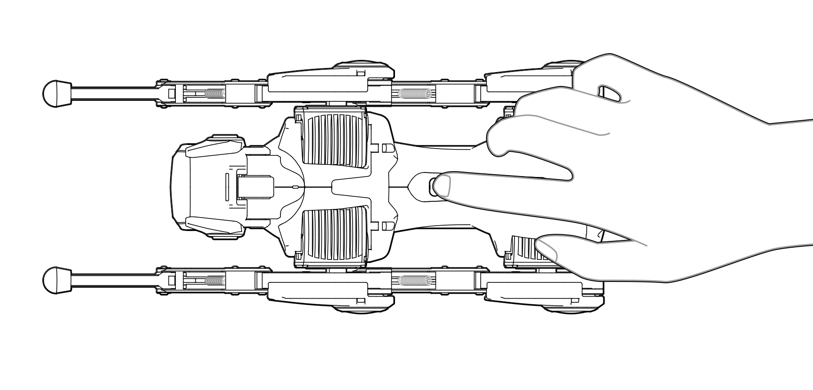
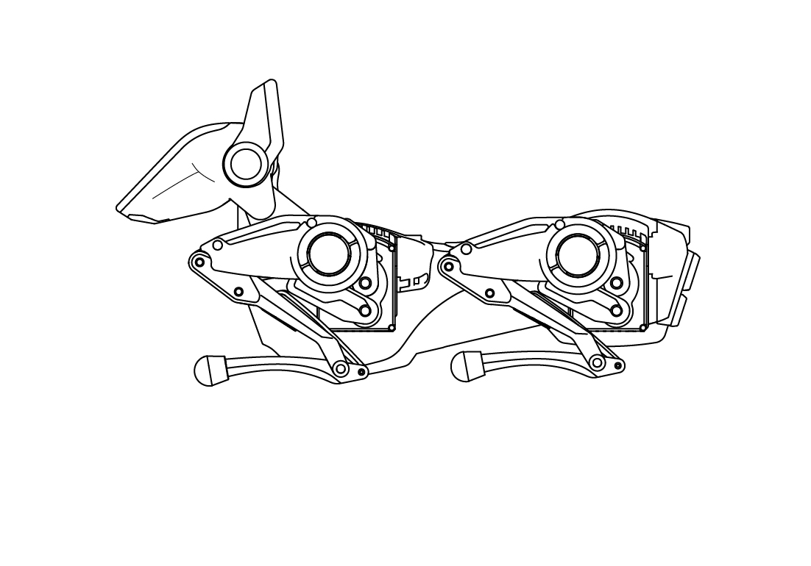
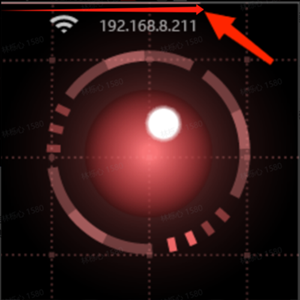

# Sirius User Manual

Thank you for choosing Sirius, a quadruped robot from Hengbot Innovation Ltd. Sirius is a flexible and smart robot partner with attractive appearance and amusing interactive experience. The shape and structure of Sirius have been optimized for many years. Its legs are designed with modular connecting rods and equipped with Neurocore integrated motor units, so that you can upgrade the power system of your Sirius like replacing the motor of four-wheel drive, or customize a unique Sirius like replacing the case of mobile phone. Every master deserves to be guarded and accompanied by a Sirius robot.

## I.Reading Guidance

| Document title | Introduction |
| ------------- | ------------- |
| [Unboxing: Entry-level configuration and usage](./tutorial-basics/quick_start_guide.md) | In this section, we will show you the basic configuration and usage of Sirius including steps of startup, operation skills, network connection and how to connect with the APP. |
| [Entry-level: APP operation](./tutorial-basics/app_user.md) | This section introduces the basic remote-control gameplay of App, covering from basic operation to gait movement, head and body movement and so on. Let’s explore all kinds of interesting gameplay in the App! |
| [Mid-level (I): Advanced APP operation](./tutorial-basics/create_a_blog_post.md) | In this section, we will further explore the advanced remote-control gameplay in the App - Keyframe Mode and Drag & Drop tutorial, to create more unique actions for your Sirius! |
| [Mid-level (II): Python API](./tutorial-basics/python_api.md) | This section introduces how to use Python SDK to control the movement status of your Sirius. You can try using Python to learn robot control and complete the secondary development of your Sirius by following the interfaces and instances we provide.|
|[Mid-level (III): WebSocket API](./tutorial-basics/deploy_your_site.md) | This section introduces how to use WebSocket API to control the movement status of your Sirius, complete the secondary development of your Sirius, and provide more detailed API information. |
| [Advanced-level (I): UI Usage](./tutorial-basics/quick_start_two.md) | This section introduces the basic UI interface and interactive operations of Sirius’s Head. |
| [Advanced-level (II): Operated by the gamepad](./tutorial-basics/sparky_remote.md) | This section provides a detailed description on how to quickly pair Sirius with the gamepad through Bluetooth for smoother movements of Sirius’s gait, head, and body through remote control. |

## II.Overview of the Sirius

- **Main body**
  
| Labelled Diagram (Front view) | Labelled Diagram (Back view) | 
|----|----|
| |  |

- **Accessory List**

List：Cleaning brush, USB data cable (Type-C), Battery charger

## III.Specifications

- **Basic**

| Name  | Parameter |
| ------------- | ------------- |
| Dimension | 250x130x250mm |
| Weight | 960g |
| Max. Load | 300g |
| Working Temperature | 10-30°C |
| Battery life（Standby）| 100-120 min|
| Battery life（Active Mode）| 45-50 min |
| Max. Speed | 0.4m/s |
| Power interface | PD30w |
| Operating System | Linux |
| Programming Language | C/C++/Python |

<!-- - **硬件参数**  

| 名称   | 说明 | 
|--------|---------------|
| 处理器 | Cortex-A7 1GHz |
| 内存	 | SIP 64MB DDR2 |
| 存储	 | 可选的16M flash |
| 系统	 | 操作系统：Linux |
| 网络   | Wi-Fi：2.4G/5G IEEE 802.11 a/b/n/g/ac |
| 摄像头 | MIPI 最高支持 1080P@60fps |  

- **运动参数**  

| 名称   | 说明 | 
|--------|---------------|
| 行走速度	| 0.4m/s |
| 自由度	| 整机14，每条腿3，头部2。 |
| 电机能力	| 类型：微型伺服电机 |
|		| 数量：腿部 Neurocores x4 头部x2 |
|       | 电机尺寸：32.7*31.4*47.7mm |
|		| 最大扭矩：0.6N·m |
| 		| 工作电压：6-8.4V |
| 		| 额定电压：7.4V |
| 		| 最大电流：3A |
| 		| 最大转速：120rpm |
| 		| 通讯方式：TTL |
| 		| 编码器分辨率：12位 |

- **电源参数**  

| 名称   | 说明 | 
|--------|---------------|
| 电源	 | 输入参数：100-240V~ 50/60Hz |
| 		 | 充电保护：过温保护，过压保护，过流保护，短路保护。|
| 电池	 | 电池类型：锂离子电池 |
| 		 | 标称电压：7.4V |
| 		 | 充电限制电压：8.4V |
|		 | 额定容量：2200Mah |
| 		 | 电池保护：均衡充电，过压保护，欠压保护，过流保护，短路保护，过温保护. |
| 充电时间 | pd30w 约50min |
| 工作时间 |  45分钟以上 |  

- **规格参数**  

| 名称   | 说明 | 
|--------|---------------|
| 产品尺寸 | 250x130x250mm |
| 整机重量 | 850g（含电池105g） |
| 工作环境 | 工作温度：10-30°C | -->

## IV.Quick Start Guide

Please refer to the Quick Start Guide, which helps you quickly understand Sirius's different documents and their usage paths, giving you a great user experience.

### 4.1 Startup

:::tip[User Tips]

Remove the foam from the packaging box. During moving, prevent the product from excessive impact, such as falling down or colliding, etc. Make sure that the Sirius is placed on a stable ground in a proper initial posture before starting it up.

| Press the button for 3s to power it on | Retract limbs after powering on | Standing after retracting limbs |
|---|---|---|
|  | |  |

**Use the original adapter and cable with the product in the packaging box for charging**：The Sirius can work for 1-2 hours without charging. It takes about 50 minutes to fully charge when turned it off. It is recommended to plug in the cable for charging during working for a long time.

:::

### 4.2 Download and install Sirius's App

### 4.3 Using Skills

| Function     | Skills | Remarks |
| -----------  | ----------- | ------- |
| **Application environment** | A clean desktop or flat ground is a relatively ideal control environment. Please do not operate the Sirius on the outdoor ground with water or other liquids, so as to avoid reducing the accuracy of Sirius control and ensure the task going well. |  |
| **Check the power** | There is a battery status bar on the top of Sirius's head. When the battery is sufficient, Sirius can work for more than 45 minutes. If the battery power is too low, it will bark to warn and automatically power off with limbs retracting. |  |
| **Recharge** | Please use the official charger (PD30w) to ensure the charging effect and safety. After connecting the charging cable, the taillight lights up to indicate that it is in the charging state. |  |
| **Power on** | Press and hold the power button on the back for three seconds to turn on the device. |
| **Power off** | Method 1 (recommended): Press and hold the power button on the back of Sirius to power off.
Method 2: Shutdown the system from the UI menu on the Sirius's head. |
| **Interaction on the head** | The functions of the left and right ear buttons are consistent, and both can be used to select or adjust options. Touching the top of the head can confirm the options. |  |
| **Heating** | It is normal that the motor temperature will rise after long-term use. Please ensure that you use it in a well-ventilated environment. In addition, Sirius has a built-in overheat protection program, when the motor temperature is too high, the motor will be disabled actively, and then restart the work when its temperature drops to a reasonable range. | |
| **Cleaning** | When dust accumulates due to long-term use of Sirius, the groove of the actuator can be cleaned with the attached small brush, and the head cover and other parts can be gently wiped with a soft wet cloth. When cleaning, please make sure that Sirius is turned off and not charging, and avoid splashing water or other liquids directly on the robot surface. |  |

## V.Important Notes

:::danger[Take care]
**Notes**: To avoid dangerous situations such as overheating and fire, please strictly follow the following precautions.

- Before starting up, please ensure that Sirius is placed in the correct initial posture on a stable ground and prevent the product from excessive impact during use, such as falling down.  
- The product has a built-in lithium-ion battery, which is removable and replaced.  
- Please use the official charger (PD30w) to ensure the charging effect and safety. Any over heating, fire or other consequences caused by the use of other charging devices shall be borne by yourself.  
- Do not place the product in or near a fire source, and do not place the product in a microwave oven.  
- Do not expose the product to direct sunlight.  
- Do not use the product in damp environments, such as near bathtubs, sinks, or swimming pools.  
- Do not disassemble, squeeze or puncture the product.  
- The normal operating temperature range of the product is 10°C to 30°C. Please avoid using the product in extremely hot or cold environments.  
- Please keep the product dry and do not spill food or liquids on it.  
- Discarding this toy may have an impact on the environment, please properly dispose it for recycling.
:::