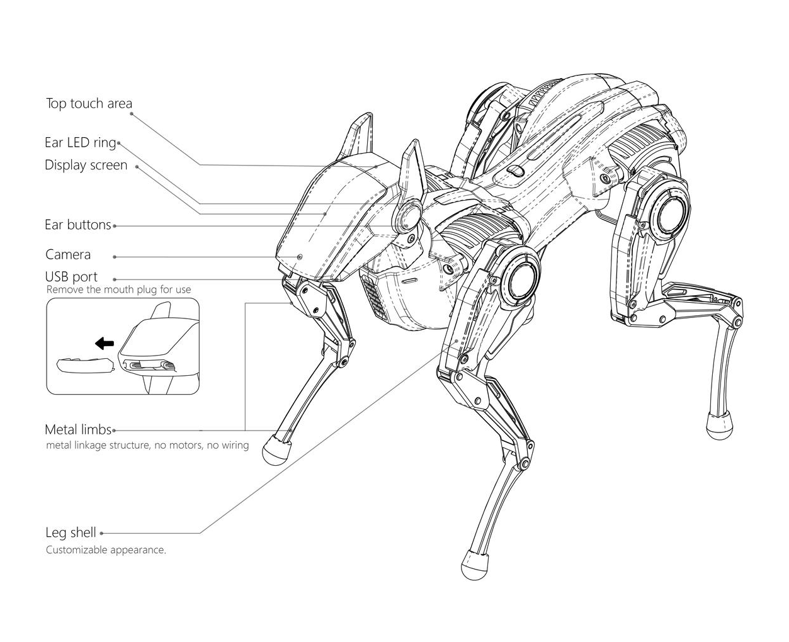
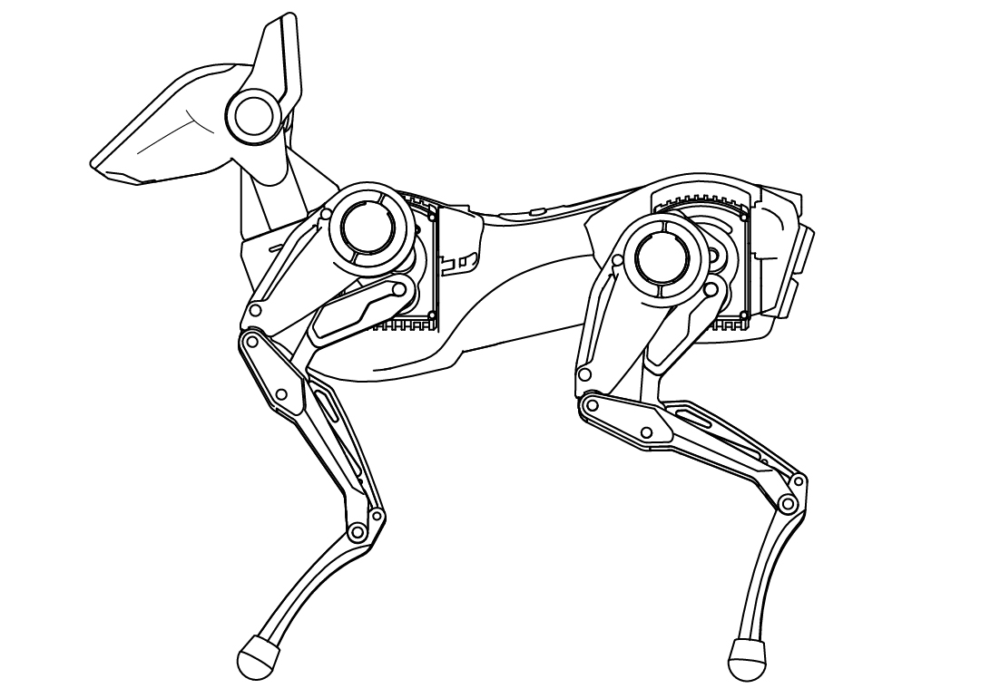

# Sparky_哮天使用说明书

感谢选择恒之未来四足机器人 Sparky 哮天！Sparky 哮天是一款灵动灵巧的机器人伙伴，颜值当道，体验为先。哮天的造型与结构经过多年打磨，它的腿部采用模块化连杆设计，搭载 AIA 一体化电机单元，让您可以像更换四驱车马达一样升级哮天的动力系统，也可以像更换手机壳般定制一款独一无二的哮天。让每一位“二郎神”，都有哮天机器人的守护与陪伴。  

## 一、文档导读

| 文档 | 导读 |
| ------------- | ------------- |
| [开箱系列：基础配置使用](./tutorial-basics/quick_start_guide.md) | 在本文中，我们将带您了解哮天的基础配置和使用方法。这包括启动步骤、操作技巧、联网指南以及如何与 APP 进行连接等各项操作流程。 |
| [基础系列：APP 玩法](./tutorial-basics/app_user.md) | 本文档为您介绍了App的基础遥控玩法，涵盖从基础操作到步态运动，头部和机身运动等各个方面。让我们一起探索 App 中的各种有趣玩法吧！|
| [探索系列（一）：APP 进阶玩法](./tutorial-basics/create_a_blog_post.md) | 在这里我们将更进一步，探索 APP 中的进阶遥控玩法——关键帧模式及拖拽示教，来为您的哮天创造更多独一无二的动作吧！|
| [探索系列（二）：Python API](./tutorial-basics/python_api.md) | 本篇文档介绍了如何使用 python sdk 控制哮天的运动状态。您可以按照我们提供的接口和例程，尝试用 Python 来学习机器人控制，完成哮天的二次开发。|
|[探索系列（三）：WebSocket API](./tutorial-basics/deploy_your_site.md) | 本篇文档介绍了如何使用 WebSocket API 来控制哮天的运动状态，完成哮天的二次开发以及更详细的 API 资料。|
| [拓展系列（一）：UI 界面使用](./tutorial-basics/quick_start_two.md) | 本文档介绍了哮天头部的 UI 基本界面与交互操作。|
| [拓展系列（二）：手柄遥控](./tutorial-basics/sparky_remote.md) | 本文档详细介绍了如何快速将哮天与蓝牙手柄配对，以便通过遥控操作实现更流畅的步态、头部和机身运动。|

## 二、产品介绍

- **主机**
  
| 主机正面标注图 | 主机背面标注图 | 
|----|----|
| |  |

- **配件清单**

清单：清洁刷  Type-C USB数据线 充电器 

## 三、产品参数

- **基本参数**

| 名称  | 说明 |
| ------------- | ------------- |
| 控制方式 | WIFI（局域网）APP 遥控/外接遥控手柄 |
| 传感器 | 摄像头 |
| | 电机内置编码器与温度传感器 |
| | 头部触摸传感器 |
| | 头部按键 |
| | 高精度姿态传感器（选配）|
| | 语音识别传感器（选配）|

- **硬件参数**  

| 名称   | 说明 | 
|--------|---------------|
| 处理器 | Cortex-A7 1GHz |
| 内存	 | SIP 64MB DDR2 |
| 存储	 | 可选的16M flash |
| 系统	 | 操作系统：Linux |
| 网络   | Wi-Fi：2.4G/5G IEEE 802.11 a/b/n/g/ac |
| 摄像头 | MIPI 最高支持 1080P@60fps |  

- **运动参数**  

| 名称   | 说明 | 
|--------|---------------|
| 行走速度	| 0.4m/s |
| 自由度	| 整机14，每条腿3，头部2。 |
| 电机能力	| 类型：微型伺服电机 |
|		| 数量：腿部AIAx4 头部x2 |
|       | 电机尺寸：32.7*31.4*47.7mm |
|		| 最大扭矩：0.6N·m |
| 		| 工作电压：6-8.4V |
| 		| 额定电压：7.4V |
| 		| 最大电流：3A |
| 		| 最大转速：120rpm |
| 		| 通讯方式：TTL |
| 		| 编码器分辨率：12位 |

- **电源参数**  

| 名称   | 说明 | 
|--------|---------------|
| 电源	| 输入参数：100-240V~ 50/60Hz |
| 		| 充电保护：过温保护，过压保护，过流保护，短路保护。|
| 电池	 | 电池类型：锂离子电池 |
| 		 | 标称电压：7.4V |
| 		 | 充电限制电压：8.4V |
|		 | 额定容量：2200Mah |
| 		 | 电池保护：均衡充电，过压保护，欠压保护，过流保护，短路保护，过温保护. |
| 充电时间 | pd30w 约50min |
| 工作时间 |  45分钟以上 |  

- **规格参数**  

| 名称   | 说明 | 
|--------|---------------|
| 产品尺寸 | 250x130x250mm |
| 整机重量 | 850g（含电池105g） |
| 工作环境 | 工作温度：10-30°C |

## 四、快速入门指引

您可以参考并使用快速入门指引！本指引将帮助您快速了解 Sparky 的不同文档及其使用路径，让您的使用体验更加顺滑。

### 4.1 开机启动

:::tip[Use Tip]

**开机前请保证哮天以正确的初始姿势放置在平稳地面上，使用时可取消包装箱的泡棉**，在途中请勿让产品受到过度冲击，例如从高处跌落或碰撞等；

| 按下背部按键三秒开机 | 开机后收紧四肢 | 收紧四肢后站立 |
|---|---|---|
|  | |  |

**请使用包装箱原装充电头与充电线充电**：哮天不充电使用时间在1-2个小时，关机下充满需要50min左右，如果需要长时间编排动作与调试，建议尾部插上充电线使用。

:::

### 4.2 下载安装 Sparky's App
  
用户可通过我们向您发布的软件安装包进行安装 APP。  
如给您带来的不便还请谅解，我们将尽快将 APP 发布于各大应用市场中，敬请期待。

### 4.3 使用小技巧

| 功能         | 使用技巧 | 备注 |
| -----------  | ----------- | ------- |
| **使用环境** | 使整洁的桌面或平整的工作地面可以提供一个相对理想的操控环境，请勿在有水或其他液体的户外地面上操作，有助于提高您操控哮天的精准度，确保任务的顺利进行。|  |
| **查看电量** | 哮天头部顶端会**实时显示电量条**，电量充足的情况下，哮天可**实现 45min 以上的不插电使用**，如电量低时，它会发出**提醒（狗狗）叫声并自动关机恢复趴下状态.** |  |
| **充电** | 请您**使用哮天官方配套的充电设备（PD30w）**，以确保安全和效果。充电时设备通电后，尾灯点亮表明已在充电状态。|  |
| **开机** | 长按背部电源键三秒进行开机操作 |
| **关机** |**方式一（推荐）**：长按背部电源键进行关机；**方式二**：头部 UI 程序内进行系统关机。|
| **头部交互** | 左右耳按键功能一致，均可进行选项选择或调节，头顶触摸可确认选项。|  |
| **发热** |哮天长时间使用后电机温度会升高，这是正常现象，请确保您在通风良好的环境中使用。此外，哮天内置过热保护程序，当电机温度过高时该电机将主动失能，待其温度降到合理范围内再重新启动工作。| |
| **清洁** | 长时间使用哮天导致积压灰尘时，可使用附赠小刷子对执行器凹槽进行清洁，头部面盖及其他部位可使用柔软的湿布轻轻擦拭。清洁时，请确保哮天是在关闭电源且不在充电状态下，避免将水或其他液体直接溅到机器人表面。|  |

## 五、注意事项

:::danger[Take care]
**注意事项**：为避免出现过热、起火等危险情况，请严格遵守以下注意事项:

- 开机前请保证哮天以正确的初始姿势放置在平稳地面上，使用途中请勿让产品受到过度冲击，例如从高处跌落等；
- 产品内置锂离子电池，可进行拆卸或更换；
- 请使用官方标配的充电设备（规格输出为 PD30w）为产品充电，如使用其他充电设备导致发热严重、起火等事项后果自负。
- 请勿将产品放置在火中或火源附近,请勿将产品放置在微波炉中；
- 请勿将产品放置在炎热的天气暴晒；
- 请勿在潮湿的环境中使用产品，例如浴缸、水槽或游泳池附近；
- 请勿拆卸、挤压或刺穿产品；
- 产品正常工作温度范围为 10°C 至 30°C，请避免在极热或极冷的环境中使用您的产品；
- 请保持产品干燥，不要将食物或液体洒在产品上；
- 随意丢弃此玩具可能会对环境造成影响，请妥善回收处理。
:::
