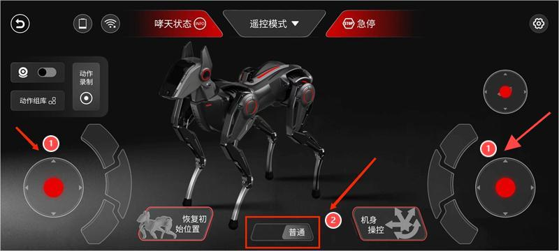
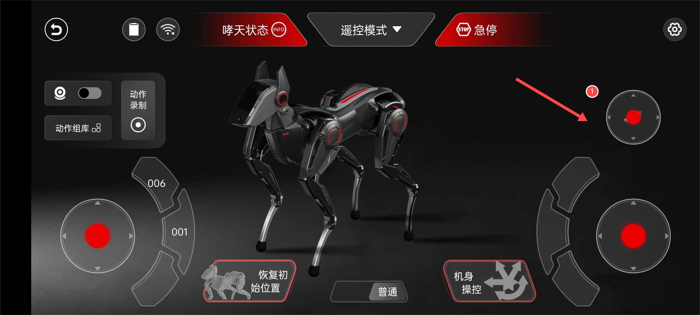
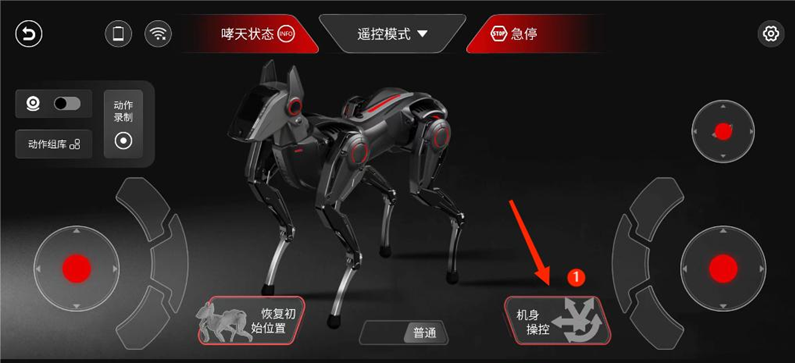

# Entry-level: APP Operation

## I.Preface

In the previous section, we met our new partner "Sirius" and learnt configuration operations including networking and App connection. Now, let's explore the fun gameplay of the App. First, Let's learn how to control the gait, head, and body movements of Sirius."

## II.Preparation Work

| Steps | Description |
|------|---------|
| **Software**: download the APP and install it according to the prompts. |  |
| **Environment**: Sirius has been connected to the Internet and successfully connected to the mobile App. | This section will not repeat the basic configuration and other operations. Please refer to this document: Unboxing:[ Entry-level Configuration and Usage for relevant information.](./quick_start_guide.md) |

## III.Experience the Entry-level Gameplay of APP

| Steps | Reference pictures |
|-------|-------|
| After the connection is successful, the APP will go directly to the home page, and click **"Enter Remote Control"** to start and experience your wonderful interaction with Sirius. | |
| After entering the Remote Control Mode, a prompt of whether to **"Restore Initial Posture"** will pop up, and then click "OK".|  |

### 3.1 Labelled Function Diagram  

First, learn the functions of various components and icons based on the labelled diagram, and then proceed to experience the gait movement of your Sirius.

### 3.2 Experience Sirius’s Gait Movement  

| Steps | Reference pictures |
|------|-------|
| **Label 1**: Slide the joystick to make Sirius move and achieve gait movement.**Label 2**: Switch the speed mode between "Normal/Rapid" to control the gait speed of Sirius. |  |

After learning the basic operation steps, you can watch the video to see the operation steps more intuitively and experience the gait movement of Sirius simultaneously.

| Function | Video effects |
|----------|---------------|
| **Left joystick**: controls quadrupedal movement: up→forward / down→backward, slide left/right to control moves in parallel | <iframe width="780" height="400" src="https://www.youtube.com/embed/sddgrfJwklk?si=AZlOMtSLRWS6SC_o" title="YouTube video player" frameborder="0" allow="accelerometer; autoplay; clipboard-write; encrypted-media; gyroscope; picture-in-picture; web-share" referrerpolicy="strict-origin-when-cross-origin" allowfullscreen></iframe> |
| **Right joystick**: controls turning in left or right | <iframe width="780" height="400" src="https://www.youtube.com/embed/K-hf0xVGXPQ?si=JcGrO0wLIagjwVRC" title="YouTube video player" frameborder="0" allow="accelerometer; autoplay; clipboard-write; encrypted-media; gyroscope; picture-in-picture; web-share" referrerpolicy="strict-origin-when-cross-origin" allowfullscreen></iframe> |
| **Dual joystick combined gait**: controlling gait speed (Normal/Rapid)  | <iframe width="780" height="400" src="https://www.youtube.com/embed/rxBW_JiWsoE?si=fcfcMxC_ozY2hzIR" title="YouTube video player" frameborder="0" allow="accelerometer; autoplay; clipboard-write; encrypted-media; gyroscope; picture-in-picture; web-share" referrerpolicy="strict-origin-when-cross-origin" allowfullscreen></iframe> |

### 3.3 Experience Head Movement

| Steps | Reference pictures |
|-------|--------------------|
| **Label 1**: The head slider has been optimized with a separate joystick control, allowing users to control head movements more finely.| |

After familiarizing yourself with the basic operation steps, you can also understand the head movements of your Sirius by watching videos.

<iframe width="780" height="400" src="https://www.youtube.com/embed/lsRLkfgB-U0?si=B36pN0rV2jiTT3Nr" title="YouTube video player" frameborder="0" allow="accelerometer; autoplay; clipboard-write; encrypted-media; gyroscope; picture-in-picture; web-share" referrerpolicy="strict-origin-when-cross-origin" allowfullscreen></iframe>

For further understanding, the table below shows detailed labels and descriptions of these functions.

| Tool | Purpose | Usage Method |
|------|---------|--------------|
| **Head slider** | Achieve head pitching and yaw motion | **Up and down sliding**: achieve pitching (head up and down); **Left and right sliding**: perform yaw motion (shake head left and right) |
| **Head Image Transmission** | The head image transmission module is currently not available, please wait for it. | | 

### 3.4 Experience body movement

| Steps | Reference pictures |
|-------|-------|
| **Label 1**: Enter the body control page and adjust the parameter axis to achieve body movement. |  |
| **Label 2**: Slide the red dot to adjust the parameter axis.**Label 3**: Click on the "-" to decrease or "+" to increase on both sides of the parameter axis.|  |

After familiarizing yourself with the basic operation steps, you can also understand the head movements of your Sirius by watching videos.

<iframe width="780" height="400" src="https://www.youtube.com/embed/8NgFbh8joss?si=gjuPSA8yoR42ZE1S" title="YouTube video player" frameborder="0" allow="accelerometer; autoplay; clipboard-write; encrypted-media; gyroscope; picture-in-picture; web-share" referrerpolicy="strict-origin-when-cross-origin" allowfullscreen></iframe>

For further understanding, the table below shows detailed labels and descriptions of these functions.

| Name | Method (sliding or adjusting the "-" and "+" buttons) | 
|------|----|
| **Reference pictures** |  |
| **Roll** | The body undergoes left and right rolling motion around the X-axis |
| **Z axis** | Leg rotation around the Z-axis to achieve squatting or standing posture |
| **Y axis** | The body undergoes yaw motion around the Y-axis |
| **X axis** | The body achieves pitch motion around the X-axis |

## IV.More Gameplay Options

Through the introduction of the gameplay in the previous text, we have become familiar with the basic remote control gameplay of the APP and learned skills for controlling the gait, head, and body movements of your Sirius. And the next step is to further explore advanced remote control gameplay in the App - keyframes and drag and drop demonstrations. Let's look forward to the exciting content of the next chapter together. Coming soon!

Go to find the document out which you desired as follows.

| Document title | Introduction |
| ------------- | ------------- |
| [Unboxing: Entry-level configuration and usage](./quick_start_guide.md) | In this section, we will show you the basic configuration and usage of Sirius including steps of startup, operation skills, network connection and how to connect with the APP. |
| [Entry-level: APP operation](./app_user.md) | This section introduces the basic remote-control gameplay of App, covering from basic operation to gait movement, head and body movement and so on. Let’s explore all kinds of interesting gameplay in the App! |
| [Mid-level (I): Advanced APP operation](./create_a_blog_post.md) | In this section, we will further explore the advanced remote-control gameplay in the App - Keyframe Mode and Drag & Drop tutorial, to create more unique actions for your Sirius! |
| [Mid-level (II): Python API](./python_api.md) | This section introduces how to use Python SDK to control the movement status of your Sirius. You can try using Python to learn robot control and complete the secondary development of your Sirius by following the interfaces and instances we provide.|
|[Mid-level (III): WebSocket API](./deploy_your_site.md) | This section introduces how to use WebSocket API to control the movement status of your Sirius, complete the secondary development of your Sirius, and provide more detailed API information. |
| [Advanced-level (I): UI Usage](./quick_start_two.md) | This section introduces the basic UI interface and interactive operations of Sirius’s Head. |
| [Advanced-level (II): Operated by the gamepad](./sparky_remote.md) | This section provides a detailed description on how to quickly pair Sirius with the gamepad through Bluetooth for smoother movements of Sirius’s gait, head, and body through remote control. |