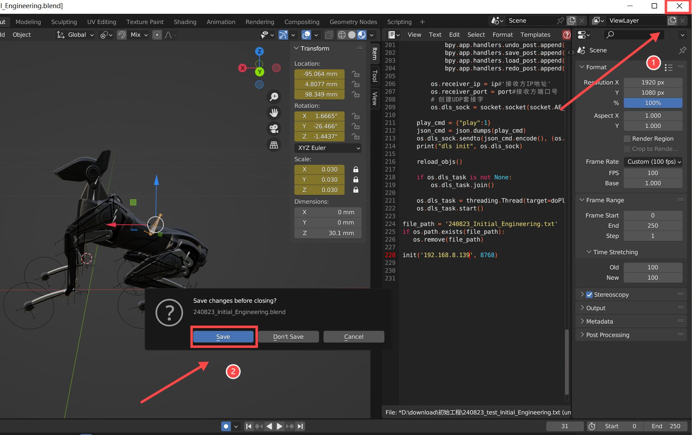
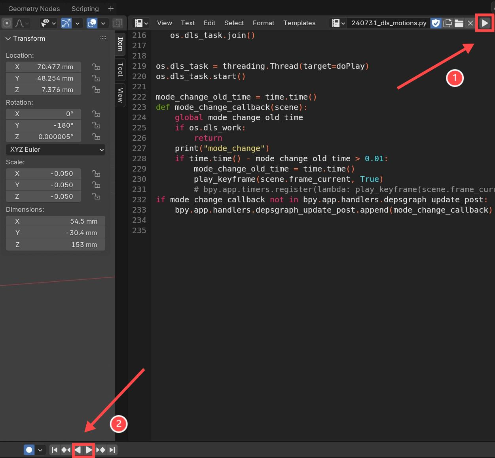
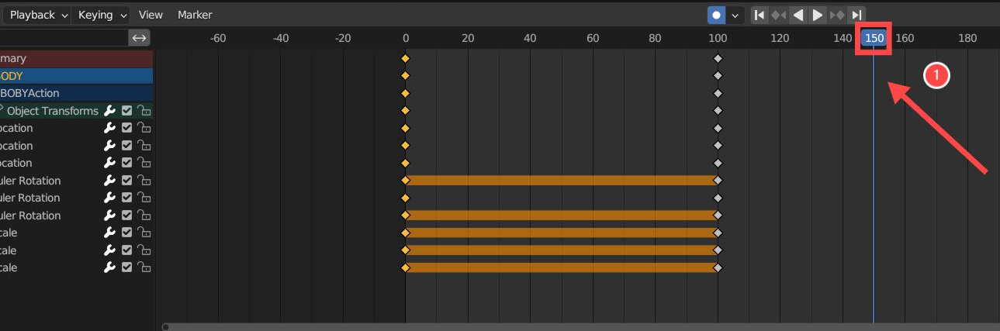
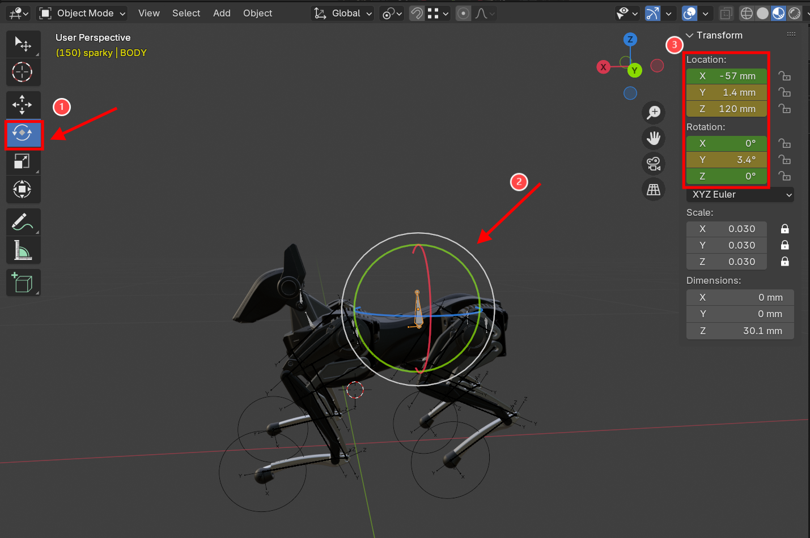
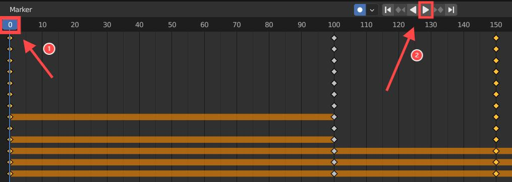
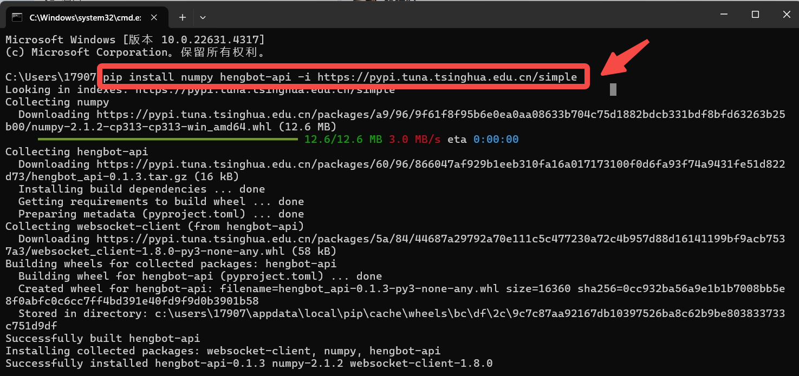
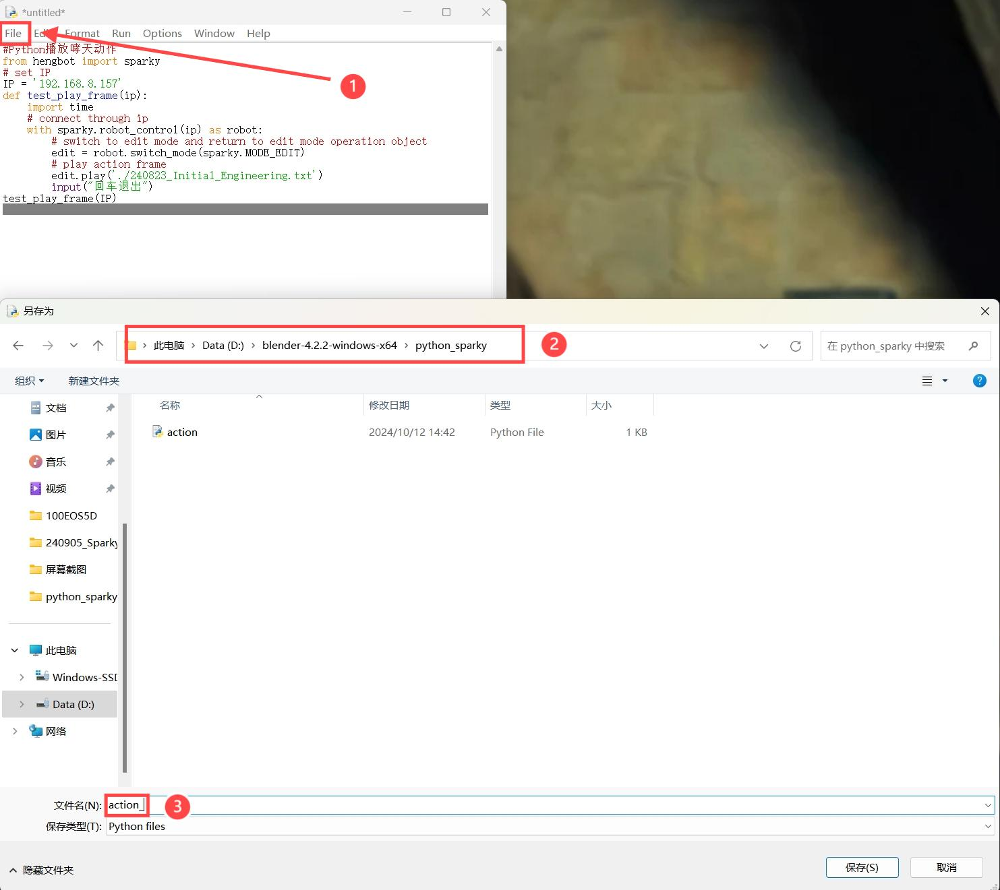
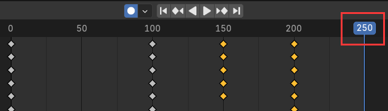
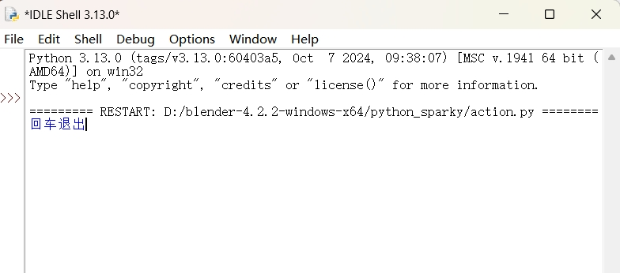
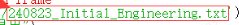

# Mid-level (Ⅳ): Blender Tutorial for Beginners

## I.Introduction

This document introduces how to use Blender to edit cool actions of Sparky and debug accordingly. The document will also demonstrate how to export and play actions through Python scripts to achieve automated demonstrations of cool actions. To help users design and master the action editing of Sparky more efficiently, let's learn what effects Blender can achieve!

## II.Results Show

<iframe width="780" height="580" src="https://www.youtube.com/embed/EkRc4fHKcsc?si=5Nd43quHA12N91ZX" title="YouTube video player" frameborder="0" allow="accelerometer; autoplay; clipboard-write; encrypted-media; gyroscope; picture-in-picture; web-share" referrerpolicy="strict-origin-when-cross-origin" allowfullscreen></iframe>

## III.Quick Guide to Experience Action Sets

> After we know what blender can achieve, will you hurry up to reproduce these interesting actions for your Sparky?
> Now, follow HENGBOT to experience the action sets!

### 3.1 Preparation

#### 3.1.1 Basic Knowledge

- Before starting, pelase read the unboxing document [“Entry-level configuration and usage”](https://hengbot-dynamics.github.io/heng-docs/docs/tutorial-basics/quick_start_guide), to learn basic configuration and usage of Sparky.
- Basic programming knowledge and running environment setup of Python are required for this document.  

#### 3.1.2 Hardware Requirements

- One Sparky
- One PC with Windows OS  

#### 3.1.3 Operation Environment

**Remove the foam from the packaging box.** During moving, prevent the product from excessive impact, such as falling down or colliding, etc. **Make sure that the Sparky is placed on a stable ground in a proper initial posture before using it.**  

#### 3.1.4 Software Preparation  

> Software preparation for both the robot dog Sparky and the PC.  

- **Start up Sparky and connect to network**

| Preparation | Reference Documents | Reference pictures |
|-------------|---------------------|--------------------|
| Power on and charging of Sparky | Please refer to the following [document](https://hengbot-dynamics.github.io/heng-docs/docs/tutorial-basics/quick_start_guide#42-startup) for the relevant operation steps.| |
| Sparky:Networking operation（ you need to manually enter WiFi mode with the left and right ear buttons.[Reference document](https://hengbot-dynamics.github.io/heng-docs/docs/tutorial-basics/quick_start_two#27-more-settings-on-the-head))| Please refer to the following [document](https://hengbot-dynamics.github.io/heng-docs/docs/tutorial-basics/quick_start_guide#51-preparation-work) for the relevant operation steps.**Tips: use the following tools to generate [QR](https://www.mywifisign.com/zh-hans) code.**||

• Download and Install Blender and the Engineering Package.  

| Steps  | Download  |
|--------|-----------|
| **Install Blender**：Download the installation package from the link on the right and complete the installation.（Blender version for demostration here：4.2.2-Windows）| [Download](https://www.blender.org/download/)|
| **Download the engineering package**: This project has already been configured with dance movements for a quick experience of Sparky's dance. Remember to extract the compressed package after downloading.（It is recommended to extract and save the project files to the same directory as Blender for future use.）||

### 3.2 Connect Sparky and Play the Action Sets

All preparations are complete, next, connect Sparky and Blender to experience action sets. Let your Sparky “dance”.

| Steps | Reference pictures |
|-------|--------------------|
|1. Double-click to open the extracted initial project. ||
|2. Change the IP address to the one on the Sparky's head (**see mark ①**); Click the button to play (**see mark ②**) |  |
|3. Shut down Blender and save codes as mark ① and ② shown in the right picture.||
|4. Restart Blender project. Click the button to run (see mark ①). Click the button to play (see mark ②). You will see the same action sets reproduced from the project.**（① Run the codes of the project including connecting Sparky.② Play/pause the action sets.）**||

## Ⅳ.How to make your Sparky “Dance”?  

>After experiencing the silky action sets in Blender, do you desire to create a set of exclusive actions for your Sparky?
>Please follow the document to learn how to make your Sparky dance.  

### 4.1 Import Initial Engineering Package

Before practical operation, we need to make some preparations.  

- Download and open a new project package.  
- Change the IP address to connect Sparky (refer to the steps above). 

### 4.2 Edit Motions for Your Sparky

> You will see that the initial frame of standing has existed in the initial project.  

As we known, `standing and lying` are two postures. Now that the frame of standing has
existed, we only need to edit the posture of lying.  

:::danger[Cautions]

When editing actions with Blender, the actions will be automatically synchronized to Sparky in real time. To avoid any incident caused by excessive movement amplitude such as bouncing, falling, or colliding, it is recommended to be extra careful when performing the following operations, or try to slow the action as much as possible.  

- When editing, please don't drag or adjust in a large amplitude, which will easily lead to the disconnection between Xiaotian and Blender.  
- After any operation, please move the cursor out of the model editing area, which prevents any damage result from bouncing or falling due to careless moving the cursor.  
- In case of disconnection, please click the button in the upper right corner to run the script again to connect.  
- If 100Hz is used as the target frame rate, the real-time preview may be lower than 100Hz due to computer performance, and the display in the upper left corner is only about 60fps,which will lead to the inconsistency between the speed of the final exported action and the preview, which needs to be considered in advance.
:::

| Steps | Reference | pictures |
|--------|----------|----------|
|1. The picture on the right shows the timeline editor. Refer to mark ① and drag the blue slider to 100 to create a new keyframe.**（0-100: The default time scale here is 100 equalling to 1 second, which can also be set to 75.）**|  |  |
| 2. Select mark① (highlight area) and **drag the cursor downwards** to make Sparky achieve a squatting posture. Then **drag the cursor to the right** to move the center of gravity backwards.Because it is difficult to understand the parameter values of squatting and moving back the center of gravity, please refer to the **mark ② demonstration parameters** for the numerical range here. |  ||
| 3. The initial project defaults to "Translation Mode" (mark ①), which only supports move Up, Down, Left, and Right. **Please switch to "Rotation Mode" (mark ②)**, and then adjust Sparky to a lying down position (mark③).Mark①: Translation ModeMark②: Rotation ModeMark④: Demo Parameters |   | **G—Translation** Press G: Click once to move along X/Y/Z axis.Click twice to switch Global and Local Axis. **R—Rotation**Press R: Click once to rotate along X/Y/Z axis.Click twice to switch Global and Local Axis. | 
| 4. Now, Sparky is nearly in a sitting posture, let's make the final adjustments.Switch to **"Translation Mode" (mark ①), use Mark②"Translation Mode" (three color reference line)**. Adjust to the desired postion and effect. And then **click “Play”button (Mark⑤)** to play actions.（**Mark①**: switch translation/rotation mode.**Mark②**: switch model view.**Mark④**: demo parameter **Mark⑤**: play/pause button (press space key to play or pause)| ||

> After editing the keyframes for Sparky lying down, transition Xiaotian from lying to standing up, completing the entire action sequence. You might be curious? Can this action 
be achieved by simply copying the keyframes of standing? Let's go ahead.

| Steps | Reference pictures  | Remarks(Principle) |
|-------|---------------------|--------------------|
|1. Copy the frame 0 to the frame 200. Now when you play the action, you find Sparky didn’t stand up fullyand didn’t lay down fully(Please refer to the remarks for the principle) | |Why? Because the center of gravity of Sparky is at the back of body when it lies down, and a force is exerted backward which makes Sparky unable to stand up when rising directly. So, we need to add a transition posture between "lying" to "standing" postures, so that Sparky's center of gravity will move forward before rising.
|2. Move the play cusor to the position of frame 150. |  ||
|3. (Rebalance): Switch to rotation mode(Mark①). Select the quadrangular prism(Mark②).Drag the green circle to balance Sparky.**（Mark③: demo parameter）** | |If we only restore the balance, we will find that Sparky still can't stand up completely, so we need to move the center of gravity of it forward.|
|4. Switch to translation mode (Mark①)and select the quadrangular prism(Mark②).Drag the red arrow to move Sparky forward.Mark③: demo parameter（Note: you can try more times or refer to the demonstration parameters for the movement. If Sparky moves forward less, it will not stand up fully, while if it moves forward too much, it will fall forward.)|||
|5. Let's witness the effect. Position the blue block to frame 0 (Mark①) and click “Play”button(Mark②).| ||
  

> So far, we have completed the action editing from “standing” to “lying” and  “standing” again.We believe that you have understood the whole operation. It’s time to edit exclusive action sets by yourself for your Sparky.  

### 4.3 Basic Operation in Blender  

For more operations and information, please see the official tutorial: [Blender 4.3 Manual](https://docs.blender.org/manual/zh-hans/dev/index.html)

## Ⅴ.Play Action Sets in Python  

After learning action editing, you may hope to apply these actions in local environment and calling by AI Large Language Model (LLM). On the purpose, we export the action files with the export function in Blender. And run the Python codes in local environment. Let’s learn how to upload, download and share these cool action sets edited in your efforts.

### 5.1 Preparation for Python

#### 5.1.1 Installation of Python

| Steps | Reference pictures |
|-------|--------------------|
|1. Click [Python Installing Package](https://www.python.org/downloads/) to download the latest version release. |   |
|2. In the Python Setup interface,check all the options (Mark①).Select and click “Install Now”(Mark②). Note: If you forget to check, please uninstall and reinstall the Python.|    |

#### 5.1.2 Configuration of Python

| Steps | Reference pictures |
|-------|--------------------|
| 1. Press `Windows + R` on the keyboad to open the “Run” dialog box. Input `cmd` and press “OK”.|  |
| 2. The Run Command Window pops up, input commands as shown in the right picture: `pip install numpy hengbot-api -i https://pypi.tuna.tsinghua.edu.cn/simple` Press `Enter` to run.|  |

#### 5.1.3 Create Python Files

After installing Python and configuring the development environment, let’s learn how to create Python files for modifications by ourselves in the future.  

```python
#Python播放哮天动作
from hengbot import sparky
# set IP
IP = '192.168.8.154'
def test_play_frame(ip):
    import time
    # connect through ip
    with sparky.robot_control(ip) as robot:
        # switch to edit mode and return to edit mode operation object
        edit = robot.switch_mode(sparky.MODE_EDIT)
        # play action frame
        edit.play('./20240808_Shaking_your_head.txt')
        input("回车退出")
test_play_frame(IP)
```

| Steps | Reference pictures |
|-------|--------------------|
| 1. Create a new file folder to save files. The folder name is customized or copy the folder name of the example.|  |
|2. Open Python IDLE.| |
|3. Click `File` (Mark①) and select `New File`(Mark②) to create a new file. |  |
|4. Copy the above codes into the new file. Click `File->Save` **(Mark①)**to save the new file into the folder `Python_sparky` **(Mark②)**. Use “English+Number” as the file name **(Mark③)** in case it was not recognized by Python. |   |

### 5.2 Export and Check the Blender File

Export action files from Blender for playing in Python.

| Steps | Reference pictures |
|-------|--------------------|
| 1. Swtich to the file (Mark①and②)`240823_udp_motions.py`and find the command line No.324 (Mark③), change the file name. Run the file(Mark④) and the system will save the file atuomatically.|  |
| 2. As the recommendation, we have saved the engineering files in the same directory with the Blender installation file, now let’s turn to the directory to open the `“txt”` file.  Note: we have to check whether the line number of action commands is same with the number of the final line.|   |
| 3. Drag the slider to the bottom (Mark①) and select the last characters (Mark②) to observe the number of lines (Mark③). |  |
| 4. The position of the slip is the end of the frames (see the red box) after playing the actions. Check whether the number of lines nd the number of the frames is consistent (the start number of the frame is 0, so the number of lines will be one less than the number of frames).|  |

After exporting and checking the text file, we can try to play the actions in Python.

### 5.3 Playing Actions in Python

:::danger[Note]
Before play another action, the current action shall be ended.  
:::

| Steps | Reference pictures |
|-------|--------------------|
|1.Find the file `action.py` Chage the IP address the one on the head of Sparky(Mark①).Change the file name into the name of the exported `txt` file(Mark②).（Note: both the `action.py` and `txt` files are in the same directory.) |   |
|2.Click `Run` **(Mark①)** and click `Run Module` **(Mark②)** to run the Python programe.||
|3.The run program will be displayed in Python window, and the local running effect in Sparky is like the video on the right.|  |

## Ⅵ.FAQ

### 6.1 Q: Python program has an error that cannot be connected. How to solve it?  

```python
Traceback (most recent call last):
  File "D:\桌面\Python播放动作\action.py", line 14, in <module>
    test_play_frame(IP)
  File "D:\桌面\Python播放动作\action.py", line 10, in test_play_frame
    edit = robot.switch_mode(sparky.MODE_EDIT)
  File "C:\Users\Administrator\AppData\Local\Programs\Python\Python312\Lib\site-packages\hengbot\sparky.py", line 116, in switch_mode
    self.ws.send('{"cmd": "Mode_Switch", "target": "' + target + '"}')
  File "C:\Users\Administrator\AppData\Local\Programs\Python\Python312\Lib\site-packages\websocket\_app.py", line 290, in send
    if not self.sock or self.sock.send(data, opcode) == 0:
  File "C:\Users\Administrator\AppData\Local\Programs\Python\Python312\Lib\site-packages\websocket\_core.py", line 297, in send
    return self.send_frame(frame)
  File "C:\Users\Administrator\AppData\Local\Programs\Python\Python312\Lib\site-packages\websocket\_core.py", line 337, in send_frame
    l = self._send(data)
  File "C:\Users\Administrator\AppData\Local\Programs\Python\Python312\Lib\site-packages\websocket\_core.py", line 559, in _send
    return send(self.sock, data)
  File "C:\Users\Administrator\AppData\Local\Programs\Python\Python312\Lib\site-packages\websocket\_socket.py", line 152, in send
    raise WebSocketConnectionClosedException("socket is already closed.")
websocket._exceptions.WebSocketConnectionClosedException: socket is already closed.
```

A：  
• Check whether Sparky is started up.
• Check whether Sparky and the PC are on the same LAN.
• Check whether the IP address on the screen of Sparky and the IP address of the Python 
file are consistent.

### 6.2 Q: Python program has an error that failed to find this file. How to solve it?  

```python
Traceback (most recent call last):
  File "D:\桌面\Python播放动作\action.py", line 14, in <module>
    test_play_frame(IP)
  File "D:\桌面\Python播放动作\action.py", line 12, in test_play_frame
    edit.play('./240823_Initial_Engineerin.txt')
  File "C:\Users\Administrator\AppData\Local\Programs\Python\Python312\Lib\site-packages\hengbot\sparky.py", line 451, in play
    with open(path, 'r', encoding='utf-8') as f:
FileNotFoundError: [Errno 2] No such file or directory: './240823_Initial_Engineerin.txt'
```

A:  
• Check whether the file exported from Blender is placed in the Python file directory.
• Check whether the text name in Python file is consistent with the file name exported 
from Blender.



### 6.3 Q: Sparky will jump after the Python program runs. How to solve it?  

A: After the action is finished, press Enter key for seven times in the IDLE Shell window,and then run the program.  

### 6.4 Q: Python program has an error that "numpy" and "hengbot-api" cannot be found. How to solve it?  

- Press the "Windows" key and the "R" key at the same time to open the "Run" dialog box. Type "cmd" and then press the "Enter" key. In the command prompt window, execute the following command line.  

```python
pip install numpy hengbot-api -i https://pypi.tuna.tsinghua.edu.cn/simple
```