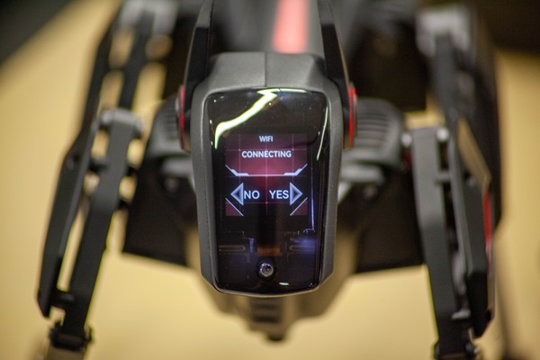
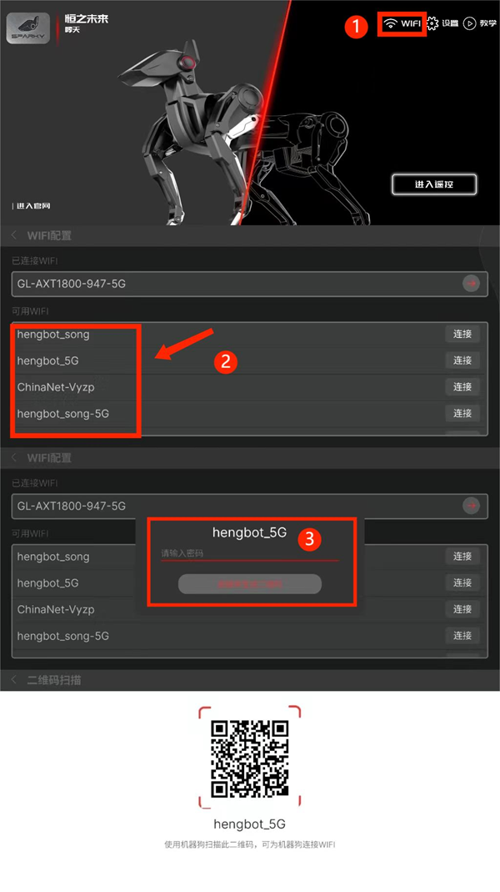
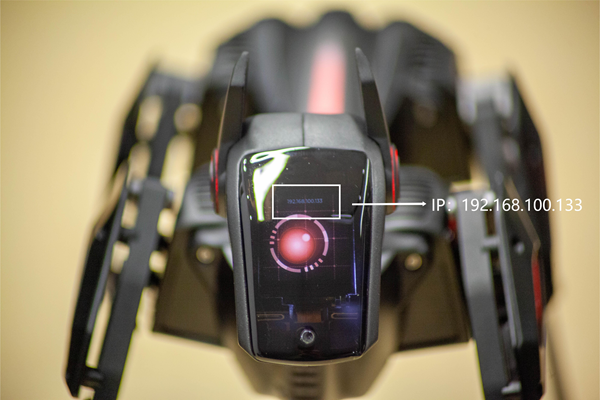

# 哮天快速使用指南_V1.0

## 一、开机启动

> 建议搭配快速启动说明页一起食用更佳噢，文档以简洁明了的模式快速阐述哮天的基础使用过程。
> 如有需更详细或进阶版本的用户可期待后续开箱以及使用等其他文档。

## 下载 HENGBOT APP

HENGBOT 软件下载：请先下载手机 APP 应用方便后续更多操作。

APP 下载链接：

**第一步**：开箱后，我们需要先将哮天整机从安全箱里取出以趴着的形态放在平整的地面或台面。

**第二步**：放置好后长按背部电源键三秒进行开机启动操作，电机灯条点亮即为开机成功，哮天将收回四肢并站立。

:::danger[Take care]

注意：哮天在电量充足的情况下可实现 45-60min 的不插电使用，但我们更建议使用 Type-C 线接入电脑端或充满电进行操作优化体验感，这是因为电量告急/关机时电机掉电卸力极易导致机身碰撞。

:::

以下为哮天的使用小技巧，便于您在使用途中提升体验感。

| 项目  | 使用技巧 |
| ------------- | ------------- |
| 充电 | 请使用官方充电设备接入 SPARKY哮天 机身尾部为其充电，此时机身尾灯会呈闪烁状态。 |
| 头部交互 | 左右耳按键可进行选项选择或调节，头顶触摸可确认选项。 |
| 关机 | 关机时请握住哮天机身避免因电机掉电导致不必要碰撞。 |
| 查看电量 | 头部显示屏区 IP 显示上方可看到电量进度条，电量条告急时请记得进行充电噢~|
> 

## 二、网络配置 

启动后 SPARKY哮天 会呈站立动作，头部显示屏亮起并提示我们进行网络配置。
此时参考使用技巧里的头部交互模式 **按下左耳按键选择"是"** 即可。

使用扫码前我们先介绍扫码连接的两种方式，分别是：WiFi 热点连接以及局域网连接。

:::danger[Take care]

1. 网络不支持任何以中文及中文符号、空格形式的 WiFi 连接（建议以英文格式为名称使用）。
2. 开启 WiFi 热点模式时勿开 AP 隔离，会影响双设备进行通信。

:::

### 方式一：WiFi 热点连接
使用手机**开启 Wi-Fi 热点模式（支持 2.4G 及 5G 的频段）设置密码以及名称并勾选允许被其他设备发现**，开启完毕后回原页面点击以二维码展示备用。

[WIFI图]

### 方式二：局域网连接
>部分机型会出现开启热点后无法生成二维码的形式，
>那就直接使用 HENGBOT 的 APP 来连接局域网的网络生成二维码给哮天进行网络配置。

打开 HENGBOT APP 软件后来进行局域网连接配置，打开后 **点击右上角的 WiFi 图标** 进入 WiFi 配置内页，**选择想连接的网络**（优先使用同局域网下的 WiFi）按照参考图例 **输入密码**，软件会自动生成二维码备用。

### 如何进行配置

哮天按下 “是” 的按钮后会弹出摄像头扫码模式，此时任意选择一种方式生成二维码并把二维码对准头部的摄像头。

SPARKY哮天会自行扫描并连接网络。连接后头部显示屏会显示 IP 地址，我们可以使用 IP 地址来与其他设备通信实现更进阶的遥控使用。

## 三、APP 遥控使用

:::tip[]

配网时我们就使用过 APP 来生成二维码进行网络配置，而在这里我们将用 APP 连接 SPARKY哮天 来实现更多有趣的应用及操作，一起与 HENGBOT 来认识它吧！

:::

**第一步**：进入软件内页后我们可以看到左右侧不同的功能组块，分别是左侧的 “进入官网” 可进入 HENGBOT 官网了解更多详细信息，而我们**需要进入右侧 “进入遥控”** 页面实现更多有趣操作。

**第二步**：进入遥控操作页面后，**点击左上角的 WiFi 速率图标**让软件与哮天进行连接（设备通信）。

**第三步**：点击后会弹出 IP 地址输入页并输入**哮天的 IP 地址**进行保存操作，APP 会自动与哮天进行连接操作。

### 遥控功能图

SPARKY哮天 连接后会回到遥控页面，遥控页面由不同功能的滑条、摇杆及按键组成的。而 HENGBOT 还在里预置了各种花样整活 “动作组” 以及各类运动姿态，与我们一起来认识都有什么好玩的功能吧！

### 体验步态运动

前文熟悉了相关的遥控组件功能，接下来可以参考图例来尝试让 SPARKY哮天 验证遥控功能实现步态运动吧！

:::danger[Take care]
注意：在遥控过程中息屏后连接会断开，再次使用需要重新进行 IP 地址连接。
:::

### 体验头部机身运动

上一步我们验证了摇杆控制步态的功能，趁热打铁一起来验证其余的摇杆组件及滑条实现头部及机身关节的更多运动用法。

### 体验 APP 动作组

搓搓小手期待已久的 SPARKY哮天 “花活” 终于与大家见面了！让我们把好奇心及目光放到遥控页面正中间的 “狗狗” 按键，那是 HENGBOT 提前预置的动作技能：伸懒腰、跳舞、画圈等。

## 四、更多使用小技巧

:::danger[Take care]
注意：任何情况下按顶部急停按键后哮天的所有电机会进行卸力操作，请按下之前先扶好哮天的机身腰部，避免出现卸力摔倒损坏机身及电机。
:::

