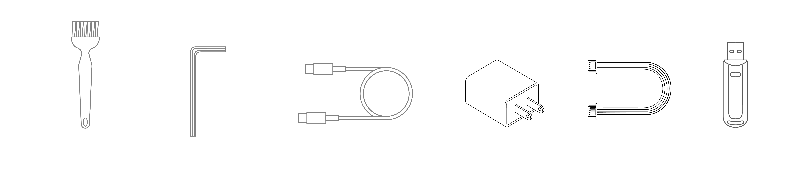
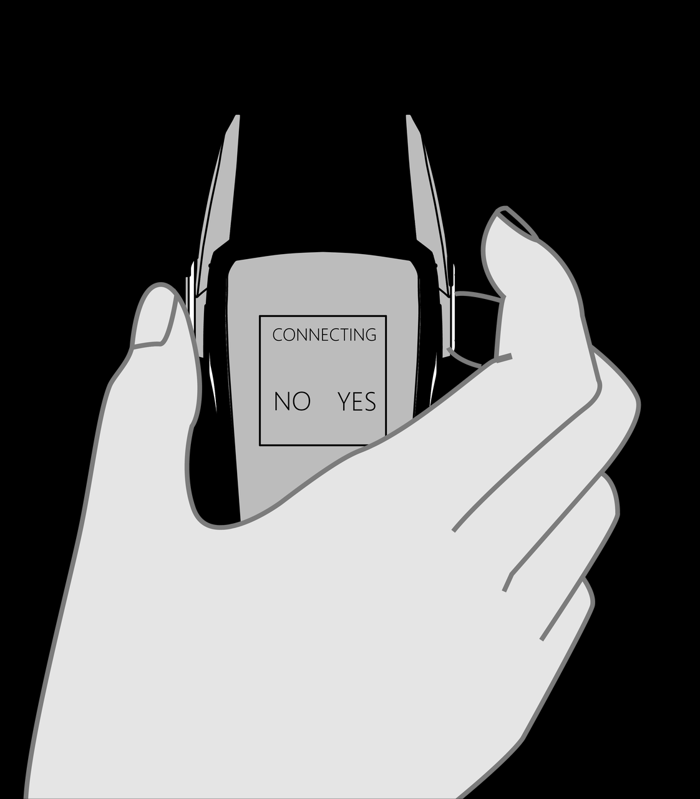
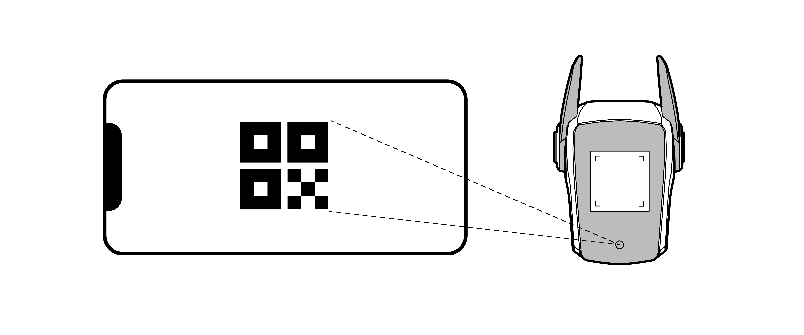
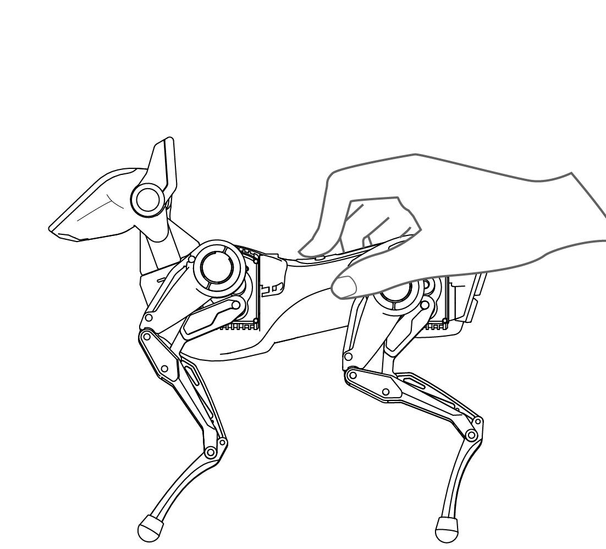
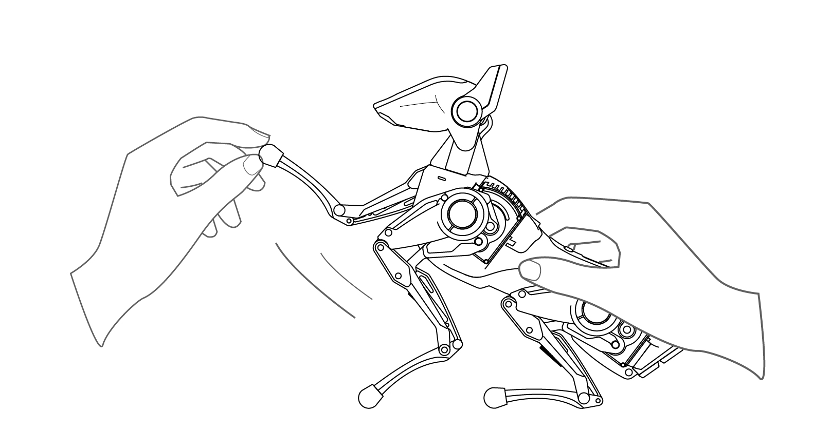
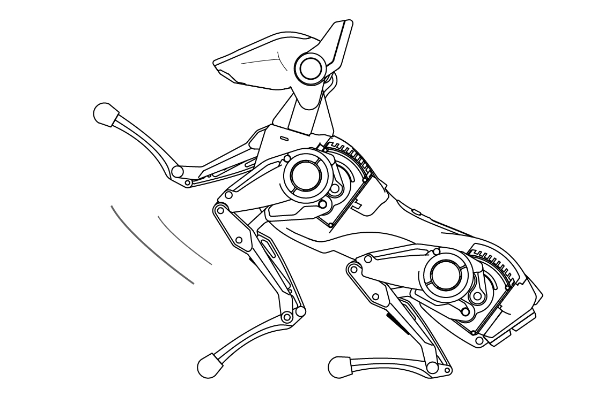
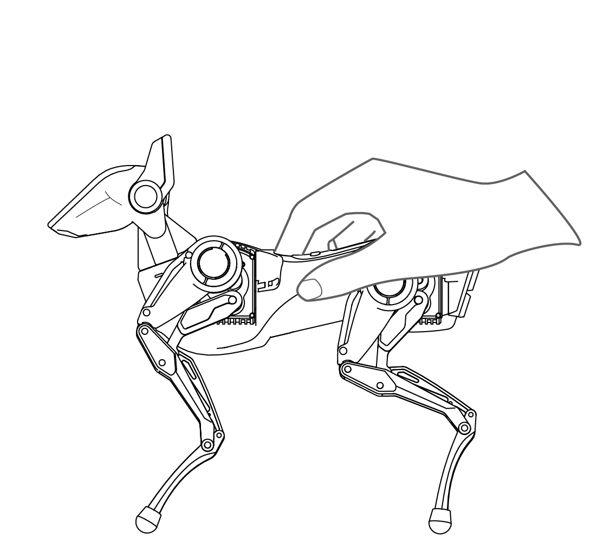

# SPARKY Product Manual

Thank you for choosing SPARKY, the Hengbot Quadruped Robot!

SPARKY is a nimble and agile robotic companion equipped with a Cortex-A7 1GHz processor. By prioritizing aesthetics and user experience, we have refined SPARKY's design and structure over the years. Its legs feature modular linkages and integrate an AIA actuator unit, allowing you to upgrade SPARKY's power system as easily as changing a four-wheel drive car motor and customize a one-of-a-kind SPARKY just like swapping phone cases.

May everyone enjoy SPARKY's guardianship and companionship.

##  Product Introduction

- **Host**
  

- **Attachment List**

Cleaning brush / hex key (Allen wrench) / Type-C USB data cable / charger / peripheral connection cable / SD card reader.

##  Basic Parameters

| Name  | Parameter |
| ------------- | ------------- |
| Product Dimensions | 250x130x250mm |
| Total Weight | 850g |
| Maximum Load | 300g |
| Operating Environment | Operating Temperature: 0-30°C |
| Battery Life | 45 minutes to 1 hour 30 minutes |
| Maximum Speed | 0.5m/s |
| Power Interface | 5V2A（PD fast charging） |
| Communication Interfaces | USB/WIFI/Serial/IIC |
| Operating System | Linux |
| Programming Languages | C/C++/Python |

## Quick Start Guide

:::tip[Use Tip]

Note: Please use the official charging equipment to charge SPARKY by connecting it to the rear of the SPARKY body before powering on.

:::

- **Powering On**

Place SPARKY on a flat surface, and long-press the power button for 3 seconds to turn it on.

After powering on, SPARKY retracts its limbs.

SPARKY stands upright after retracting the four limbs.

- **Download and Install the SPARKY's App**
  
Users can temporarily install the app using the software installation package we have provided to you. If this causes any inconvenience, we apologize and appreciate your understanding. We will soon release the app on major application stores, so please stay tuned for updates.

[APP二维码]

- **Connecting SPARKY Through the App**
  
**Method 1: SPARKY Connects to the Same Wi-Fi Network as the Phone**

1. Enable Wi-Fi sharing on your phone and display the QR code.
2. Use SPARKY's camera to scan the QR code displayed on your phone screen.
3. Follow the prompts to manually input the Wi-Fi password and complete the connection.

**Method 2: SPARKY Connects to the Phone's Hotspot**

1. Enable the hotspot on your phone and display the QR code.
2. Use SPARKY's camera to scan the QR code displayed on your phone screen.
3. Follow the prompts to manually input the hotspot name and password.
4. Use your phone to scan the QR code displayed on SPARKY's screen to complete the connection.

>Note: When the device is connected, you can perform all operations within the software. When the device is not connected, some functions are available, but control functions are not accessible.

  Follow the app's instructions to generate a QR code. Then, use SPARKY's camera to scan the QR code for network connection.

- **Select an Appropriate Area for Controlling SPARKY**

A clean desktop or a level working surface can provide a relatively ideal control environment, helping 
to enhance the precision of controlling SPARKY and ensuring smooth task execution.

## Function Explanation

>**With an accompanying app interface diagram below, annotated with functions and usage instructions**

- Omni-Directional Remote Control: Control SPARKY's movement or perform specific actions. The system comes with pre-set action sets, allowing users to command SPARKY to execute these actions.
- Live Video Feed: The app can receive the live video feed from SPARKY's camera.
- Unleash Skills: Achieve agile and lifelike movements, with several sets of nimble actions preloaded in the app for user selection.
- Edit Actions: Develop custom nimble actions for SPARKY with zero programming knowledge. Users can customize SPARKY's actions through fast recording, manual teaching, and editing in director mode. These custom actions can be saved and replayed.
- AI Capabilities: SPARKY's head features a camera, display screen, microphone, and speaker, enabling AI functions like facial recognition, facial tracking, object recognition, and color tracking.
- Advanced Player Development Platform: Hardware development interfaces are exposed on the back, facilitating debugging and development. An API for robot motion control software is provided.

>Note: For information about the head circuit board, you can visit the MaixPy3 documentation on the Sipeed Wiki website.

## User Instructions

- **Retain the Packaging Box**
Please keep this packaging box for future transport and storage to prevent unnecessary damage to the robot when it's not in use.

- **Powering On and Off**
Press and hold the power button for 3 seconds to start SPARKY. To turn it off, press and hold the power button for 3 seconds again. Welcome to the beginning of your robot exploration journey!

:::danger[Take care]

When powering off, please hold SPARKY's body by hand to prevent any unintended collisions due to the motors losing power.

:::

- **Head Interaction**

Adjustment Options for Left and Right Ear Buttons

[交互英文版图片]

Top Touch for Confirming Options

[交互英文版图片]

If not in use for an extended period, while in remote control mode or action editing mode, or when clicking on specific menu options, SPARKY will enter Free Mode (indicated by eyes displayed on the screen). In Free Mode, the eyes will track faces, and there will be sound and light feedback when touching the head. To exit Free Mode at any time, simply press any of the ear buttons.

- **WiFi Connection**
  
To enjoy most of SPARKY's features, it needs to be connected to your WiFi network or your mobile hotspot for seamless remote control and real-time monitoring.

**Method 1: SPARKY Connects to the Same WiFi Network as Your Phone**
1. Enable WiFi sharing on your mobile phone to generate a QR code.
2. Use SPARKY's camera to scan the QR code displayed on your phone's screen.
3. Follow the prompts to manually input the WiFi password, and complete the connection.
   
**Method 2: SPARKY Connects to Your Phone's Hotspot**
1. Enable the hotspot on your mobile phone to generate a QR code.
2. Use SPARKY's camera to scan the QR code displayed on your phone's screen.
3. Follow the prompts to manually input the hotspot name and password.
4. Then, use your mobile phone to scan the QR code displayed on SPARKY's head screen to finalize the connection.
   
>These methods will ensure a smooth connection for remote control and real-time monitoring of SPARKY's functions.

- **Remote Control**

After successfully connecting SPARKY to the network, you can remotely control SPARKY using the mobile app or an optional remote control joystick. Through the interface's virtual joystick, you can control SPARKY's 14 degrees of freedom for omnidirectional movement, including forward and backward motion, left and right turns, pitch, yaw, and head movements.

- **Action Editing**
  
Through the editing feature, you can customize SPARKY's performance, making it your most personalized companion and exploring endless possibilities!

**Method 1: Teaching Mode**

In this mode, you can manually pose SPARKY into the desired positions. SPARKY will record these key positions and reproduce them sequentially.

**Method 2: Editing Mode**

You can adjust SPARKY's actions within the app's interface. Follow the prompts to create more complex action sequences.

**Method 3: Simple Gestures Through Head Interaction**

You can also perform simple gesture-based action editing directly through head interaction without opening the app. 

> Note: This method can not be used to name or permanently save edited actions; it only supports
recording and playing back actions on the fly.

With these methods, you can tailor SPARKY's actions to your liking, making it your unique companion for endless exploration!

1. **Manually adjust SPARKY's pose**

2. **SPARKY replicates the manually adjusted poses**

In manual teaching mode, the motors will be disengaged. When you receive a disengagement prompt, please hold SPARKY's body by hand to prevent any unintended collisions.

### About Heat Generation

SPARKY generates heat during operation, and the motor temperature may rise after prolonged use, which is a normal occurrence. Please ensure that you place it in a well-ventilated environment during use. Additionally, SPARKY has overheat protection mechanisms. When the motor temperature becomes too high, it will automatically disable the affected motor and restart it when the temperature returns to a reasonable range.

- **About Charging**

When the robot's battery level is low, connect it to the provided charger for charging to maintain its continued efficient performance. SPARKY needs to be charged under indoor temperature conditions, and when the battery is completely depleted, it is expected to take approximately 100 minutes to fully charge.

- **About Cleaning**

When cleaning the robot, be sure to turn off the power and disconnect it from the charger. You can use the included small brush to clean the actuator grooves. For the head cover and other parts, gently wipe them with a soft, damp cloth, avoiding direct splashes of water or other liquids onto the robot's surface.

## Safety Precautions

:::danger[To prevent overheating, fires, and other potential dangers, please strictly adhere to the following safety precautions:]

- The product has a built-in lithium-ion battery and should not be disassembled or replaced.
- Use a power adapter with an output specification of 5V/2A to charge the product.
- Do not place the product in or near an open flame or heat source, and do not place it in a microwave oven.
- Avoid exposing the product to extremely hot weather.
- Do not use the product in damp environments, such as near bathtubs, sinks, or swimming pools.
- Do not disassemble, crush, or puncture the product.
- Avoid subjecting the product to excessive impact, such as dropping it from a height.
- The normal operating temperature range for the product is 10°C to 30°C; please avoid using your product in extremely hot or cold environments.
- Keep the product dry and avoid spilling food or liquids on it.
- Disposing of this toy improperly may have environmental impacts, so please recycle or dispose of it properly.

:::

## Maintenance Records

| Date | Serial Number | Issue Description | Maintenance Personnel |
| ------------- | ------------- | ------------- | ------------- | 
|  |  |  |  |  
|  |  |  |  |  
|  |  |  |  | 