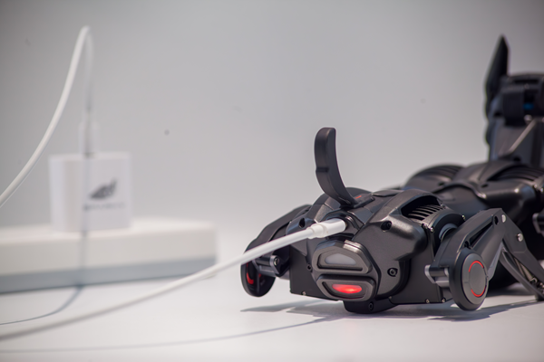

# Sparky 哮天使用说明书

感谢选择恒之未来四足机器人 Sparky 哮天！Sparky 哮天是一款灵动灵巧的机器人伙伴，搭载 Cortex-A7 1GHz 处理器。颜值当道，体验为先。哮天的造型与结构经过多年打磨，它的腿部采用模块化连杆设计，搭载 AIA 一体化电机单元，让您可以像更换四驱车马达一样升级哮天的动力系统，也可以像更换手机壳般定制一款独一无二的哮天。让每一位“二郎神”，都有哮天机器人的守护与陪伴。  

## 产品介绍 

- **主机**
  
| 主机正面标注图 | 主机背面标注图 | 
|----|----|
| |  |

- **配件清单**

从左至右：清洁刷  六角扳手  Type-C USB数据线 充电器 SD读卡器  

## 基本参数
| Name  | Parameter |
| ------------- | ------------- |
| 产品尺寸 | 250x130x250mm |
| 整机重量 | 850g |
| 最大负载 | 300g |
| 工作环境| Operating Temperature: 0-30°C |
| 续航时间| 45 minutes to 1 hour 30 minutes |
| 最高速度 | 0.5m/s |
| 电源接口 | 5V2A（PD fast charging） |
| 通讯连接 | USB/WIFI/Serial/IIC |
| 操作系统 | Linux |
| 编程语言 | C/C++/Python |

## 快速入门指引

- **开机**

:::tip[Use Tip]

将 Sparky 放置到平面上，长按电源键3秒开机。
注：请在开机前使用官方配套充电设备接入 Sparky 机身尾部为其充电。

:::

| 按下背部按键开机 |开机后收紧四肢 | 收紧四肢后站立 |
|---|---|---|
|  | |  |

- **下载安装应用 Sparky's App**
  
用户可暂时通过我们向您发布的软件安装包进行安装APP，如给您带来的不便，还请谅解，我们将尽快将APP发布于各大应用市场中，敬请期待。

> 链接

## 使用小技巧

| 功能         | 使用技巧 | 备注 |
| -----------  | ----------- | ------- |
| **使用环境** | 使整洁的桌面或平整的工作地面可以提供一个相对理想的操控环境，请勿在有水或其他液体的户外地面上操作，有助于提高您操控哮天的精准度，确保任务的顺利进行。|  |
| **查看电量** | 哮天头部顶端会**实时显示电量条**，电量充足的情况下，哮天可**实现 45-60min 的不插电使用**，如电量低时，它会发出**提醒（狗狗）叫声并自动关机恢复趴下状态.** |  |
| **充电** | 我们建议您**使用哮天官方认证的充电器**，以确保安全和效果。在充电过程中，您可以通过尾灯颜色变化来了解充电状态：**红色表示正在充电**，蓝色则意味着充电已完成。|  |
| **开机** | 长按背部电源键三秒进行开机操作 |
| **关机** | 一种是头部 UI 程序进行系统关机，另一种是长按背部电源键进行关机。|
| **头部交互** | 左右耳按键功能一致，均可进行选项选择或调节，头顶触摸可确认选项。|  |
||长期不使用遥控状态，动作编辑状态或点击菜单相应选项会进入自由模式（显示屏显示眼睛），自由模式时眼睛会追踪人脸，触摸头部会有声音动作与灯光反馈。此时，按任意耳朵键可退出自由模式。||
| **发热** |哮天长时间使用后电机温度会升高，这是正常现象，请确保您在通风良好的环境中使用。此外，哮天内置过热保护程序，当电机温度过高时该电机将主动失能，待其温度降到合理范围内再重新启动工作。| |
| **清洁** | 长时间使用哮天导致积压灰尘时，可使用附赠小刷子对执行器凹槽进行清洁，头部面盖及其他部位可使用柔软的湿布轻轻擦拭，但在清洁时确保哮天在关闭电源且不在充电状态下，避免将水或其他液体直接溅到机器人表面。|  |

:::danger

**注意事项**：为避免出现过热、起火等危险情况,请严格遵守以下注意事项:

- 产品内置锂离子电池,不可以拆卸或更换；
- 请使用规格输出为 5V/2A的电源适配器为产品充电;
- 请勿将产品放置在火中或火源附近,请勿将产品放置在微波炉中;
- 请勿将产品放置在炎热的天气暴晒;
- 请勿在潮湿的环境中使用产品，例如,浴缸、水槽或游泳池附近:
- 请勿拆卸、挤压或刺穿产品;
- 请勿让产品受到过度冲击,例如从高处跌落;
- 产品正常工作温度范围为10°C至30°C，请避免在极热或极冷的环境中使用您的产品;
- 请保持产品干燥,不要将食物或液体洒在产品上;
- 随意丢弃此玩具,可能会对环境造成影响,请妥善回收处理。
:::
