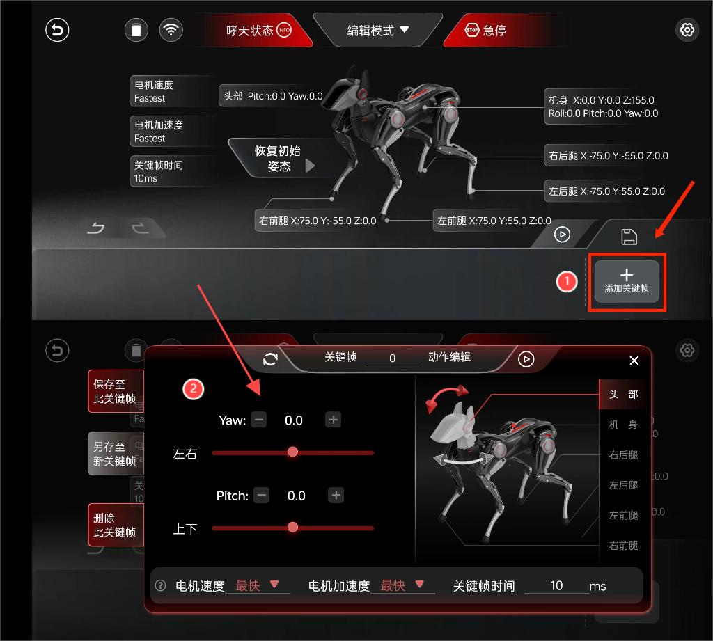

# Mid-level (I): Advanced APP Operation

## I.Preface  

Hey, the future Sparky training master! You have embarked on an exploration journey with your Sparky. Familiarizing yourself with its startup, interaction, and usage process, which undoubtedly adds a lot of fun to life. Now, let's take action editing to the next level and create more unique action sets for your Sparky.

## II.Preparation Work

| Steps	 | Introduction |
|--------|---------|
|**Software**: download the APP and install it according to the prompts.|  |
|**Environment**: Sparky has been connected to the Internet and successfully connected to the mobile App.| This section will not repeat the basic configuration and other operations. Please refer to this document: Unboxing:[Entry-level Configuration and Usage](./quick_start_guide.md) for relevant information.|

## III.Keyframe Mode  

**Keyframe Mode (Edit Mode)**: Provides more accurate control ability, allowing to adjust the action details of each frame of Sparky, including parameters such as speed, acceleration, pause time and angle; While editing parameters, the values will be sent to the device for synchronous adjustment. This mode enables precise adjustment of each frame action, thereby achieving higher precision and high control system.

<iframe width="780" height="400" src="https://www.youtube.com/embed/razfjav5x6A?si=_TeCl-8AE6svFB4b" title="YouTube video player" frameborder="0" allow="accelerometer; autoplay; clipboard-write; encrypted-media; gyroscope; picture-in-picture; web-share" referrerpolicy="strict-origin-when-cross-origin" allowfullscreen></iframe>

> **Users can be familiar with the use of Keyframe Mode according to the effect video. The following is a breakdown of the steps in the text version. If you have any questions, please refer to the details.**

### 3.1 Enter Keyframe Mode

| Reference pictures | Steps |
|------|-----|
|| **Label 1**: Switch to Edit Mode through the top bar.**Label 2**: After entering the page, it prompts to restore the initial posture. Press "OK" to confirm. The editing page displays the joint parameters of Sparky in its initial posture as a reference for users when editing actions. |

### 3.2 Create new keyframes

| Reference pictures | Steps |
|--------------------|-----|
||**Label 1**: (New Keyframe) Click "Add Keyframe" to enter the editing page.**Label 2**: (Edit Page)Users can modify the XYZ three-axis parameters of the head, body, right hind leg, left hind leg, left front leg, and right front leg on the page, create keyframes for one frame of Sparky, and perform operations such as save, save as, and delete.|

### 3.3 Example keyframes (breakdown steps)

The following is an example of a keyframe for creating a Sparky's head up and butt twist. The specific parameter values are for reference only.

| Joint | Parameters |
|-------|-----|
| **Head** | `Yaw`: controls the left and right rotation of the neck. `Pitch`: controls the up and down movement of the head.|
| **Body** | `Roll`：Control the rolling motion of the body. `Pitch`：Control the pitch motion of the body. `Yaw`：Control the yaw motion of the body. |
| **Legs** | `X-axis`: Control the forward and backward movement of the legs. `Y-axis`: Control the left and right swing of the legs. `Z-axis`: controls leg movement up and down. |

After understanding the joint parts, parameters and their definitions that we can modify, let's create a new keyframe!

| Steps | Reference pictures (comparison before and after modification) |
|---------|-------|
| **Step 1. Edit the head parameters**: We need a keyframe for creating a Sparky's head up and butt twist. To achieve this, the Pitch parameters need to be modified to lift the head, and at the same time, in order to make Sparky look more agile, the Yaw parameters need to be modified to achieve left and right neck turning. |  |
| **Step 2: Edit the body parameters**: In order to make the overall movement more coordinated, when Sparky's head is lifted, we also tried to modify the body pitch parameters to achieve the twisting of the buttocks with the tail of the body raised and the front lowered. We also added the Yaw parameter to the neck, and the body can be fine tuned with this parameter. | |

**Step 3: Edit quadruped parameters**: When adjusting, pay attention to the original parameters of each leg to ensure natural and coordinated movements. The legs can be modified to include left hind leg, right hind leg, left front leg, and right front leg. To match the posture of the body, the upper and lower parameters of the legs need to be adjusted, lowering the position of the front legs and raising the position of the hind legs to achieve a twisting posture for Sparky.

| Reference pictures (right hind leg) | Reference pictures (left hind leg) |
|-----|-----|
|| |

During the fine-tuning process, it is possible that raising the hind legs may cause Sparky to become unstable. At this point, the parameters of the hind legs can be fine tuned to make the support surface of the hind legs wider and stand more steadily.

| Reference pictures (left front leg) | Reference pictures (right front leg) |
|-----|-----|
| | |

After completing all parameter adjustments, we can adjust the keyframes to 200ms to observe Sparky.

|  Steps | Reference pictures |
|------|-------|
| **Step 4: Save keyframes**: After editing, click the save button on the left (labelled as 1) to save the keyframes of this frame. |  |
| **Step 5**: Play keyframes: Clicking on the play icon (triangle) in the lower left corner will play this keyframe. |  |

<iframe width="780" height="400" src="https://www.youtube.com/embed/razfjav5x6A?si=_TeCl-8AE6svFB4b" title="YouTube video player" frameborder="0" allow="accelerometer; autoplay; clipboard-write; encrypted-media; gyroscope; picture-in-picture; web-share" referrerpolicy="strict-origin-when-cross-origin" allowfullscreen></iframe>

### 3.4 Adjust Parameter Items  

- **Label 1: After clicking the play button, the edit button will pop up.**
- **Label 2: Click to enter the parameter editing page.**

- **Adjust motor parameters**

| Parameter items | Related meanings and operations | Remarks |
|-------|-----|-----|
||||
| **Adjust the motor speed (label 1)** | There are four options for motor speed adjustment: fastest, fast, slow, and slowest. | If the motor speed is adjusted to the fastest, the motor's response speed will be the fastest, which means it will quickly complete the actions of the action sets. Similarly, if the motor speed is adjusted to the slowest, the actions of the action sets will be completed in a slow and smooth state. |
| **Adjust motor acceleration (label 2)** | There are four options for adjusting motor acceleration: fastest, fast, slow, and slowest. | |
| **Adjust keyframe time (label 3)**| You can adjust the time of keyframes here, and it is recommended to set a frame time of 200ms. | |

- **Save, Save As, Delete Keyframes**

| Parameter items | Related meanings and operations |
|-----|-----|
|| |
| **Label 1: Save to this keyframe** | Click this option to save the currently edited keyframe to the current action sequence. | 
| **Label 2: Save as new Keyframe** | Select this option to save the currently edited keyframe as a new independent keyframe. |
| **Label 3: Delete this keyframe** | Click this option to remove the currently selected keyframe from the action sequence. | 

## IV.Conclusion  

The above content is a user guide for advanced remote control gameplay. For users with much curiosity, understanding the principles behind these remote control operations is very important. Therefore, we will now explore the core of remote control operations - the remote control API interface. Let's explore together.

<!-- ## 四、拖拽示教模式（暂未开放）

> 此功能暂未开放，后期会陆续开放，敬请期待。

在示教模式下，用户可摆动哮天的四肢和机身来教会它新动作。同时它会通过其电机位置传感器来记录动作，当需要复现动作时，哮天将执行记录的每一个动作或姿势。这种模式让个性化训练过程变得既简单又充满乐趣。

> 使用流程图  
> 

### 4.1 快速录制（示教）使用

### 4.2 进入示教模式

| 示例图 | 操作描述 |
|------|-----|
|  | 我们可通过顶栏切换到示教模式，进页面后会提示恢复初始姿态，按“确认”即可。|
|  | 页面上显示了哮天的俯视线稿图，所有电机部位默认以红色高亮显示，并处于锁定状态。这意味着这些部位目前被固定，无法移动或执行动作。 |
|  | （图例：全身关节已解锁状态）开启录制前，用户根据动作需求点击 “锁” 的图标解锁相应的关节，解锁后关节呈卸力站立姿态，我们可开始对哮天“摆动作”进行录制。 |

### 4.3 开启动作录制

:::danger[Take care]
1. 录制新动作时，请考虑哮天的平衡或支撑力是否足够，防止哮天复现动作时重力不稳往后弹或跌倒。
2. 播放新录制的动作时，为防止录制完成后电机上电后导致机身弹起请握紧机身。
:::

| 示例图 | 操作描述 |
|------|-----|
|  | **第一步（进入录制）**：点击“添加动作”后进入“录制动作”，页面会提示三秒掉电倒计时，计时结束哮天进入站立但关节卸力姿态。**第二步（开始录制）**：在录制过程中，页面将持续显示计时，方便熟悉录制时长。我们可为哮天设计一系列有趣的动作，比如让它抬头、扭动身体等。同时也可参照示例动作组进行学习和复现。|
|  | **第三步（结束录制）**：录制完动作组后，请点击“结束录制”退出录制程序即可。|
|  | **第四步（复现播放）**：新文件会显示在下方存放栏，可点击“播放”键让哮天复现新录制的动作。|
|  | **第五步**：点击标注一进入参数修改页面，在此页面您可以调节电机速度、电机加速度、播放速度、命名等参数，并进行修改、保存倒库或删除。|

### 4.4 示例动作组

示例待补

### 4.5 更多操作

| 参数项 | 相关含义及操作 | 备注 |
|-----|-----|-----|
| **调节播放速度（标注二）**| 拉动滑条进行调节录制的动作组播放速度 | |
| **如何重新命名（标注三）**| 对标注处修改即可，支持中英文更名。||
| **调节电机速度（标注四）**| 电机速度调节有四个选项：最快、快、慢、最慢 | 如果将电机速度调至最快，电机的反应速度最快，也就代表会快速完成动作组的动作。以此类推，如果将电机速度调至最慢，而动作组的动作则会以缓慢且丝滑的状态完成。|
| **调节电机加速度（标注五）**| 电机加速度调节有四个选项：最快、快、慢、最慢 |
| **保存动作至库（标注六）**| 将此动作组存放进动作库，可在遥控模式下查询此动作组 |
| **删除动作组（标注七**）| 点击“删除此动作”即可移除相应的动作组 |

了解页面如何使用后，接下来请跟随示例动作组教程来创建哮天第一个专属动作组吧！

## 五、结语

"以上内容是关于进阶遥控玩法的使用指南。对于好奇的用户来说，了解这些遥控操作背后的原理同样重要。因此，我们接下来将探讨遥控操作的核心——遥控 API 接口。让我们一起探索吧！"

 -->