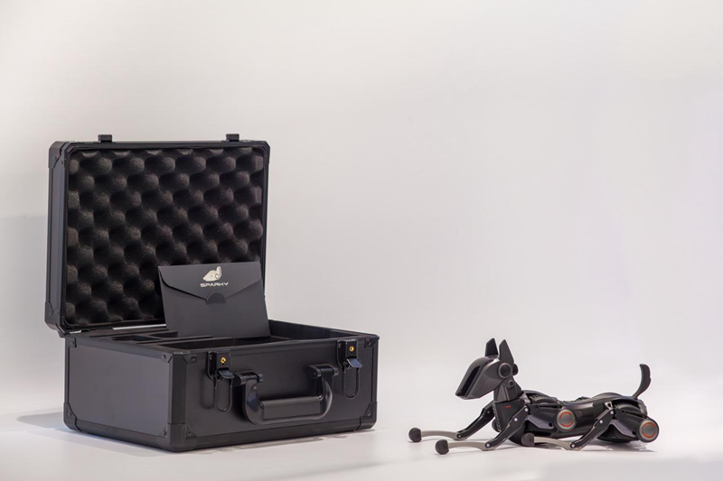

# 致开发者的一封信

亲爱的开发者：
 
首先，感谢您选择并信任我们的产品——SPARKY 哮天，首个手办级高动态机器人开发平台。我们深知，从小白到大师的开发路上从来都不是一帆风顺。而在这崎岖的练级之路上，开发者们通常会面临一些相似的困境和难题：玩法单一、上手开发困难、文档资源贫瘠等。

因此，同样作为开发者的我们在踩过无数坑后总结经验教训，潜心多年研发，并最终为大家带来了SPARKY 哮天，希望能够在降低开发难度的同时使开发更加便捷： SPARKY 哮天支持 Python 、C/C++ 作为开发语言；搭载自主研发的 AIA 一体化执行器（ALL-IN-ACTUATOR），将腿部三个自由度集成在一个执行器内，高集成度设计赋予机器人极大的工作空间和动作灵巧度；能够两颗螺丝实现腿部杆组的装配与升级，支持自行设计打印个性化外壳；配备快拆式磁吸背部盖板，轻松使用外设接口连接您自己的硬件外设......

事实上， SPARKY 不仅是一台机器人，它更是我们机器人美学观的集中体现。我们坚持机器人设计“少即是多，越简单越可靠”的理念，坚持生命科学和科技元素的有机融合，坚持在功能和外观的不断取舍中寻求平衡：采用模仿真实四足哺乳动物腿部数学模型、采用储能元件模仿真实跟腱、将所有的传感与计算集成于哮天头部模仿大脑皮层、所有执行器像神经中枢一样连接到头部、采用从一而终的合金提升产品质感。在此，我们也非常高兴能够与您一同分享我们的目标：恒之未来致力于以机器人与人工智能技术为核心，助力人类探索并解决生命科学问题。我们希望， SPARKY 可以成为您得力的开发平台，赋予机器人像是真实狗狗一样的运动能力。

随着技术的不断发展，生命体与机器的融合变得不再遥远。我们需要更多人参与进来，你们提出的每一个创意和想法都是推动我们向前迈进的动力。作为我们最宝贵的早期合作伙伴，随箱附送HENGBOT为您准备的具有唯一编号的VIP 卡一张，此卡将作为 HENGBOT 后续产品内测、产品深度定制、产品发布会等全部活动的入场券，还请妥善保管。同时，为更好的沟通与交流，期待您通过下方二维码添加小助手微信并加入官方社群与我们相会。

再次衷心感谢你们对 SPARKY 以及 HENGBOT 的支持和信任！
 
最诚挚的问候，
HENGBOT TEAM 
