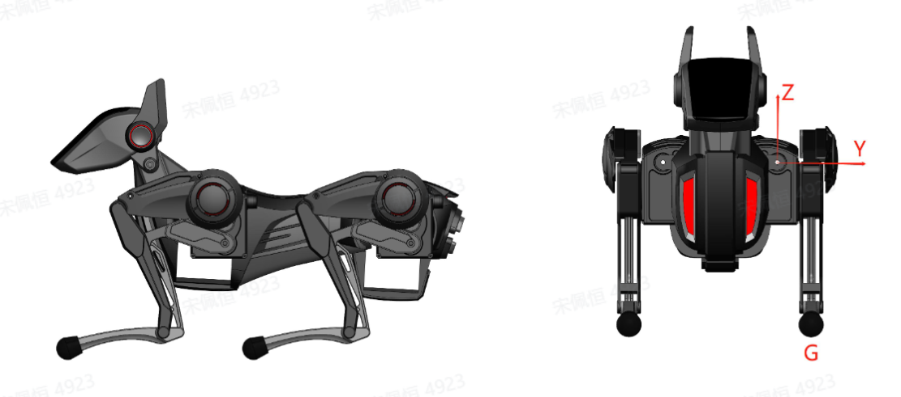
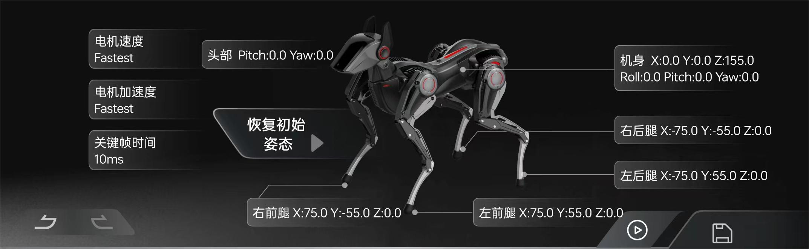

# WebSocket API 使用说明

## 一、前言

阅读此文档前请先浏览哮天相关文档熟悉基础使用，HENGBOT 前提默认您有一定的编程开发基础、熟悉 Python 语言及接口调用，文档在这不对任何专业名词进行介绍以及科普。一起跟着这篇文档来调试并开发 Sparky 哮天的 API 接口实现更多有趣的玩法。

## 二、准备工作

使用前我们需要进行一些准备工作，让我们后续使用更加顺利。

### 2.1 硬件

- 一只更新至最新镜像哮天（版本：hzwl831-m2dock-20240621）


### 2.2 软件

- 调试工具
  - Webscoket 调试网页：http://wstool.js.org/
  - Json 格式在线转换工具：https://www.sojson.com/
- 使用环境
  - 哮天：默认是已联网状态并已在屏幕获取 IP 地址（例如“IP:192.168.8.232” ）
  - API 测试：默认哮天机身进入遥控模式下才可进行 API 测试。
  - PC端：已安装 Python 环境

以上环境构建在本文档不会详细说明，如有需要可参考以下资料文档。  
>开箱使用文档：[初识 Sparky：开箱指南](./quick_start_guide.md)   
>APP 更多玩法：[探索 Sparky：玩转动作编辑](./create-a-blog-post.md)

## 三、注意事项

为了更好的使用 API，您需要了解一些关于哮天的机身物理定义：

| 示意图 |  |
|-----|-----|
|||

| | 机身物理含义 | |
|----|----|---|
| **遥控** | move_x | ove_x = 1/-1 时最大前进、后退速率为 0.28m/s|
| | move_y | move_y = 1/-1 时最大前进、后退速率为 0.3m/s |
| | move_w | move_w = 1 时最大z轴旋转速度为 2 弧度每秒 | 
| | head_pitch | 活动范围为 -1 ~ 1弧度 |
| | head_yaw | 活动范围为 -1 ~ 1弧度 |
| | tranx | tranx 在-1~1时 活动范围为前后 20mm |
| | trany |trany 在-1~1时 活动范围为左右 20mm |
| | tranz | tranz 在-1~1时 活动范围为上下 30mm |
| **关键帧** | roll、pitch、yaw | 使用弧度制，范围在 -1~1 之间。|
| | body | body 中 tran_z 为机身站立高度单位mm |
| | 足端位置 | 均使用mm单位，使用笛卡尔坐标系。|

## 四、API 使用流程

开启 API 使用之前，我们需要了解如何通过两种主要方式来实现 API 功能；分别是浏览器调试和 Python 开发，以下是详细的使用流程，它将会引导您开启 API 体验之旅！

### 4.1 API 浏览器调试

1. 准备阶段：按准备工作完成关于软硬件的用前准备。
2. 验证连接：先确定哮天是否可正常被连接。
3. 测试遥控步态：测试是否可对哮天发出指令并执行指令。
4. 录制播放：体验示教模式下录制功能，是否可播放预置的录制脚本。
5. 播放关键帧：体验编辑模式下关键帧功能，是否可播放预置的关键帧。
6. 异常状态 Q&A：了解哮天出现异常状态时如何恢复正常使用。

### 4.2 更多 API 开发资料

1. API 开发详细资料解读：涵盖（模式切换与机身姿态重置、遥控模式、示教模式、编辑模式）
2. API Python 使用示例
3. Mjpeg 图传使用 

## 五、API 浏览器调试
大多数的 API 功能和机器狗的模式相关，而需要在特定模式下才能使用。所以当我们在与机器狗建立连接后需先进行模式切换才能使用具体功能。

## 5.1 连接哮天

我们已经在准备工作里将哮天联网并获取了 IP 地址做备用，此处以 IP：192.168.8.74 来示例。

:::danger[Take care]
注意：如有部分用户开启后显示得是：`https://wstool.js.org/` 请将 https 改为 http，浏览器安全规范只能建立 wws 链接，而 ws 链接会导致报错。
:::

| 操作步骤 | 示例图 |
|----|----|
| **第一步**：点击进入 Webscoket 调试网页 并输入 `ws://<机器狗IP>:10710/getjson` 以 IP 为信息的服务地址。例：`ws://192.168.8.74:10710/getjson` | |
| **第二步**：输入后点击 **“开启连接”**，此时连接成功哮天后会返回调试信息。接下来接着勾选“收包 JSON 解码”，您就可以在浏览器端开启调试 API 功能啦！ ||
| **第三步**：尝试向哮天发出第一条指令，来获取哮天机体的基本状态吧！ |`{"cmd":"Get_Status"}`|
| **第四步**：复制上文指令并粘贴在发送框点击发送，右侧消息框会返回哮天端状态信息。 | |

我们可以尝试解读返回的数据代表的是什么意思？数据里包含了电池信息、硬件错误状态、联网信息、状态信息这四大部分。目前可获取的有效信息只有以下三大部分，而硬件状态还未规范。

- 电池信息：
  - 电池容量：2340mAh
  - 电量：87%
  - 电池百分比：93.6%
  - 电池状态指示：正在放电
  - 充电时间：65535
  - 当前电流：-1.62A（表示电池正在放电）
  - 瞬时功率：-11.664W（同样表示电池正在放电）
  - 温度：36°C
  - 电压：7.2V
- 网络信息：
  - 客户端IP地址：192.168.8.155
  - 设备IP地址：192.168.8.232
  - SSID：test
- 反馈信息：获取状态（feedback: "Get_Status" 可能表示这是一个状态更新的反馈）

### 5.2 测试遥控步态

:::danger[Take care]
注意事项：
1. 急停模式、步态运动导致哮天进入卸力状态，请在开始前抓握住哮天腰部，避免磕碰或跌落造成损坏。
2. 每次模式切换结束后，请先发送重置机身姿态的指令后再使用机器狗。
3. 用户可以根据需求使用恢复机身姿态的功能，以将机器狗调整到稳定的站立状态。
:::

验证哮天机器人可正常连接之后，参考下文开启指令测试，来测试哮天是否能够接收并执行指令。

#### 测试一：切换模式并恢复正常姿态

分别发送进入 **遥控模式 -> 急停模式 -> 恢复机身姿态** 的代码指令，参考指令发送后效果视频如下。

```json
{"cmd":"Mode_Switch","target":"Remote_Control_Mode"}
{"cmd":"Mode_Switch","target":"Emergency_Stop"}
{"cmd":"Reset_Robot_Position"} 
```

```json
// 切换到遥控模式
{"cmd":"Mode_Switch","target":"Remote_Control_Mode"}
// 进入急停模式，开启前请握住哮天机身防止因电机卸力出现碰撞损坏！！！实验功能
{"cmd":"Mode_Switch","target":"Emergency_Stop"}
/* 恢复机身姿态 */
{"cmd":"Reset_Robot_Position"} 
```

#### 测试二：测试步态运动

开启步态运动的测试之前，首先我们先发送指令确保哮天已进入遥控模式。接下来，请把哮天放置在平整空旷的地面或台面，我们将按照以下步骤进行步态测试。  

1. 发送全速前进指令，观察哮天在全速前进的姿态，此时记录页会跳出相关参数信息。
2. 发送停止指令结束步态运动。
3. 测试完成后，发送恢复机身姿态的指令，确保哮天能够安全地恢复到原始姿态。

```json
{"cmd":"Mode_Switch","target":"Remote_Control_Mode"}
{"cmd":"Control_Move","movex":1.0,"movey":0,"movew":0,"moveh":0,"tranx":0,"trany":0,"tranz":0,"roll":0,"pitch":0,"yaw":0,"headpitch":0,"headyaw":0,"speed":"normal"}
{"cmd":"Control_Move","movex":0,"movey":0,"movew":0,"moveh":0,"tranx":0,"trany":0,"tranz":0,"roll":0,"pitch":0,"yaw":0,"headpitch":0,"headyaw":0,"speed":"normal"}
{"cmd":"Reset_Robot_Position"} 
```

```json
// 切换到遥控模式
{"cmd":"Mode_Switch","target":"Remote_Control_Mode"}
// 全速前进，开启前请把哮天放置在平整空旷的地面或台面！！！
{"cmd":"Control_Move","movex":1.0,"movey":0,"movew":0,"moveh":0,"tranx":0,"trany":0,"tranz":0,"roll":0,"pitch":0,"yaw":0,"headpitch":0,"headyaw":0,"speed":"normal"}
// 停止
{"cmd":"Control_Move","movex":0,"movey":0,"movew":0,"moveh":0,"tranx":0,"trany":0,"tranz":0,"roll":0,"pitch":0,"yaw":0,"headpitch":0,"headyaw":0,"speed":"normal"}
/* 恢复机身姿态 */
{"cmd":"Reset_Robot_Position"} 
```

### 5.3 录制播放

录制播放是示教模式下的亮点功能，在进入 API 开发前我们先体验一下如何播放已录制好的动作帧。  
模式切换与机身姿态重置是所有模式功能的前置步骤，开始使用前请认已经切换到示教模式。

```json
{"cmd":"Mode_Switch","target":"Teach_Mode"}

{"cmd":"Start_Play"} 

{"AIA":{"BackLeftLeg":{"x":-58.03042221069336,"y":19.174842834472656,"z":-166.43234252929688},"BackRightLeg":{"x":-64.67723846435547,"y":0.9458351135253906,"z":-164.07229614257813},"FrontLeftLeg":{"x":38.319374084472656,"y":-8.239791870117188,"z":-168.74769592285156},"FrontRightLeg":{"x":54.310855865478516,"y":21.319934844970703,"z":-165.0332794189453},"Head":{"pitch":0.3413107395172119,"yaw":0.0007669925689697266}},"cmd":"Playing","time":3000}

{"cmd":"Stop_Play"}

{"cmd":"Reset_Robot_Position"}
```

```json
// 切换到示教模式
{"cmd":"Mode_Switch","target":"Teach_Mode"}
/* 动作播放 */
// 1、发送动作播放指令
{"cmd":"Start_Play"}
// 2、发送所有需要播放的动作帧，开启前请握住哮天机身防止因电机卸力出现碰撞损坏！！！
// 与录制帧的格式区别是"feedback": "Recording" 替换为 "cmd": "Playing"
{"AIA":{"BackLeftLeg":{"x":-58.03042221069336,"y":19.174842834472656,"z":-166.43234252929688},"BackRightLeg":{"x":-64.67723846435547,"y":0.9458351135253906,"z":-164.07229614257813},"FrontLeftLeg":{"x":38.319374084472656,"y":-8.239791870117188,"z":-168.74769592285156},"FrontRightLeg":{"x":54.310855865478516,"y":21.319934844970703,"z":-165.0332794189453},"Head":{"pitch":0.3413107395172119,"yaw":0.0007669925689697266}},"cmd":"Playing","time":3000}

// 播放过程中会发送反馈信息，代表已经播放的时间
// {"feedback":"Recording""time":3000}

// 3、结束播放
// 发送这段指令停止动作播放计时器
{"cmd":"Stop_Play"}

// 4、恢复到站立姿态
{"cmd":"Reset_Robot_Position"}
```

### 5.4 播放关键帧

编辑模式下可以精细控制动作播放，该模式使用机身坐标系，除了四肢坐标外还包含机身的姿态信息。  
一起与 HENGBOT 体验播放一帧已压缩好的关键帧动作吧！

:::danger[Take care]
注意
1. 模式切换与机身姿态重置是所有模式功能的前置步骤，在开始使用前需要确认已经切换到编辑模式。
2. 编辑模式下发送任何关键帧都会被立刻执行。
:::

```json

{"cmd":"Mode_Switch","target":"Edit_Mode"}

{"cmd":"Play_Keyframe","speed":"Fastest","acc":"Fastest","time":10,"Body":{"pitch":0.0,"roll":0.0,"tran_x":0.0,"tran_y":0.0,"tran_z":145.0,"yaw":0.0},"FootPoint":{"FrontLeftLeg":{"x":75.0,"y":48.0,"z":0.0},"FrontRightLeg":{"x":75.0,"y":-48.0,"z":0.0},"BackLeftLeg":{"x":-55.0,"y":48.0,"z":0.0},"BackRightLeg":{"x":-55.0,"y":-48.0,"z":0.0}},"Head":{"pitch":0.0,"yaw":0.0}}

{"cmd":"Reset_Robot_Position"}
```

```json
// 切换到编辑模式
{"cmd":"Mode_Switch","target":"Edit_Mode"}
/* 关键帧播放 */
// 发送压缩后的关键帧
{"cmd":"Play_Keyframe","speed":"Fastest","acc":"Fastest","time":10,"Body":{"pitch":0.0,"roll":0.0,"tran_x":0.0,"tran_y":0.0,"tran_z":145.0,"yaw":0.0},"FootPoint":{"FrontLeftLeg":{"x":75.0,"y":48.0,"z":0.0},"FrontRightLeg":{"x":75.0,"y":-48.0,"z":0.0},"BackLeftLeg":{"x":-55.0,"y":48.0,"z":0.0},"BackRightLeg":{"x":-55.0,"y":-48.0,"z":0.0}},"Head":{"pitch":0.0,"yaw":0.0}}
//恢复到站立姿态
{"cmd":"Reset_Robot_Position"}
```

### 5.5 异常状况处理方法

Q：如出现发送指令但哮天机身无任何反应？  

A：注意指令是处于遥控/编辑/示教模式下的任何一模式，是否进入相对应的模的前提下再发送。  

Q：如出现 Python 端已结束进程，但哮天端的进程还在继续无法停止的情况。  

A：此进程在 Python 端停止后还需进入浏览器端切换任意模式，即可停止进程。  

Q：浏览器端消息页结束进程后，出现大量数据导致哮天运行出现缓慢的情况。  

A：刷新浏览器端的网页，数据量过大导致出现缓慢情况。

## 六、更多 API 开发资料

"这里是为有需求的开发者提供的关于 API 详细资料。我们不深入介绍专业术语及其使用过程细节，因此，对于无编程背景的用户，我们推荐使用前文提及的浏览器调试方式，以便获得更好的体验。"

### 6.1 模式切换与机身姿态重置

机器狗有五种相关模式：遥控、示教、编辑、急停和自由。其中，遥控、示教、编辑和急停模式已经被APP使用，而自由模式由于其行为流程尚未确定，因此目前没有投入使用。

:::danger[Take care]
注意事项：
1. 急停模式、步态运动导致哮天进入卸力状态，请在开始前抓握住哮天腰部，避免磕碰或跌落造成损坏。
2. 每次模式切换结束后，请先发送重置机身姿态的指令后再使用机器狗。
3. 用户可以根据需求使用恢复机身姿态的功能，以将机器狗调整到稳定的站立状态。
:::

#### 6.1.1 模式切换指令表

可根据下文指令来自由切换当下机器狗的模式及恢复机身姿态。

```json
{"cmd":"Mode_Switch","target":"Remote_Control_Mode"}

{"cmd":"Mode_Switch","target":"Teach_Mode"}

{"cmd":"Mode_Switch","target":"Edit_Mode"}

{"cmd":"Mode_Switch","target":"Emergency_Stop"}

{"cmd":"Mode_Switch","target":"Free_Mode"}

{"cmd":"Reset_Robot_Position"} 
```

```json
/* 模式切换相关指令 */
// 切换到遥控模式
{"cmd":"Mode_Switch","target":"Remote_Control_Mode"}
// 切换到示教模式
{"cmd":"Mode_Switch","target":"Teach_Mode"}
// 切换到编辑模式
{"cmd":"Mode_Switch","target":"Edit_Mode"}
// 进入急停模式
{"cmd":"Mode_Switch","target":"Emergency_Stop"}
// 进入自由模式(当前无明确功能)
{"cmd":"Mode_Switch","target":"Free_Mode"}

/* 恢复机身姿态 */
{"cmd":"Reset_Robot_Position"} 
```

#### 6.1.2 模式使用顺序说明

模式切换的指令交互流程全部相同，以进入遥控模式为例子，下表是过程中需要的全部指令。

```json
{"cmd":"Mode_Switch","target":"Remote_Control_Mode"}

{"cmd":"Mode_Switch","target":"Emergency_Stop"}

{"cmd":"Reset_Robot_Position"}
```

```json
// 1、发送切换到遥控模式的指令
{"cmd":"Mode_Switch","target":"Remote_Control_Mode"}

// * 机器人端会回复收到的指令(后续不再赘述)
// < {"cmd":"Mode_Switch","target":"Remote_Control_Mode"}

// 进入急停模式，开启前请握住哮天机身防止因电机卸力出现碰撞损坏！！！
{"cmd":"Mode_Switch","target":"Emergency_Stop"}

// 2、重置机身姿态
{"cmd":"Reset_Robot_Position"}
```

### 6.2 遥控模式

:::danger[Take care]
前提条件：执行本节前需要进行(6.1部分)模式切换，确认处于遥控模式下。  
遥控模式下的点击扭力输出由程序自动控制，故此步行遥控、快速动作录制等功能在当前模式下较为特殊。
:::

#### 6.2.1 步行遥控

步行遥控是由单个多参数指令组成，不同字段的含义大致如下：

| 名称 | 功能 |
|------|------|
| move | 用于控制机身的位置变化 |
| movex | 控制前进后退 |
| movey | 控制左右运动 |
| movew | 控制原地旋转变化 |
| tran | 用于控制机身偏移，机身四足的位置不变仅改变重心位置。|
| roll、pitch、yaw | 用于控制机身姿态 |
| headpitch、headyaw |专门控制头部的俯仰和偏航| 
|speed | 配置步频，当前并不影响速度。|

```json
{"cmd":"Control_Move","movex":1.0,"movey":0,"movew":0,"moveh":0,"tranx":0,"trany":0,"tranz":0,"roll":0,"pitch":0,"yaw":0,"headpitch":0,"headyaw":0,"speed":"normal"}

{"cmd":"Control_Move","movex":-1.0,"movey":0,"movew":0,"moveh":0,"tranx":0,"trany":0,"tranz":0,"roll":0,"pitch":0,"yaw":0,"headpitch":0,"headyaw":0,"speed":"normal"}

{"cmd":"Control_Move","movex":0,"movey":0,"movew":0,"moveh":0,"tranx":0,"trany":0,"tranz":0,"roll":0,"pitch":0,"yaw":0,"headpitch":0,"headyaw":0,"speed":"normal"}
```

> 以下包含带有注释及部分未经过 `json` 压缩的指令，使用前请看注释。  

```json
/* 未压缩的遥控指令 */
/* 数值的有效范围均为-1 ~ 1 */
{
    "cmd": "Control_Move",
    "movex": 0.2, // 
    "movey": 0,
    "movew": 0, //相对于Z轴逆时针运动的角速度(弧度/秒) 原地踏步旋转(当前未实现)
    "moveh": 0, //保留字符数值默认为 0 [2月26日]
    "tranx": 0, // 机身在X轴上的偏移，前后方向
    "trany": 0, // 
    "tranz": 0, //数值-1~1之间 代表机身高度的偏移量(-35 ~ 35 mm) 
    /* 相对于初始位置的机身姿态 */
    "roll": 0,
    "pitch": 0,
    "yaw": 0,
    /* 相对于初始位置的头部姿态 */ 
    "headpitch": 0,
    "headyaw": 0,
    /* 速度设置 */
    "speed":"fast" //行走状态下的速度配置 另一个值为 "normal"
}

/* 压缩后的指令 */
// 全速前进
{"cmd":"Control_Move","movex":1.0,"movey":0,"movew":0,"moveh":0,"tranx":0,"trany":0,"tranz":0,"roll":0,"pitch":0,"yaw":0,"headpitch":0,"headyaw":0,"speed":"normal"}
// 全速后退
{"cmd":"Control_Move","movex":-1.0,"movey":0,"movew":0,"moveh":0,"tranx":0,"trany":0,"tranz":0,"roll":0,"pitch":0,"yaw":0,"headpitch":0,"headyaw":0,"speed":"normal"}
// 停止
{"cmd":"Control_Move","movex":0,"movey":0,"movew":0,"moveh":0,"tranx":0,"trany":0,"tranz":0,"roll":0,"pitch":0,"yaw":0,"headpitch":0,"headyaw":0,"speed":"normal"}
```

#### 6.2.2 快速动作录制

步行模式下的电机扭力由程序自动控制，快速录制会导致机器人完全卸力，务必在开始录制前抓握住机器人，避免磕碰或跌落造成损坏。
快速录制过程中的指令:

```json
{"cmd":"Start_Record"}

{"cmd":"Stop_Record"}

{"cmd":"Reset_Robot_Position"}
```

```json
// 1、开始录制
{"cmd":"Start_Record"}

// *注意：机器人四肢的扭力输出会关闭，务必在开始快速录制前抓握住机器人
// *机器人收到数据后会回传足端坐标与头部姿态的数据
// 回传的数据格式见下表

// 2、结束录制
// *结束录制后扭力输出会被打开，此时机器人会保持在当前姿态
{"cmd":"Stop_Record"}

// 3、恢复到站立姿态
{"cmd":"Reset_Robot_Position"}
```

回传数据：
机器人端不存储录制后的数据，需要用户自行存储供播放使用。回传数据使用髋关节坐标系，坐标仅与腿部的安装位置有关，与机身位置无关。时间代表录制开始到当前帧所经过的时间，在播放时用于时序同步。

```json
/* 压缩后的数据 */
{"AIA":{"BackLeftLeg":{"x":-58.03042221069336,"y":19.174842834472656,"z":-166.43234252929688},"BackRightLeg":{"x":-64.67723846435547,"y":0.9458351135253906,"z":-164.07229614257813},"FrontLeftLeg":{"x":38.319374084472656,"y":-8.239791870117188,"z":-168.74769592285156},"FrontRightLeg":{"x":54.310855865478516,"y":21.319934844970703,"z":-165.0332794189453},"Head":{"pitch":0.3413107395172119,"yaw":0.0007669925689697266}},"feedback":"Recording","time":2359}

/* 展开后的数据 */
{
  "AIA":{
    "BackLeftLeg":{
      "x":-58.03042221069336,
      "y":19.174842834472656,
      "z":-166.43234252929688
    },
    "BackRightLeg":{
      "x":-64.67723846435547,
      "y":0.9458351135253906,
      "z":-164.07229614257812
    },
    "FrontLeftLeg":{
      "x":38.319374084472656,
      "y":-8.239791870117188,
      "z":-168.74769592285156
    },
    "FrontRightLeg":{
      "x":54.310855865478516,
      "y":21.319934844970703,
      "z":-165.0332794189453
    },
    "Head":{
      "pitch":0.3413107395172119,
      "yaw":0.0007669925689697266
    }
  },
  "feedback":"Recording",
  "time":2359
}
```

### 6.3 示教模式

:::danger[Take care]
注意:模式（6.1）切换与机身姿态重置是所有模式功能的前置步骤，开始使用前请认已经切换到示教模式。  
示教模式下用户可以干涉电机的扭力输出，该模式下的录制允许少量输出扭力。方便用户对姿态进行精细控制。
:::

#### 6.3.1 指令表/电机扭力配置

```json
{"cmd":"Get_Parameter","parameter":"Output_Torque","type":"AIA_ALL"}

{"cmd":"Set_Parameter","type":"AIA_Head","parameter":"Output_Torque","value":"Enable"} 
{"cmd":"Set_Parameter","type":"AIA_Head","parameter":"Output_Torque","value":"Disable"} 

{"cmd":"Set_Parameter","type":"AIA_Head","parameter":"Output_Torque","value":"Limit"}   

{"cmd":"Set_Parameter","type":"AIA_Head","parameter":"Output_Torque","value":"UnLimit"} 

{"cmd":"Set_Parameter","type":"AIA_Head","parameter":"Output_Torque","value":"Limit"}
{"cmd":"Set_Parameter","type":"AIA_FrontLeft","parameter":"Output_Torque","value":"Limit"}
{"cmd":"Set_Parameter","type":"AIA_FrontRight","parameter":"Output_Torque","value":"Limit"}
{"cmd":"Set_Parameter","type":"AIA_BackLeft","parameter":"Output_Torque","value":"Limit"}
{"cmd":"Set_Parameter","type":"AIA_BackRight","parameter":"Output_Torque","value":"Limit"}

{"cmd":"Set_Parameter","type":"AIA_ALL","parameter":"Output_Torque","value":"Limit"}

{"cmd":"Start_Record"}

{"cmd":"Stop_Record"}

{"cmd":"Reset_Robot_Position"}
```

```json
/* 获取电机扭力输出配置 */
{"cmd":"Get_Parameter","parameter":"Output_Torque","type":"AIA_ALL"}

/* 设置电机扭力输出 */
// 注意：进行电机扭力精细控制前需要确认模式不处于遥控模式下，否则扭力输出不会生效
// 可配置的五个执行器(四肢、头部) AIA_Head、AIA_FrontLeft、AIA_FrontRight、AIA_BackLeft、AIA_BackRight
// 可配置参数 上电/下电 限幅/解除限幅 Enable/Disable Limit/UnLimit
// * Enable和Disable可以相互切换 Limit UnLimit仅在Enable下生效
{"cmd":"Set_Parameter","type":"AIA_Head","parameter":"Output_Torque","value":"Enable"} 
{"cmd":"Set_Parameter","type":"AIA_Head","parameter":"Output_Torque","value":"Disable"} // 遥控模式下：快速录制模式的默认策略(完全下电)
{"cmd":"Set_Parameter","type":"AIA_Head","parameter":"Output_Torque","value":"Limit"}   // 示教模式下录制的策略
{"cmd":"Set_Parameter","type":"AIA_Head","parameter":"Output_Torque","value":"UnLimit"} // 示教模式下录制的策略

/* 动作录制 */
// (可选)1、配置电机扭力策略[两种方式]
// 1.A 推荐使用Limit模式体验示教模式下的录制[独立配置每个肢体]
{"cmd":"Set_Parameter","type":"AIA_Head","parameter":"Output_Torque","value":"Limit"}
{"cmd":"Set_Parameter","type":"AIA_FrontLeft","parameter":"Output_Torque","value":"Limit"}
{"cmd":"Set_Parameter","type":"AIA_FrontRight","parameter":"Output_Torque","value":"Limit"}
{"cmd":"Set_Parameter","type":"AIA_BackLeft","parameter":"Output_Torque","value":"Limit"}
{"cmd":"Set_Parameter","type":"AIA_BackRight","parameter":"Output_Torque","value":"Limit"}
// 1.B 同时配置所有电机[所有配置]
{"cmd":"Set_Parameter","type":"AIA_ALL","parameter":"Output_Torque","value":"Limit"}

// 2、开始录制
// *注意：示教模式下开始录制后电机会少量输出扭力、方便用户调整姿态
// *机器人收到数据后会回传足端坐标与头部姿态的数据
// 回传的数据格式与快速动作录制一致
{"cmd":"Start_Record"}

// 3、结束录制
// *结束录制后扭力输出会增大
{"cmd":"Stop_Record"}

// 4、恢复到站立姿态
{"cmd":"Reset_Robot_Position"}
```

#### 6.3.2 动作播放

动作播放涉及数据的序列化与反序列化，不推荐用户直接使用 API。

**播放流程**

```json
{"cmd":"Start_Play"}

{"AIA":{"BackLeftLeg":{"x":-58.03042221069336,"y":19.174842834472656,"z":-166.43234252929688},"BackRightLeg":{"x":-64.67723846435547,"y":0.9458351135253906,"z":-164.07229614257813},"FrontLeftLeg":{"x":38.319374084472656,"y":-8.239791870117188,"z":-168.74769592285156},"FrontRightLeg":{"x":54.310855865478516,"y":21.319934844970703,"z":-165.0332794189453},"Head":{"pitch":0.3413107395172119,"yaw":0.0007669925689697266}},"cmd":"Playing","time":3000}

{"cmd":"Stop_Play"}

{"cmd":"Reset_Robot_Position"}
```

```json
/* 动作播放 */
// 1、发送动作播放指令
{"cmd":"Start_Play"}
// 2、发送所有需要播放的动作帧
// 与录制帧的格式区别是"feedback": "Recording" 替换为 "cmd": "Playing"
{"AIA":{"BackLeftLeg":{"x":-58.03042221069336,"y":19.174842834472656,"z":-166.43234252929688},"BackRightLeg":{"x":-64.67723846435547,"y":0.9458351135253906,"z":-164.07229614257813},"FrontLeftLeg":{"x":38.319374084472656,"y":-8.239791870117188,"z":-168.74769592285156},"FrontRightLeg":{"x":54.310855865478516,"y":21.319934844970703,"z":-165.0332794189453},"Head":{"pitch":0.3413107395172119,"yaw":0.0007669925689697266}},"cmd":"Playing","time":3000}

// 播放过程中会发送反馈信息，代表已经播放的时间
// {"feedback":"Recording""time":3000}

// 3、结束播放
// 发送这段指令停止动作播放计时器
{"cmd":"Stop_Play"}

// 4、恢复到站立姿态
{"cmd":"Reset_Robot_Position"}
```

### 6.4 编辑模式

:::danger[Take care]
注意
1. 3.1 模式切换与机身姿态重置是所有模式功能的前置步骤，在开始使用前需要确认已经切换到编辑模式，编辑模式可以精细控制动作播放，该模式使用机身坐标系，除了四肢坐标外还包含机身的姿态信息。
2. 编辑模式下发送任何关键帧都会被立刻执行。
:::

#### 6.4.1 关键帧示例

关键帧中的 time 属性代表该帧的持续时间，与动作组的含义不同。

```json
/* 关键帧内容 */
    {
        "cmd": "Play_Keyframe",
        "speed": "Fastest",
        "acc": "Fastest", // Fastest, Fast, Slow, Slowest 对应四个速度、加速度配置选项
        "time": 10,//当前帧的持续时长(ms)
        "Body": {
            "pitch": 0.0,//使用弧度制范围  -1 ~ 1
            "roll": 0.0,//使用弧度制范围 -1 ~ 1
            "tran_x": 0.0,
            "tran_y": 0.0,
            "tran_z": 141.0, //新机身建议使用145mm作为站立高度
            "yaw": 0.0
        },
        "FootPoint": { //初始状态下足端端点的世界坐标，可以认为此时四足端点都位于地面
            "FrontLeftLeg": {
                "x": 75.0,
                "y": 48.0,
                "z": 0.0
            },
            "FrontRightLeg": {
                "x": 75.0,
                "y": -48.0,
                "z": 0.0
            },
            "BackLeftLeg": {
                "x": -55.0,
                "y": 48.0,
                "z": 0.0 
            },
            "BackRightLeg": {
                "x": -55.0,
                "y": -48.0,
                "z": 0.0
            }
            
        },
        "Head": {
                "pitch": 0.0,//使用弧度制范围-1 ~ 1
                "yaw": 0.0//使用弧度制范围-1 ~ 1
        }
    }
```

#### 6.4.2 播放关键帧

```json

{"cmd":"Play_Keyframe","speed":"Fastest","acc":"Fastest","time":10,"Body":{"pitch":0.0,"roll":0.0,"tran_x":0.0,"tran_y":0.0,"tran_z":145.0,"yaw":0.0},"FootPoint":{"FrontLeftLeg":{"x":75.0,"y":48.0,"z":0.0},"FrontRightLeg":{"x":75.0,"y":-48.0,"z":0.0},"BackLeftLeg":{"x":-55.0,"y":48.0,"z":0.0},"BackRightLeg":{"x":-55.0,"y":-48.0,"z":0.0}},"Head":{"pitch":0.0,"yaw":0.0}}

{"cmd":"Reset_Robot_Position"}
```

```json
/* 关键帧播放 */
// 发送压缩后的关键帧
{"cmd":"Play_Keyframe","speed":"Fastest","acc":"Fastest","time":10,"Body":{"pitch":0.0,"roll":0.0,"tran_x":0.0,"tran_y":0.0,"tran_z":145.0,"yaw":0.0},"FootPoint":{"FrontLeftLeg":{"x":75.0,"y":48.0,"z":0.0},"FrontRightLeg":{"x":75.0,"y":-48.0,"z":0.0},"BackLeftLeg":{"x":-55.0,"y":48.0,"z":0.0},"BackRightLeg":{"x":-55.0,"y":-48.0,"z":0.0}},"Head":{"pitch":0.0,"yaw":0.0}}
//恢复到站立姿态
{"cmd":"Reset_Robot_Position"}
```

### 6.5 使用 Python 控制机器人运动

:::tip[Use Tip] 
以下程序需要根据用户实际使用环境与机器人IP调整使用，非大规模对外释放版本。
:::

> 注意：默认已安装好 Python 环境，请参考以下命令安装相关依赖包。

```python
# 部分依赖包
pip install numpy websockets websocket-client opencv-python pillow matplotlib -i https://pypi.tuna.tsinghua.edu.cn/simple
```
> 使用 Python 控制机器人运动源码：[controi_UI.py](./api_py/controlui.py

### Jupyter notebookc 测试

我们已在 Windows/linux 下测试过 Jupyter Notebook 均可正常使用，以下连接为遥控功能测试的 `ipynb` 包。

[遥控测试](./api_py/key_test.ipynb)

### 6.6 图形化 GUI 控制哮天各维度运动

源码：[keyDrame_UI.py](./api_py/keyFrameUI.py)

### 6.7 图形化 GUI 录制与播放动作

源码：[record_UI.py](./api_py/recordUI.py)

### 6.8 可视化生成波形曲线控制哮天各自由度节律运动

源码：[wave_control_GUI.py](./api_py/240623_wave_control_GUI.py)

**Websocket 在远端和本地端都可运行**


:::tip[Use Tip] 
哮天在本地端（如831/X3）运行websocket时，ip地址需要改为127.0.0.1
:::
> 视频


### 6.6 视频 mjpeg 图传

用户可以直接在浏览器中运行，一起来感受哮天视角下的风景。
> `例：http://<机器狗IP>:8080` http://192.168.8.232:8080