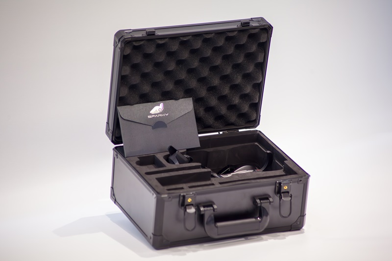
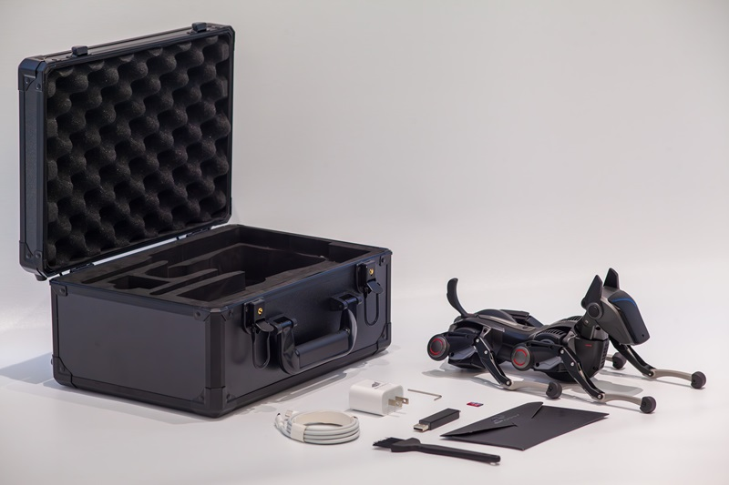
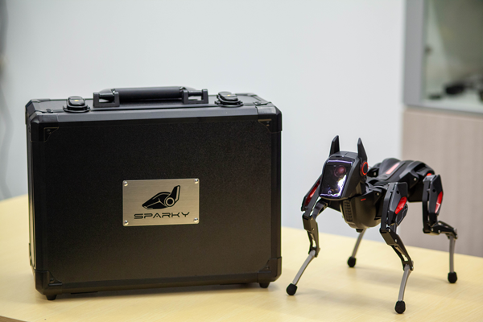
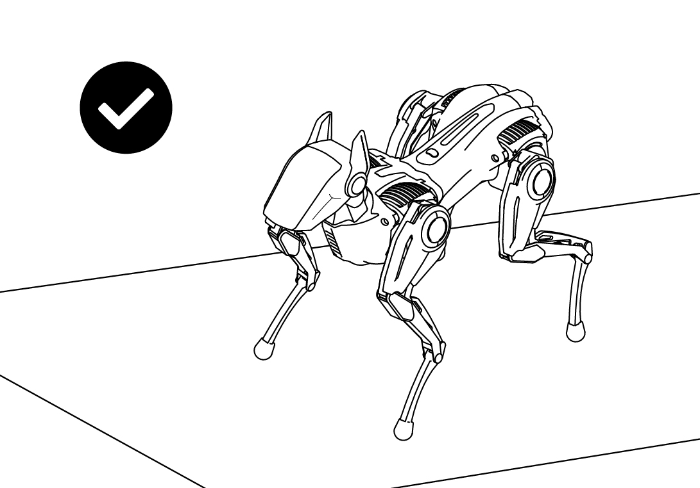
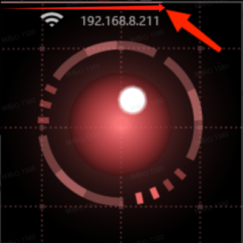
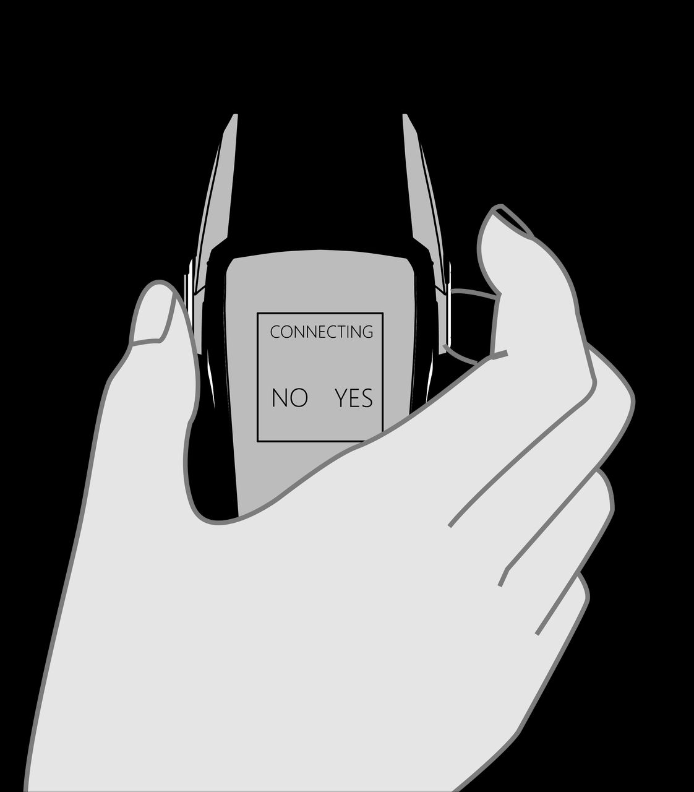
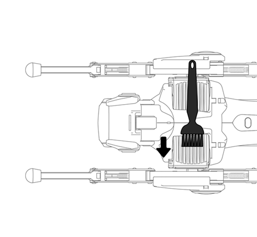
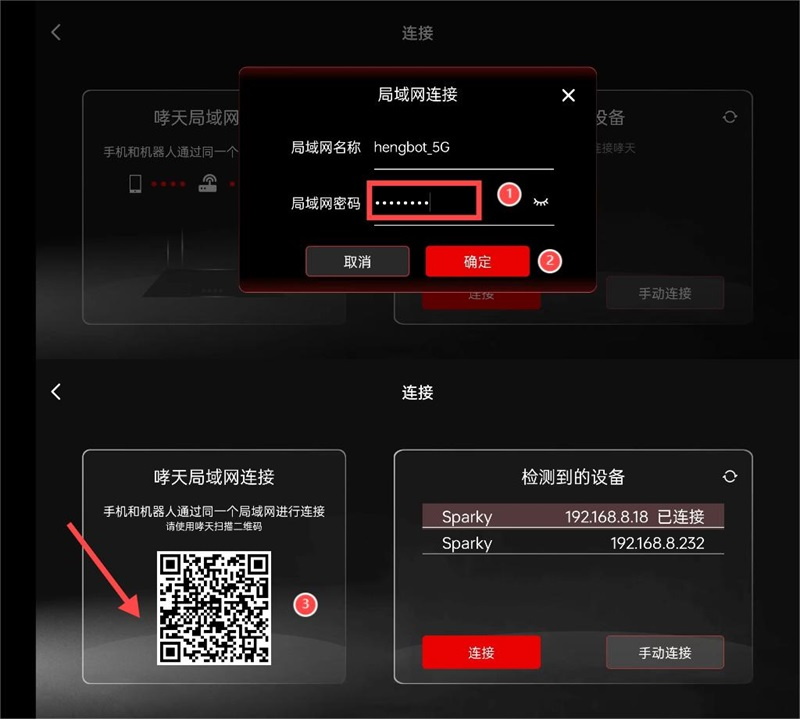
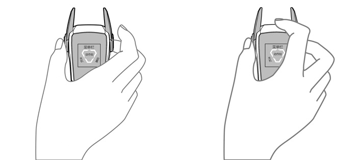
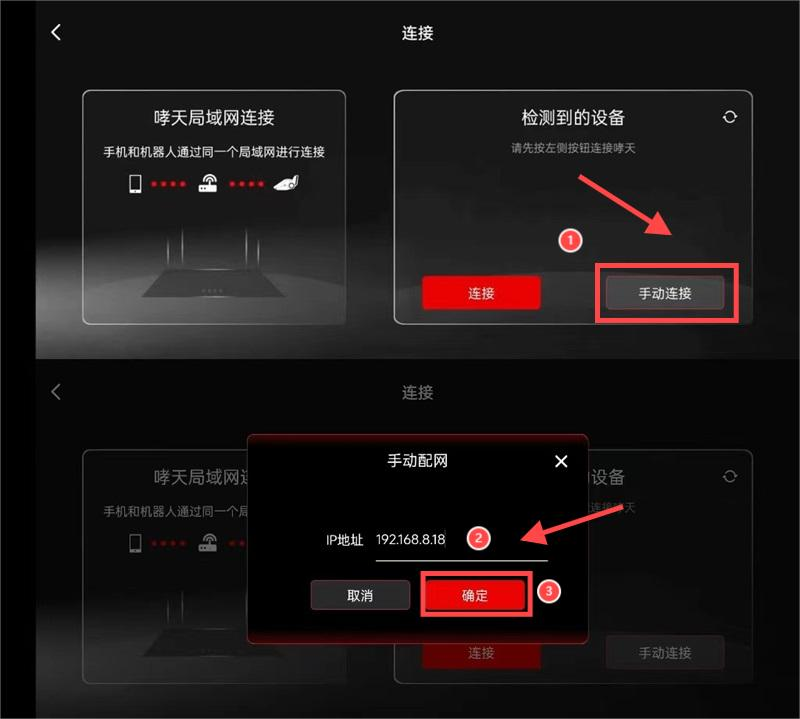

# Unboxing: Entry-level Configuration and Usage

:::warning Historical snapshot — the app and the network setup steps may have changed

This guide was written against **App version `240726`** and the firmware of that time. The app screens, the LAN auto-connect behaviour and the QR-code network setup described below are a snapshot of that release and may no longer match the app you have installed.

Hardware and unboxing steps can also differ between models — check them against the model you actually own.

:::

## I.Preface

Hey, the future robot dog trainer! Welcome to the  journey with your new partner-Sparky. This unboxing guide will lead you to understand the wonderful world of Sparky. It will teach you how to start, use and interact with your Sparky. At the same time, this guide will also stimulate your creativity and encourage you to explore the unknown and create more interesting ways to play.   

## II.Unboxing

First of all, thank you for trusting us with your choice of Sparky! Now, let's open the box together. We have equipped Sparky with a metal box as the outer packaging. The surface of the box is designed with bright stripes, and the front is inlaid with a silver nameplate, which not only increases the aesthetics, but also facilitates users to carry or store Sparky. Next, let's unlock the box and find it out!

After unpacking, the first thing that catches the eye is our protagonist - Sparky. It lies in the box in the comfortable posture of a dog resting. Before starting to use, please grab Sparky's waist and carefully take it from the box. And then, place it on any flat ground or tabletop.

Sparky weighs only 850g, which is equivalent to the weight of two bottles of water. We have adopted advanced lightweight design, significantly reduced the weight of the body and legs, while maintained a lightweight feel and the robustness of the metal structure.

## III.Accessory List  

List: Cleaning brush, USB data cable (Type-C), Battery charger.

  

| Accessory Name  |  Description  |
| ----------- | ----------- |
| **SD mirror card** | Built in Sparky mirror system (pre-inserted into the head card slot) |
| **Cleaning brush** | Clean the dust on the head or body |
| **USB cable (Type-C)** | Connect Sparky with other devices (e.g. PC) for data transmission or charging |
| **Charger** | Used with Type-C USB cable for charging |

The end of unpacking guide. 
Before starting the interaction with your Sparky, please carefully check and visually inspect the entire product and accessories. If any problems are found during the inspection, please contact us through the purchasing channel or email support@hengbot.com for necessary assistance and solutions.  

:::tip[USER TIPS] 

- Appearance inspection: Please carefully check the appearance of your Sparky and the entire body to ensure that there are no obvious signs of damage, such as scratches, dents, etc.  
- Charging check: Please use the official charger for charging test. The taillight lights up to indicate that it is in the charging state.

:::

## IV.Start up Sparky  

After checking, the next step is to start Sparky.

:::tip[Use Tip]

**Remove the foam from the packaging box**. During moving, prevent the product from excessive impact, such as falling down or colliding, etc. **Make sure that the Sparky is placed on a stable ground in a proper initial posture before starting it up.**  

| Before starting up | After starting up |
|----------|----------|
|  |  |

**Use the original adapter and cable with the product in the packaging box for charging**: The Sparky can work for 1-2 hours without charging. It takes about 50 minutes to fully charge when turned it off. It is recommended to plug in the cable for charging during working for a long time.

:::

### 4.1 Startup

Place Sparky on a flat ground, **press and hold the power button on its back for three seconds** to turn on the device. Sparky will retract its limbs from a prone position, automatically adjust to a standing posture, and make a barking sound. At this point, **boot and wink animations begin to play on the head**. Please accept the friendly Wink from your Sparky!

### 4.2 Startup

| Function     | Skills | Remarks |
| -----------  | ----------- | ------- |
| **Application environment** | A clean desktop or flat ground is a relatively ideal control environment. Please do not operate the Sparky on the outdoor ground with water or other liquids, so as to avoid reducing the accuracy of Sparky control and ensure the task going well. |  |
| **Check the power** | There is a battery status bar on the top of Sparky's head. When the battery is sufficient, Sparky can work for more than 45 minutes. If the battery power is too low, it will bark to warn and automatically power off with limbs retracting. |  |
| **Recharge** | Please use the official charger (PD30w) to ensure the charging effect and safety. After connecting the charging cable, the taillight lights up to indicate that it is in the charging state. |  |
| **Power on** | Press and hold the power button on the back for three seconds to turn on the device. |
| **Power off** | Method 1 (recommended): Press and hold the power button on the back of Sparky to power off.
Method 2: Shutdown the system from the UI menu on the Sparky's head. |
| **Interaction on the head** | The functions of the left and right ear buttons are consistent, and both can be used to select or adjust options. Touching the top of the head can confirm the options. |  |
| **Heating** | It is normal that the motor temperature will rise after long-term use. Please ensure that you use it in a well-ventilated environment. In addition, Sparky has a built-in overheat protection program, when the motor temperature is too high, the motor will be disabled actively, and then restart the work when its temperature drops to a reasonable range. | |
| **Cleaning** | When dust accumulates due to long-term use of Sparky, the groove of the actuator can be cleaned with the attached small brush, and the head cover and other parts can be gently wiped with a soft wet cloth. When cleaning, please make sure that Sparky is turned off and not charging, and avoid splashing water or other liquids directly on the robot surface. |  |

## V.Network Connection

After playing the startup animation on Sparky, if the device is in a network-disconnected state, QR code scanning page will display on the head and wait to scan the code to connect to the internet. Please connect the internet as following two ways below:

### 5.1 ​Preparation Work

- **Download the App (version: 240726)**  
  
i.Prepare an Android phone.
ii.Download APK into the phone and complete the App installation as instructions.

### 5.2 LAN Connection APP  

When open the App, if the network is in disconnection state, a page will pop up for LAN connection.
If the IP address has been connected before, the App will automatically connect without manually scanning the code.

| Steps | Reference pictures |
|----------|-------|
| After clicking on **“Sparky LAN Connection”**, Sparky's App automatically searches and displays the network |  |
| **Label 1**: Select the network to be connected and enter the password，**Label 2**: Click "OK" after completion，**Label 3**: Generate a QR code.|  |
| Please **aim the QR code at Sparky's head** for scanning. After scanning, Sparky will automatically search and connect to the network. |  |
| After the network connection is successful, the message **"Connection Successful"** will be displayed in the head and at the same time, it will enter remote control mode and display the network name, IP address, and battery level. |  |

### 5.3 Wi-Fi Hotspot Connection

:::tip[USER TIPS] 
This Tip is an optional step. If the network connection is successful, you can skip this step. When you can't use the mobile APP to connect with Sparky, you can still connect with Sparky as following steps.
:::

| Steps    | Reference pictures |
|----------|-------|
| **Label 1**: Select the network to be connected and click to enter the settings page. **Label 2**: Click to generate or share this network (QR code). **Label 3**: Save the generated QR code for later use. |  |
| Please aim the QR code at Sparky's head for scanning. After scanning, Sparky will automatically search and connect to the network. |  |
| After the network connection is successful, the message "Connection Successful" will be displayed in the head and at the same time, it will enter remote control mode and display the network name, IP address, and battery level. |  |

## VI.Connect APP  

### 6.1 Precondition

- **Ensure that Sparky is connected to the network and the UI on the head displays that it has entered remote control mode.**
- **Ensure that Sparky and the mobile App are in the same network.**

**Here is a partial explanation of the relevant logic:**
**Logic 1**: Under normal usage, when the device is turned on and the QR code is scanned, the display of the eye logo and IP address on the head of Sparky indicates that it is connected to the internet and has entered remote control mode.
**Logic 2**: However, if you manually turn on WIFI for network connecting in the head (UI), you also need to manually enter remote control mode.

 

| Function | Steps | Reference pictures |
|---------|--------|-----|
| **Interaction on the head** | The functions of the left and right ear buttons are consistent, and both can be used to select or adjust options. Touching the top of the head can confirm the options. |  |
| **Enter Head (UI) Remote Control Mode** | Select the 'Remote Control Mode' option directly from the main menu. Activate this function by touching the top of the head to confirm the selection. ||

### 6.2 Connect APP

After completing the above preconditions, return to the App networking page to connect Sparky with the mobile App.

| Steps    | Reference pictures |
|---------|--------|
| **Label 1**: After clicking the "Refresh" icon, the detected device IP will be displayed on the page. **Label 2**: Select the "IP address" of Sparky.**Label 3**: Click the "Connect" button to connect network with the selected IP address. And then, "Connection successful" will pop up. |  |  

If the IP address is not displayed when connecting, we can also connect through the "Manual Connection" feature on this page.

| Steps | Reference pictures |
|-------|------|
| **Label 1**: Click on "Manual Connection".**Label 2**: Enter the IP address of Sparky's head.**Label 3**: Click "OK" to manually connect to Sparky. ||

## VII.Conclusion

In the previous text, we learnt the basic configuration and usage of Sparky. Now, we will explore various interesting entry-level gameplay of Sparky. You can follow the introduction below to other documents!

| Document title | Introduction |
| ------------- | ------------- |
| [Unboxing: Entry-level configuration and usage](./quick_start_guide.md) | In this section, we will show you the basic configuration and usage of Sparky including steps of startup, operation skills, network connection and how to connect with the APP. |
| [Entry-level: APP operation](./app_user.md) | This section introduces the basic remote-control gameplay of App, covering from basic operation to gait movement, head and body movement and so on. Let’s explore all kinds of interesting gameplay in the App! |
| [Mid-level (I): Advanced APP operation](./create_a_blog_post.md) | In this section, we will further explore the advanced remote-control gameplay in the App - Keyframe Mode and Drag & Drop tutorial, to create more unique actions for your Sparky! |
| [Mid-level (II): Python API](./python_api.md) | This section introduces how to use Python SDK to control the movement status of your Sparky. You can try using Python to learn robot control and complete the secondary development of your Sparky by following the interfaces and instances we provide. **Sirius v1.0 generation — read the safety notice at the top of that page first.**|
|[Legacy Sirius v1.0 WebSocket API (retired)](./deploy_your_site.md) | This page is a retirement notice for the legacy v1.0 WebSocket API. It explains why that protocol was withdrawn and the safety boundaries to observe; it provides no current API instructions. |
| [Advanced-level (I): UI Usage](./quick_start_two.md) | This section introduces the basic UI interface and interactive operations of Sparky’s Head. |
| [Advanced-level (II): Operated by the gamepad](./sparky_remote.md) | This section provides a detailed description on how to quickly pair Sparky with the gamepad through Bluetooth for smoother movements of Sparky’s gait, head, and body through remote control. |
