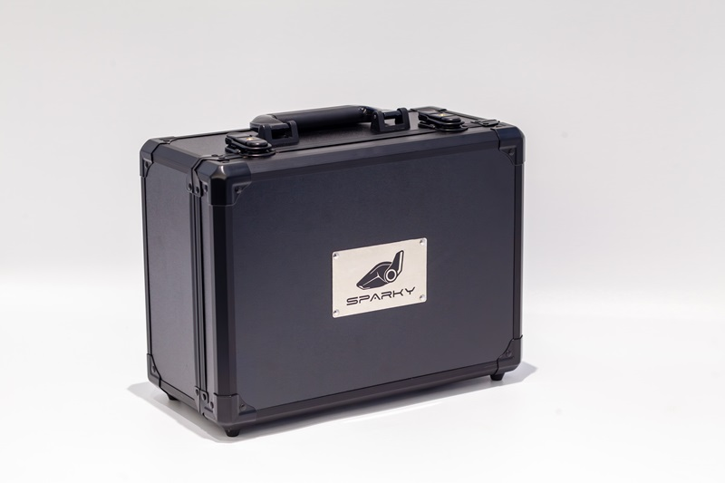
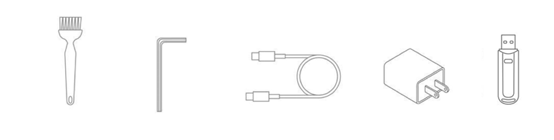
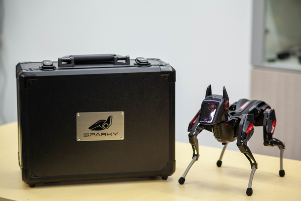
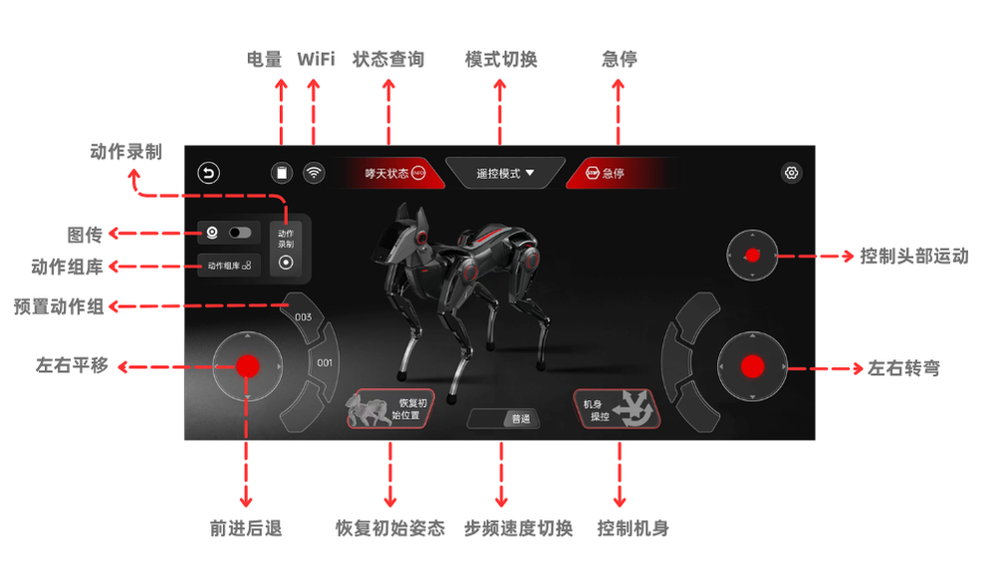
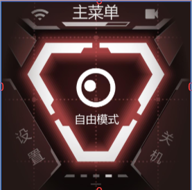

# 初识 Sparky：开箱指南

## 一、前言

嘿，未来的机器狗训练大师！欢迎您踏上与新伙伴——哮天的旅程。这份精心准备的开箱指南将引导您深入了解哮天的奇妙世界。它将教您如何启动、使用并与哮天进行互动。同时，这份指南也将激发您的创造力，鼓励您探索未知，创造更多有趣的玩法。

>开箱视频

## 二、开箱放送

首先，感谢您选择并信任我们的产品——哮天（Sparky）！现在，让我们一起来开箱。
我们为哮天配备了金属箱体作为外包装，箱体表面采用亮光纹设计，正面镶嵌了银色铭牌，这不仅增加了美观性，还便于用户携带或保存哮天。接下来，一起解开包装箱的锁扣一探究竟吧！

开箱后，首先映入眼帘的是我们的主角——哮天。它以狗狗休息时的舒适姿态趴在箱内。在开始使用前请抓住哮天的腰部，小心地将它从箱中取出，取出后放置在任意平整的地面或台面上。

哮天整机重量仅有850克，相当于两瓶矿泉水的重量。这种设计得益于精细的工艺和材料。我们采用了先进的轻量化设计，在机身和腿部进行了重量的大幅减轻，既确保了轻巧的手感，也保证了高效的运动性能。

## 三、配件盘点

随箱您将收到来自 HENGBOT 团队致开发者的一封信！  
以及一份使用配件：清洁刷 / 六角扳手 / 双 Type-C 数据线 / 充电器 / SD 读卡器 / 系统镜像卡。

  

| 配件图 |
|-----|
| **从左至右：清洁刷  六角扳手  双 Type-C 数据线  充电器  SD读卡器** |
| |

| 配件名称      | 作用 |
| ----------- | ----------- |
| **SD镜像卡** | 内置哮天镜像系统（已提前烧录内置）|
| **清洁刷** | 可对头部或机身进行灰尘清洁 |
| **六角扳手** | 可紧固或拆卸内六角螺钉（不建议无经验用户拆卸机身）|
| **Type-C 数据线** | 连接 SPARKY哮天 与其他设备（PC端）的线材，用于数据传输和充电 |
| **充电器** | 搭配 Type-C 数据线 进行充电使用 |
| **SD 读卡器** | 辅助在电脑端查看并读写 SD 镜像卡的工具 |

至此，开箱过程就告一段落了。  
在开启与哮天的互动前，请仔细对整机及配件进行核对及外观检查。如果在检查过程中发现任何问题，请您立即联系 HENGBOT 团队提供必要的帮助和解决方案。 

:::tip[Use Tip] 

- 外观检查：请仔细观察哮天的外观以及整机机身，确保没有任何明显的损坏迹象，如划痕、凹陷等。
- 配件核对：请检查随箱附赠的配件，确保它们齐全并且外观上没有明显的损坏。
- 通电检查：请使用官方附赠的充电器进上电接入哮天就行通电测试。
:::

## 四、启动哮天

检查无误后，下一步是启动哮天。

### 4.1 开机操作

将哮天放置平地后**长按背部电源键三秒**开机，启动时哮天将从趴卧形态收回四肢，自动调整至站立姿态并发出狗吠声。此时**头部开始播放开机及眨眼动画**，请接受来自哮天的友好 Wink 吧！

| 开机前状态 | 开机后状态 |
|----------|----------|
|  |  |

### 4.2 使用技巧

| 功能         | 使用技巧 | 备注 |
| -----------  | ----------- | ------- |
| **使用环境** | 使用时请在平坦宽阔的地面或台面上使用哮天，请勿在有水或其他液体的户外地面上操作。| |
| **查看电量** | 哮天头部顶端会**实时显示电量条**，电量充足的情况下，哮天可**实现 45-60min 的不插电使用**，如电量低时，它会发出**提醒（狗狗）叫声并自动关机恢复趴下状态.** |  |
| **充电** | 我们建议您**使用哮天官方认证的充电器**，以确保安全和效果。在充电过程中，您可以通过尾灯颜色变化来了解充电状态：**红色表示正在充电**，蓝色则意味着充电已完成。|  |
| **开机** | 长按背部电源键三秒进行开机操作 |
| **关机** | 一种是头部 UI 程序进行系统关机，另一种是长按背部电源键进行关机。|
| **头部交互** | 左右耳按键功能一致，均可进行选项选择或调节，头顶触摸可确认选项。|  |
| **发热** |哮天长时间使用后电机温度会升高，这是正常现象，请确保您在通风良好的环境中使用。此外，哮天内置过热保护程序，当电机温度过高时该电机将主动失能，待其温度降到合理范围内再重新启动工作。| |
| **清洁** | 长时间使用哮天导致积压灰尘时，可使用附赠小刷子对执行器凹槽进行清洁，头部面盖及其他部位可使用柔软的湿布轻轻擦拭，但在清洁时确保哮天在关闭电源且不在充电状态下，避免将水或其他液体直接溅到机器人表面。|  |

## 五、体验 Sparky's App

体验 Sparky's App 之前先进行一些准备工作，以便您在体验过程中有更好的体验。

### 5.1 准备工作

- **下载 Sparky's App （版本：240627）**  
  
  1. 请准备一台安卓系统并能开启热点的手机备用。
  2. 请先用准备的手机下载 SPARKY'S APP 安装包，并依照指示完成安装，方便后续使用。

> 软件包待更新

哮天启动后头部会显示摄像头画面，并等待扫码进行联网操作。  
我们可通过 **Sparky's App 生成二维码给哮天进行联网**，并将其与哮天连接更方便我们体验遥控。

### 5.2 联网

:::danger[Take care]
1. 开机时无跳出/错过联网页面时，请前往头部设置查看如何手动开启 WIFI 联网功能。
2. 局域网连接方式需持有 APP 的手机及哮天双设备的网络在同一局域网下。
3. 如果您是第一次为哮天设备进行联网，并且需要同时连接到 Sparky's App，请按照我们的文档流程进行操作以确保顺利连接。
:::

首次启动 Sparky's App 后会直接弹出联网页面，这里提供了两种局域网下的连接方式，用户可根据需求任意选择其一方式进行连接。

**第一步：选择网络并输入密码生成二维码**

点击 **"哮天局域网"** 后 Sparky's App 自动搜索并显示网络，用户直接 **"输入密码"** 后 Sparky's App 会生成二维码。

**第二步：二维码对准哮天头部进行联网**

请将二维码对准哮天头部进行扫描，扫描后哮天会自动搜索并连接到网络。  
联网成功后头部会显示 **“连接成功”** 的信息，同时会展示出已连接的 `网络名称`、` IP地址` 及`电量`。

| 扫描二维码 | 联网后头部显示内容 |
|----------|----------|
|  |  |

### 5.3 连接 Sparky's App

:::danger[Take care]
**连接 Sparky's App 必要前提**：哮天头部 UI 程序已进入遥控模式下。否则会出现连接失败的操作。  
:::

**第三步：使用 IP 地址将 Sparky's App 与哮天完成连接配对。**

联网成功后头部 UI 程序会自动进入遥控模式，我们回到 Sparky's App 联网页面，点击 **"刷新键"**，刷新后页面会显示检测到的设备 IP。点击 **"哮天 IP 地址"** 进行连接，成功后会自动进入首页，点击 **“进入遥控"** 开始您的遥控体验旅程吧！

### 5.4 拓展用法

:::tip[Use Tip]
文档（6.3）小节是拓展用法，专为已使用过哮天联网及 Sparky's App 连接功能的用户开放，此小节非必要开箱步骤，新用户可直接跳过这一章节！
:::

#### 5.4.1 联网

哮天除上文用的方法：使用头部对 Sparky's App 生成的二维码进行扫描联网。
还可使用手机端分享或生成网络二维码供哮天联网操作。

**第一步：使用手机端 WIFI 生成二维码**

进入打开手机端的 WiFi 页面选择已连接的网络，点击网络名称进入内页了解详情并生成二维码的形式备用。

**第二步：二维码对准哮天头部进行联网**

请将二维码对准哮天的头部进行扫描。扫描后，哮天的头部会自动开始读取网络信息。连接成功后头部会显示“连接成功”的提示，并展示已连接的网络名称及 IP 地址。

#### 5.4.2 遥控

:::danger[Take care]
哮天连接 Sparky's App 的前提：双方都应均在同一局域网下！！！
:::

除上文的检测到 IP 地址进行连接，如果出现没有 IP 地址显示。我们还可以通过此页面的 **“手动连接”** 进行连接设备，此用法更适合已联网过的哮天，只需输入 IP 地址即可一步完成连接。

连接完成后 APP 会回到首页，此时 **点击“进入遥控”** 开启体验您与哮天的奇妙互动。

### 5.5 遥控模式

进入后会弹出是否恢复初始姿态的提醒，点击 **“确定”** 后即可。

先根据标注图了解各类组件及图标的作用，熟悉后接着往下体验哮天的步态运动。

#### 5.5.1 体验步态运动

先尝试**滑动摇杆让哮天动起来实现步态运动**，再尝试 **切换速度模式“普通/急速”** 来控制哮天的步态速度。

| 工具 | 用途 | 使用方法 | 效果展示
|----|----|----|----|
| **左侧摇杆** | **控制四足：实现前进后退的步态运**动 | 向上滑动左侧摇杆（前进）  向下滑动左侧摇杆（后退）/ 摇杆的左右可搭配上下共同滑动来控制步行方向| |
| **右侧摇杆** | **控制四足：搭配左侧摇杆可实现左右方向型转弯**。| | |
| **速度模式** | **控制步态速度：普通/急速** | 点击即可切换速度模式 | |

#### 5.5.2 体验头部运动

此次头部单独做了摇杆控制的优化，用户能够更精细地控制头部运动。

| 工具 | 用途 | 使用方法 | 效果展示
|----|----|----|----|
| **头部滑杆** |控制头部：实现头部的俯仰及偏航运动 | **向上或下滑动**：头部实现俯仰动作（抬头低头）/ **向左或右滑动**：头部及颈部进行偏航运动（左右摇头）||
| **头部图传** | Sparky's App 内置的头部图传模块暂未开放，敬请期待。| | |

#### 5.5.3 体验机身运动

参照以下示例图进入机身操控页面，我们可以通过调整参数轴来实现各类机身运动。调整参数轴的方法有两种：一是**滑动红点进行调整**；二是**通过点击参数轴两侧的“-”来减少或“+”来增加。**

| 名称 | 用途（滑动或调整“-”“+”按键使用）  | 效果展示 |
|----|----|----|
| **Roll** | 机身绕 X 轴做左右滚转运动 | |
| **Z轴** | 腿部绕 X 轴实现蹲下或站立姿态 | |
| **Y轴** | 机身绕Y轴进行偏航运动 || 
| **X轴** | 机身绕X轴实现俯仰运动 ||

可同时控制多个滑动条实现完整或复杂动作（更多效果请观看示例视频）

#### 5.5.4 体验动作录制

前文，我们学习了如何使用遥控模式来操控哮天的头部、机身和姿态，从而实现多样化的运动。现在，让我们转向新功能——动作录制。我们可以通过认识及熟悉录制动作流程及技巧，来为哮天设计更加精彩和个性化的动作。

**第一步：进入并开启“动作录制”**

参照图例左上角 **点击“动作录制”按钮**，进入动作录制页面后将哮天 **“恢复至初始位置”**。现在，我们可以 **“点击开始录制”** 来熟悉录制的具体操作和流程。

**第二步：熟悉录制过程及操作，并为哮天移动头部或抬腿。**

点击后会弹出“掉电倒计时”的提示，哮天进入电机半卸力的状态，您可以尝试移动头部或抬抬腿部来熟悉动作录制的流程，再接着尝试让哮天抬头扭屁股完成整组动作。

**第三步：点击“结束录制”并播放哮天新录制动作**

:::danger[Take care]
1. 请点击“结束录制”按钮来结束，切勿点击右上角的×键来结束，否则会出现一直录制不中断的情况
2. 请注意在完成录制后及播放动作后，哮天将保持录制时的结束姿势。若要将其恢复至初始位置，请确保在电机上电前牢固握持机身，以防止因电机突然启动导致的机身弹起和损坏。
:::

点击“结束录制”后录制会停止，然后请握住哮天机身并点击“恢复初始姿态”使哮天回到默认姿势，最后参考图例点击“播放”键，哮天会为您复现刚才录制的动作。

>视频待补充

**第四步：进行命名及保存到库操作**

在 Sparky's App 中，您可对录制的文件进行命名并保存到库。只需点击“保存”按钮，页面会弹出命名框和保存确认框，为您刚录制的动作进行命名后确认即可保存到动作库。

#### 5.5.5 体验动作库

>我们保存的录制文件会被存放到什么位置呢？  
答案就是：动作组库！点击动作组库来查看保存的文件吧！

**第一步：查看保存的录制文件**

- 点击“动作组库”图标，进入动作库的内页。
- 在这您可以查看到系统预置的动作组以及您新建的录制文件。

>动作组库里不止有新建的录制动作组，还有 HENGBOT 已提前内置的哮天精彩动作组，我们还可以创建“动作组快捷触发”按键，可在展示步态运动时顺便让哮天展示动作组，那如何创建动作组快捷按键呢？

**第二步：创建动作组快捷触发**

- 进入动作组库，点击您想要编辑的动作组的图标。
- 从列表中选择一个动作组，点击“确认”按钮。
- 系统会返回到遥控模式页面，此时摇杆组块会显示您选择的动作组名称。
- 直接点击该组块，哮天将展示您放置的动作组。
  
这样，您就可以在遥控模式下快速触发并展示您选择的动作组了。

一起来演示来快速演示下放置好的动作组吧！
>视频待补充

### 5.6 更多玩法

关于 Sparky's App 遥控模式基础使用已经介绍完毕，如果您想进一步探索 App 的更多有趣模式，请点击文档让我们更进一步来玩转编辑、示教模式下的动作编辑，为哮天创造更多独一无二的动作组！”

> APP 更多玩法：探索 Sparky：玩转动作编辑  
> API 开发资料：WebSocket API 使用说明

## 六、体验 UI 玩法

探索完 Sparky’s App 的遥控模式后，您可以通过按下哮天耳朵的左右按键来退出遥控模式。接下来，让我们一起看看哮天头部还预置了哪些有趣且实用的功能：

### 6.1 UI 玩法技巧

探索完 Sparky’s App 的遥控模式后，您可以通过按下哮天耳朵的左右按键来退出遥控模式。接下来，让我们一起看看哮天头部还预置了哪些有趣且实用的功能：

| **技巧** | **使用** |
|----|----|
| 进入交互页面后如何操作 | 只需通过哮天左右耳的按钮选择“退出”，并通过轻触头顶区域确认退出。|
| 如何手动开启遥控/自由/任意模式 | 只需通过哮天左右耳的按钮选择“xx（任意）模式”，并通过轻触头顶区域确认选择。|
| 如何退出遥控/自由/任意模式 | 一是连按左耳或右耳的按键两下即可退出“任意模式”。二是只需通过哮天左右耳的按钮选择“退出”，并通过轻触头顶区域确认退出。 |
| 如何进入更多功能 | 使用哮天左右耳的按键，选择进入“更多功能”的菜单。然后轻触头顶区域来确认进入页面 |

### 6.2 颜色识别

> 颜色识别通常涉及到图像处理和机器学习技术，颜色识别就像是给哮天一个“调色板”，使其不仅能够看到图像中的颜色，并且能够识别出特定的颜色，并将用户感兴趣的颜色进行标记。

要体验颜色识别功能，您可以按照以下步骤进行：
1. **选择颜色识别**：在“更多功能”菜单中，使用左右耳按键选择“颜色识别”功能。并通过触摸头顶来开启这一功能。
2. **准备识别对象**：功能启动后，准备一个红色的球或红色纸盒。确保该物体完全处于头部摄像头的视野范围内，以便哮天能够自动进行颜色识别。

如果您需要识别其他颜色，您可能需要自行更改后台脚本，以适应不同的颜色识别需求。

>效果视频

### 6.3 自平衡

> 自平衡（Self-Balancing）是指一个系统或设备能够自动调整其姿态或位置，以保持稳定状态的能力；想象一下就像是哮天拥有了自己的“平衡感”；当它站立时，无论是被轻轻推动还是自己微调位置，它体内的系统会迅速感知到这些变化，并通过精细调整腿部动作来恢复平衡。

要观察哮天在不同动作下如何实现自平衡姿态，请按照以下步骤操作：
1. **选择自平衡功能**：在“更多功能”菜单中，使用左右耳按键选择“自平衡”功能。并通过触摸头顶来开启这一功能。
2. **单腿抬起测试**：轻轻抬起哮天的单腿，观察它的其他三条腿如何缓慢而稳定地调整位置，以保持整个机身的平衡。
3. **双腿抬起测试**：尝试同时抬起哮天的前左腿和前右腿，观察它的后腿如何巧妙地降低高度并抬起屁股，以保持整体的平衡。
4. **自定义平衡动作**：现在，您可以自由尝试您想让哮天保持平衡的动作。  

这些步骤不仅帮助您了解哮天的自平衡能力，还能让您探索更多创造性的玩法。但记得在进行测试时，请确保哮天处于安全的环境中，避免因失去平衡而造成损伤。

### 6.4 自由模式

如何开启自由模式，您可以按照以下步骤进行操作：  

1. **选择自由模式**：在“更多功能”菜单中，再次使用左右耳按键选择“自由模式”选项。确认选择后，通过触摸头顶来开启这一功能。
2. **体验自由模式**：开启自由模式后，哮天会像观察者一样注视您，头部会随着您的脸部移动而移动。同时，它的腿部会处于半卸力的自平衡状态，即使有小幅度的碰撞或挤压，也不必担心会对机器狗造成影响。
3. **退出自由模式**：当您想退出自由模式时，使用左右耳按键选择“返回”选项，并通过头顶触摸来确认选择。系统会自动退出自由模式。

### 6.5 开发者模式

开发者模式是给希望有更深层次编程和二次开发的开发者设计的。一旦启用，哮天头部 UI 程序将被中止，以便开发者可以使用 HENGBOT 提供的API 接口文档，并通过 Python 等编程语言实现自己的创新想法。

> 开发资料及文档待补充

### 6.6 头部更多设置

设置里预置了 WIFI、音量、系统自检、系统信息、以及返回上一级五个选项可供用户调整。

#### 6.6.1 如何开启 WIFI 联网

除开机时自动跳出联网页面，我们可通过手动开启 WIFI 连接页面，联网操作跟上文一致。  

1. **进入设置菜单**：使用哮天左右耳的按键，选择进入“设置”的菜单。轻触头顶区域来确认进入页面。
2. **选择WIFI功能**：在设置菜单中，使用左右耳按键选择“WIFI”功能，并通过触摸头顶来开启。
3. **连接WIFI**：开启WIFI功能后，系统会显示摄像头画面，按照之前的指导进行WIFI连接。

 
#### 6.6.2 如何调节音量

第一步：通过 SPARKY 左右耳的按键，选择进入“设置”的菜单，然后轻触头顶区域来确认进入页面。
第二步：使用左右耳按键选择 “调节音量”，并通过触摸头顶来开启这一功能。
第三步：最后通过左右耳按键来进行提高或减小音量的调整即可。

#### 6.6.3 如何进行系统自检

第一步：通过 SPARKY 左右耳的按键，选择进入“设置”的菜单，然后轻触头顶区域来确认进入页面。
第二步：使用左右耳按键选择 “系统自检”，并通过触摸头顶来开启这一功能。
第三步：进入后系统会自动对：IMU、KEY、Battery、WiFi Driver、Motor Servo 此硬件进行自检，检查完成后会显示以勾为图标全部通过的页面。

>图待补充

#### 6.6.4 检查系统信息
第一步：通过哮天左右耳的按键，选择进入“设置”的菜单，然后轻触头顶区域来确认进入页面。
第二步：使用左右耳按键选择 “系统信息”，并通过触摸头顶来开启这一功能。
第三步：开启后可看见系统相关版本信息。

## 七、更多用法

> 更多玩法待补充。
