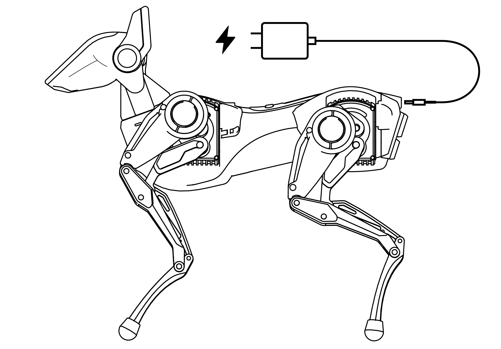
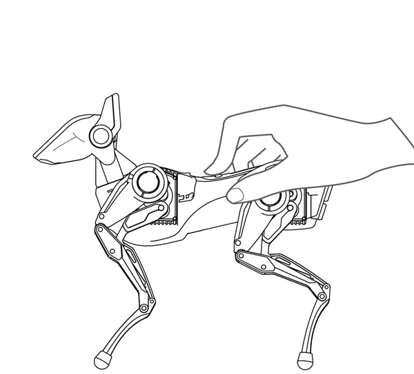
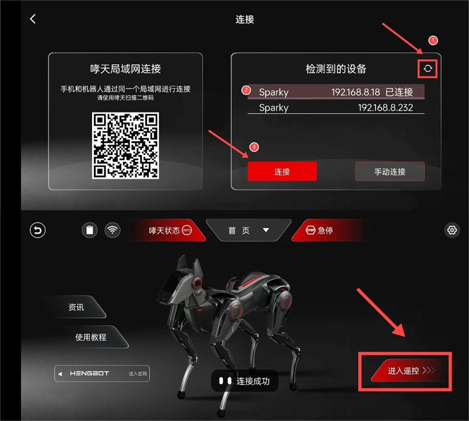
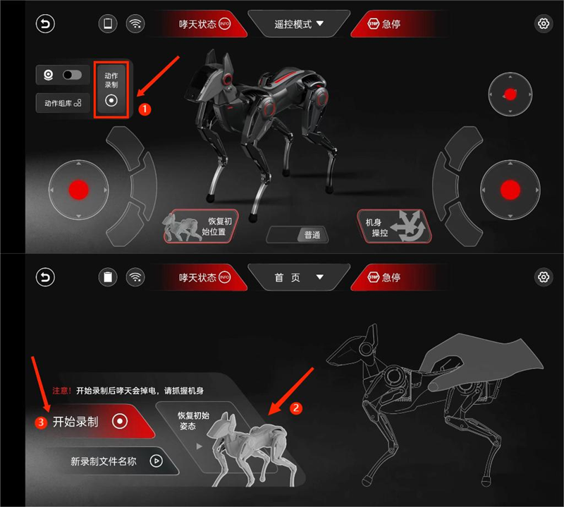
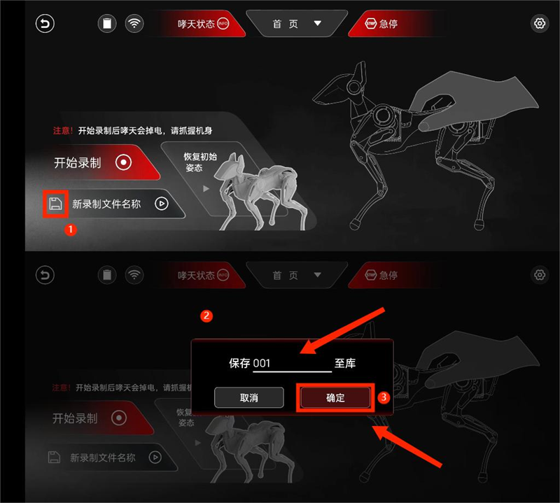
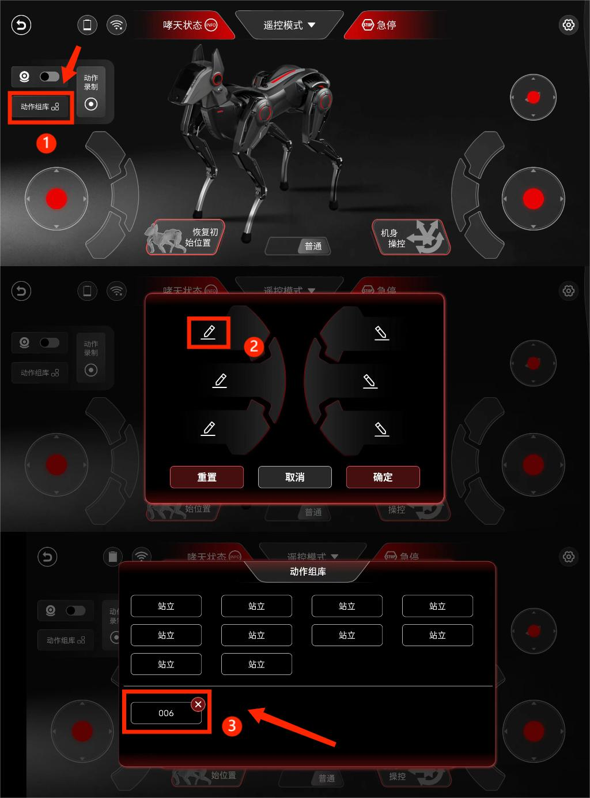

# 开箱系列：基础配置使用

## 一、前言

嘿，未来的机器狗训练大师！欢迎您踏上与新伙伴——哮天的旅程。这份精心准备的开箱指南将引导您深入了解哮天的奇妙世界。它将教您如何启动、使用并与哮天进行互动。同时，这份指南也将激发您的创造力，鼓励您探索未知，创造更多有趣的玩法。

## 二、开箱

首先，感谢您选择并信任我们的产品——哮天（Sparky）！现在，让我们一起来开箱。
我们为哮天配备了金属箱体作为外包装，箱体表面采用亮光纹设计，正面镶嵌了银色铭牌，这不仅增加了美观性，还便于用户携带或保存哮天。接下来，一起解开包装箱的锁扣一探究竟吧！

开箱后，首先映入眼帘的是我们的主角——哮天。它以狗狗休息时的舒适姿态趴在箱内。在开始使用前请抓住哮天的腰部，小心地将它从箱中取出，取出后放置在任意平整的地面或台面上。

哮天整机重量仅有850克，相当于两瓶矿泉水的重量。这种设计得益于精细的工艺和材料。我们采用了先进的轻量化设计，在机身和腿部进行了重量的大幅减轻，既确保了轻巧的手感，也保证了高效的运动性能。

## 三、配件盘点

以及一份使用配件：清洁刷 / 双 Type-C 数据线 / 充电器。

  

| 配件名称     |    作用     |
| ----------- | ----------- |
| **SD镜像卡** | 内置哮天镜像系统（已提前插入头部卡槽）|
| **清洁刷** | 可对头部或机身进行灰尘清洁 |
| **Type-C 数据线** | 连接 SPARKY哮天 与其他设备（PC端）的线材，用于数据传输和充电 |
| **充电器** | 搭配 Type-C 数据线 进行充电使用 |

至此，开箱过程就告一段落了。  
在开启与哮天的互动前，请仔细对整机及配件进行核对及外观检查。如果在检查过程中发现任何问题，请您立即联系 HENGBOT 团队提供必要的帮助和解决方案。 

:::tip[Use Tip] 

- 外观检查：请仔细观察哮天的外观以及整机机身，确保没有任何明显的损坏迹象，如划痕、凹陷等。
- 充电检查：请使用官方配套充电器进上电接入哮天进行充电测试，尾巴灯亮起表示在充电状态。
:::

## 四、启动哮天

检查无误后，下一步是启动哮天。

:::tip[Use Tip]

**开机前请保证哮天以正确的初始姿势放置在平稳地面上，使用时可取消包装箱的泡棉**，在途中请勿让产品受到过度冲击，例如从高处跌落或碰撞等；

| 开机前状态 | 开机后状态 |
|----------|----------|
|  |  |

**请使用包装箱原装充电头与充电线充电**：哮天不充电使用时间在1-2个小时，关机下充满需要50min左右，如果需要长时间编排动作与调试，建议尾部插上充电线使用。

:::

### 4.1 开机操作

将哮天放置平地后**长按背部电源键三秒**开机，启动时哮天将从趴卧形态收回四肢，自动调整至站立姿态并发出狗吠声。此时**头部开始播放开机及眨眼动画**，请接受来自哮天的友好 Wink 吧！

### 4.2 使用技巧

| 功能         | 使用技巧 | 备注 |
| -----------  | ----------- | ------- |
| **使用环境** | 请在平坦宽阔的地面或台面上使用哮天，请勿在有水或其他液体的户外地面上操作。|   |
| **查看电量** | 哮天头部顶端会**实时显示电量条**，电量充足的情况下，哮天可**实现 45min 以上的不插电使用**，如电量低时，它会发出**提醒（狗狗）叫声并自动关机恢复趴下状态.** |  |
| **充电** | 我们建议您**使用官方配套充电设备**（PD30w)，以确保充电的安全和效果。充电时设备通电后，尾灯点亮表明已在充电状态。|  |
| **开机** | 长按背部电源键三秒进行开机操作 |  |
| **关机** | 一种是长按背部电源键进行关机，另一种是头部 UI 程序进行系统关机。|
| **头部交互** | 左右耳按键功能一致，均可进行选项选择或调节，头顶触摸可确认选项。|  |
| **发热** |哮天长时间使用后电机温度会升高，这是正常现象，请确保您在通风良好的环境中使用。此外，哮天内置过热保护程序，当电机温度过高时该电机将主动失能，待其温度降到合理范围内再重新启动工作。| |
| **清洁** | 长时间使用哮天导致积压灰尘时，可使用附赠小刷子对执行器凹槽进行清洁，头部面盖及其他部位可使用柔软的湿布轻轻擦拭，但在清洁时确保哮天在关闭电源且不在充电状态下，避免将水或其他液体直接溅到机器人表面。|  |

## 五、联网操作

哮天播放开机动画后，如设备处于无联网状态下，则头部会显示摄像头等待扫码联网页面，此时可通过以下两种方式进行联网。

### 5.1 准备工作

- **下载 App （版本：240627）**  
  
  1. 请准备一台安卓系统的手机备用。
  2. 请先用准备的手机下载安装包，并依照指示完成安装，方便后续使用。

### 5.2 APP 局域网连接

启动 App 时如果哮天处于未联网状态，App 会直接弹出联网页面，方便我们进行连接。

| 操作步骤 | 示意图 |
|----------|-------|
| **点击 "哮天局域网连接"** 后 Sparky's App 自动搜索并显示网络， |  |
| **标注一**：选择需连接的网络并输入密码，**标注二**：完成后点击“确定”，**标注三**：生成二维码备用。|  |
| 请将生成**二维码对准哮天头部**进行扫描，扫描后哮天会自动搜索并连接到网络。 |  |
| 联网成功后头部会显示 **“连接成功”** 的信息，同时会进入遥控模式并显示相关信息的 `网络名称`、` IP地址` 及`电量`。 |  |

### 5.3 Wifi 热点连接

:::tip[Use Tip] 
此处是出现（无手机 APP 情况）在哮天无法联网的前提下，仍然能为哮天联网的保底操作，非开箱的必要操作，联网成功后可跳过。
:::

| 操作步骤 | 示例图 |
|----------|-------|
| **标注一**：选择需连接的网络并点击进入详情页，**标注二**：点击生成或分享此网络（二维码形式），**标注三**：将生成二维码保存备用。|  |
| 请将生成**二维码对准哮天头部**进行扫描，扫描后哮天会自动搜索并连接到网络。 |  |
| 联网成功后头部会显示 **“连接成功”** 的信息，同时会进入遥控模式并显示相关信息的 `网络名称`、` IP地址` 及`电量`。 |  |

## 六、连接 APP

### 6.1 前提条件

- **确保哮天已联网并且头部（UI）进入遥控模式。**
- **确保哮天网络与 `手机app端` 的网络处于同一局域网下。**

> **这里阐述下部分相关逻辑：**  
**逻辑一**：正常使用流程下开机扫码后，哮天头部显示 `眼睛标志` 及 `IP 地址` 就代表已联网并进入遥控模式。  
**逻辑二**：但如果是在头部（UI）手动开启 `WIFI` 进行联网则也需手动进入遥控模式。  
 

|项目 | 操作步骤 | 示例图 |
|---------|--------|-----|
| **头部交互** | 左右耳按键功能一致，均可进行选项选择或调节，头顶触摸可确认选项。|  |
| **进入头部（UI）遥控模式** | 直接在主菜单选择 “遥控模式” 选项。确认选择后，通过触摸头顶来开启这一功能。  ||

### 6.2 连接 APP

完成以上的前提条件后，我们回到 App 联网页面将哮天与手机 App 连接。

| 操作步骤 | 示例图 |
|---------|--------|
| **标注一**：点击 "刷新键" 后页面显示检测到的设备 IP，**标注二**：选择哮天的 "IP 地址"，**标注三**：点击 "连接" 按钮使用 IP 地址进行连接，成功后会弹出“连接成功”。 |  |

如果连接时出现没有显示 IP 地址，我们还可以通过此页面的 **“手动连接” 进行连接**哮天。

| 操作步骤 | 示例图 |
|-----|------|
| **标注一**：点击 “手动连接”，**标注二**：输入哮天头部 IP 地址，**标注三**：点击 “确定” 手动连接哮天。 ||

## 七、结语

上文我们熟悉了哮天的基础配置用法，接下来就开始探索哮天各种有趣的基础玩法，敬请期待吧！

<!-- ## 七、更多玩法

### 5.4 拓展用法

:::tip[Use Tip]
文档（6.3）小节是拓展用法，专为已使用过哮天联网及 Sparky's App 连接功能的用户开放，此小节非必要开箱步骤，新用户可直接跳过这一章节！
:::

#### 5.4.1 联网

哮天除上文用的方法：使用头部对 Sparky's App 生成的二维码进行扫描联网。
还可使用手机端分享或生成网络二维码供哮天联网操作。

#### 5.4.2 遥控

:::danger[Take care]
哮天连接 Sparky's App 的前提：双方都应均在同一局域网下！！！
:::

除上文的检测到 IP 地址进行连接，如果出现没有 IP 地址显示。我们还可以通过此页面的 **“手动连接”** 进行连接设备，此用法更适合已联网过的哮天，只需输入 IP 地址即可一步完成连接。

连接完成后 APP 会回到首页，此时 **点击“进入遥控”** 开启体验您与哮天的奇妙互动。

### 5.5 遥控模式

进入后会弹出是否恢复初始姿态的提醒，点击 **“确定”** 后即可。

先根据标注图了解各类组件及图标的作用，熟悉后接着往下体验哮天的步态运动。

#### 5.5.1 体验步态运动

先尝试**滑动摇杆让哮天动起来实现步态运动**，再尝试 **切换速度模式“普通/急速”** 来控制哮天的步态速度。

| 工具 | 用途 | 使用方法 | 效果展示
|----|----|----|----|
| **左侧摇杆** | **控制四足：实现前进后退的步态运**动 | 向上滑动左侧摇杆（前进）  向下滑动左侧摇杆（后退）/ 摇杆的左右可搭配上下共同滑动来控制步行方向| |
| **右侧摇杆** | **控制四足：搭配左侧摇杆可实现左右方向型转弯**。| | |
| **速度模式** | **控制步态速度：普通/急速** | 点击即可切换速度模式 | |

#### 5.5.2 体验头部运动

此次头部单独做了摇杆控制的优化，用户能够更精细地控制头部运动。

| 工具 | 用途 | 使用方法 | 效果展示
|----|----|----|----|
| **头部滑杆** |控制头部：实现头部的俯仰及偏航运动 | **向上或下滑动**：头部实现俯仰动作（抬头低头）/ **向左或右滑动**：头部及颈部进行偏航运动（左右摇头）||
| **头部图传** | Sparky's App 内置的头部图传模块暂未开放，敬请期待。| | |

#### 5.5.3 体验机身运动

参照以下示例图进入机身操控页面，我们可以通过调整参数轴来实现各类机身运动。调整参数轴的方法有两种：一是**滑动红点进行调整**；二是**通过点击参数轴两侧的“-”来减少或“+”来增加。**

| 名称 | 用途（滑动或调整“-”“+”按键使用）  | 效果展示 |
|----|----|----|
| **Roll** | 机身绕 X 轴做左右滚转运动 | |
| **Z轴** | 腿部绕 X 轴实现蹲下或站立姿态 | |
| **Y轴** | 机身绕Y轴进行偏航运动 || 
| **X轴** | 机身绕X轴实现俯仰运动 ||

可同时控制多个滑动条实现完整或复杂动作（更多效果请观看示例视频）

#### 5.5.4 体验动作录制

前文，我们学习了如何使用遥控模式来操控哮天的头部、机身和姿态，从而实现多样化的运动。现在，让我们转向新功能——动作录制。我们可以通过认识及熟悉录制动作流程及技巧，来为哮天设计更加精彩和个性化的动作。

**第一步：进入并开启“动作录制”**

参照图例左上角 **点击“动作录制”按钮**，进入动作录制页面后将哮天 **“恢复至初始位置”**。现在，我们可以 **“点击开始录制”** 来熟悉录制的具体操作和流程。

**第二步：熟悉录制过程及操作，并为哮天移动头部或抬腿。**

点击后会弹出“掉电倒计时”的提示，您可以尝试移动头部或抬抬腿部来熟悉动作录制的流程，再接着尝试让哮天抬头扭屁股完成整组动作。

**第三步：点击“结束录制”并播放哮天新录制动作**

:::danger[Take care]
1. 请点击“结束录制”按钮来结束，切勿点击右上角的×键来结束，否则会出现一直录制不中断的情况
2. 请注意在完成录制后及播放动作后，哮天将保持录制时的结束姿势。若要将其恢复至初始位置，请确保在电机上电前牢固握持机身，以防止因电机突然启动导致的机身弹起和损坏。
:::

**点击“结束录制”后**录制会停止，然后请握住哮天机身并**点击“恢复初始姿态”**使哮天回到默认姿势，最后参考图例**点击“播放”键**，哮天会为您复现刚才录制的动作。

>视频待补充

**第四步：进行命名及保存到库操作**

在 Sparky's App 中，您可对录制的文件进行命名并保存到库。只需**点击“保存”按钮**，页面会弹出命名框和保存确认框，为您刚录制的动作进行命名后确认即可保存到动作库。

#### 5.5.5 体验动作库

>我们保存的录制文件会被存放到什么位置呢？  
答案就是：动作组库！点击动作组库来查看保存的文件吧！

**第一步：查看保存的录制文件**

- 点击“动作组库”图标，进入动作库的内页。
- 在这您可以查看到系统预置的动作组以及您新建的录制文件。

>动作组库里不止有新建的录制动作组，还有 HENGBOT 已提前内置的哮天精彩动作组，我们还可以创建“动作组快捷触发”按键，可在展示步态运动时顺便让哮天展示动作组，那如何创建动作组快捷按键呢？

**第二步：创建动作组快捷触发**

- 进入动作组库，点击您想要编辑的动作组的图标。
- 从列表中选择一个动作组，点击“确认”按钮。
- 系统会返回到遥控模式页面，此时摇杆组块会显示您选择的动作组名称。
- 直接点击该组块，哮天将展示您放置的动作组。
  
这样，您就可以在遥控模式下快速触发并展示您选择的动作组了。

一起来演示来快速演示下放置好的动作组吧！
>视频待补充

## 六、更多玩法

>探索完 Sparky’s App 的遥控模式后，您是否会觉得到这里已经结束了？  
>不，这只是一个无限可能的新开始！

**我们还有以下这些有趣的玩法：**

### 6.1 开箱指南续集

您已踏上与哮天（Sparky）的探索之旅。在这份指南的引导下，您可以体验头部的 UI 程序，看看我们预置了哪一些彩蛋以及有趣的应用。

> [初识 Sparky（续）：更多玩法](./quick_start_two.md)

### 6.2 玩转动作编辑

在这篇《玩转动作编辑》的 `Sparky's App` 续篇中，我们深入探索如何个性化定制哮天的动作。利用示教模式，您可以亲自引导哮天学习一系列新动作，而编辑模式则让您能够精准调整每个动作的关键帧，创造出独一无二的舞蹈或表演。

> [探索 Sparky：玩转动作编辑](./create_a_blog_post.md)

### 6.3 WebSocket API 使用

文档不止有详细的使用指南，开发者们期待已久的 API 使用指南我们也一并奉上，在这我们公开了遥控的 API 接口相关信息，以及部分图形化相关案例，希望您可以使用它探索并为哮天创造更多的花样玩法。

> [WebSocket API 使用说明](./deploy_your_site.md)

### 6.4 Python 二次开发

在这我们着重介绍了核心 API 手册以及如何使用 `Python SDK` 控制哮天的运动状态。您可以按照我们提供的接口和例程，学习机器人控制，完成哮天的二次开发。

> [Python 二次开发指南](./python_api.md)
 -->
