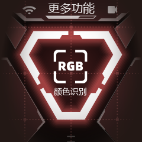
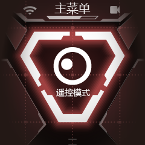

# 拓展系列（一）：UI 界面使用

## 一、前言

我们将在这介绍哮天头部 UI 界面，它的头部不仅是其视觉和交互的核心，还集成了一个功能丰富的用户界面（UI），以及来自 HENGBOT 研发人员的惊喜彩蛋。

## 二、UI 界面

### 2.1 使用技巧

首先我们来介绍一些通用的玩法技巧，帮助大家快速上手。

| **技巧** | **使用** | **示例图** |
|----|----|---|
| **进入交互页面后所有的操作** | 只需通过哮天左右耳的按钮选择“退出”或“进入”，并通过轻触头顶区域确认即可。|  |

### 2.2 颜色识别

> 颜色识别通常涉及到图像处理和机器学习技术，颜色识别就像是给哮天一个“调色板”，使其不仅能够看到图像中的颜色，并且能够识别出特定的颜色，并将用户感兴趣的颜色进行标记。

<iframe width="780" height="400" src="https://www.youtube.com/embed/D72uZHluP_s?si=ZFdCK-wyzF8Mfkao" title="YouTube video player" frameborder="0" allow="accelerometer; autoplay; clipboard-write; encrypted-media; gyroscope; picture-in-picture; web-share" referrerpolicy="strict-origin-when-cross-origin" allowfullscreen></iframe> 

要体验颜色识别功能，您可以按照以下步骤进行：

| 操作步骤 | 示例图 |
|---------|------|
| **第一步：选择颜色识别**：在“更多功能”菜单中，使用按键选择“颜色识别”功能。并通过触摸头顶来开启功能。|  |
| **第二步：准备识别对象**：功能启动后，准备一个红色的球或红色纸盒。确保该物体完全处于头部摄像头的视野范围内，以便哮天能够自动进行颜色识别跟随。| |

如果您需要识别其他颜色，您可能需要自行更改后台脚本，以适应不同的颜色识别需求。

### 2.3 自平衡

> 自平衡（Self-Balancing）是指一个系统或设备能够自动调整其姿态或位置，以保持稳定状态的能力；想象一下就像是哮天拥有了自己的“平衡感”；当它站立时，无论是被轻轻推动还是自己微调位置，它体内的系统会迅速感知到这些变化，并通过精细调整腿部动作来恢复平衡。

<iframe width="780" height="400" src="https://www.youtube.com/embed/6p6EiA26qwU?si=88CYzRoqmllL6nZl" title="YouTube video player" frameborder="0" allow="accelerometer; autoplay; clipboard-write; encrypted-media; gyroscope; picture-in-picture; web-share" referrerpolicy="strict-origin-when-cross-origin" allowfullscreen></iframe>

要观察哮天在不同动作下如何实现自平衡姿态，请按照以下步骤操作：

| 操作步骤 | 示例图 |
|---------|------|
| **第一步：选择自平衡功能**：在“更多功能”菜单中，使用按键选择“自平衡”功能。并通过触摸头顶来开启这一功能。|  |
| **第二步：单腿抬起测试**：轻轻抬起哮天的单腿，观察它的其他三条腿如何缓慢而稳定地调整位置，以保持整个机身的平衡。| |
| **第三步：双腿抬起测试**：尝试同时抬起哮天的前左腿和前右腿，观察它的后腿如何巧妙地降低高度并抬起屁股，以保持整体的平衡。||
| **第四步：自定义平衡动作**：现在，您可以自由尝试您想让哮天保持平衡的动作。 ||

这些步骤不仅帮助您了解哮天的自平衡能力，还能让您探索更多创造性的玩法。但记得在进行测试时，请确保哮天处于安全的环境中，避免因失去平衡而造成损伤。

### 2.4 自由模式

如何开启自由模式，您可以按照以下步骤进行操作：  

| 操作步骤 | 示例图 |
|---------|------|
| **第一步：选择自由模式**：在“更多功能”菜单中，再次使用左右耳按键选择“自由模式”选项。确认选择后，通过触摸头顶来开启这一功能。|  |
| **第二步：体验自由模式**：开启自由模式后，哮天会像观察者一样注视您，头部会随着您的脸部移动而移动。同时，它的腿部会处于半卸力的自平衡状态，即使有小幅度的碰撞或挤压，也不必担心会对机器狗造成影响。 | |

> 视频

### 2.5 遥控模式

遥控模式是哮天头部 UI 界面的核心功能之一，专为实现哮天（Sparky）的远程操控而设计。在这个模式下，用户可以进行联网设置、以及实现 Sparky's App 与哮天的连接、以及使用 WebSocket API 接口进行更深层次的开发。

| 操作步骤 | 示例 |
|------|------|
| **直接在主菜单选择 “遥控模式”** 选项。确认选择后，通过触摸头顶来开启这一功能。 |  |

### 2.6 开发者模式

| 介绍 | 示例图 |
|---------|------|
| 开发者模式是给想深层编程和二次开发的开发者设计的。一旦启用，哮天头部 UI 程序将被中止，以便开发者可以使用 HENGBOT 提供的 API 接口文档，并通过 Python 等编程语言实现自己的创新想法。| |

> [探索系列（二）：Python API](./python_api.md)  

> [探索系列（三）：WebSocket API](./deploy_your_site.md)

### 2.7 头部更多设置

| 介绍 | 示例图 | 视频 |
|---------|------|------|
| 设置里预置了 WIFI、音量、系统自检、系统信息、以及返回上一级五个选项可供用户调整。|  | <iframe width="580" height="380" src="https://www.youtube.com/embed/rsfhIzw3UIE?si=i7me8lW9ld3sJfWN" title="YouTube video player" frameborder="0" allow="accelerometer; autoplay; clipboard-write; encrypted-media; gyroscope; picture-in-picture; web-share" referrerpolicy="strict-origin-when-cross-origin" allowfullscreen></iframe> |

| 功能  |  介绍 | 示例图 |
|---------|------|------|
| **如何开启 WIFI 联网** | 除开机时自动联网页面，还可通过手动开启 WIFI 连接，联网操作一致。|  |
| **如何调节音量** | 我们可通过调节音量来控制哮天叫声的大小。|  |
| **如何进行系统自检** | 开启后会自动对硬件 IMU、KEY、Battery、WiFi Driver、Motor Servo 进行自检，确保在所有硬件无任何问题的前提下，再去体验软件功能。|  |
| **检查系统信息** | 开启后哮天会自动对系统信息进行读取 |  |

体验到这里后，大家应该对哮天有了基础的了解及认知，开箱指南到这里结束啦，请尽情探索其他有趣的花样玩法吧！