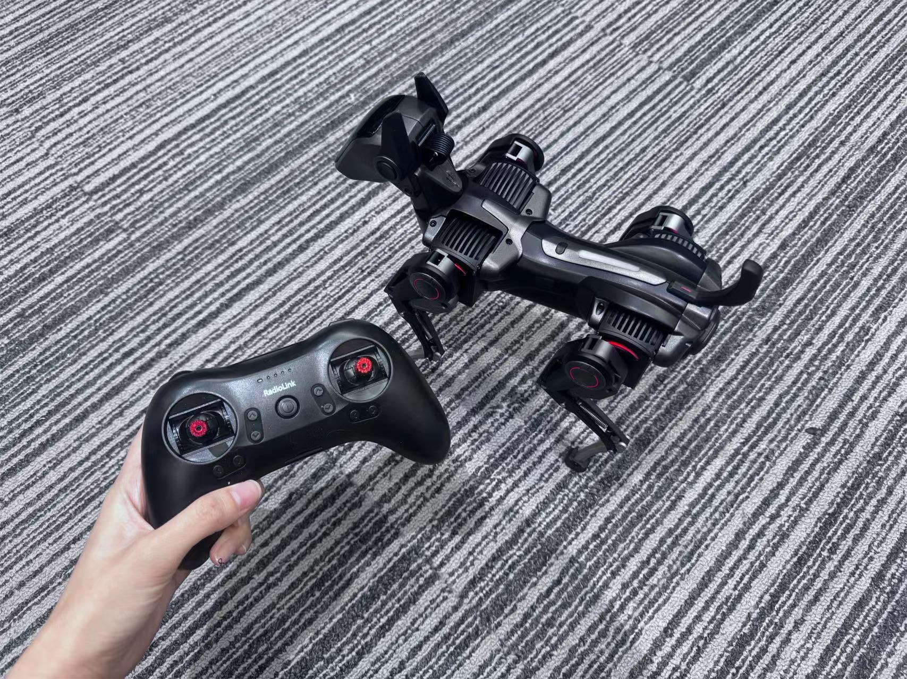
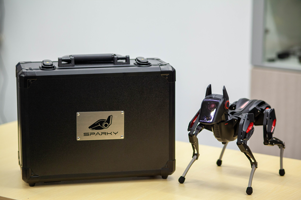
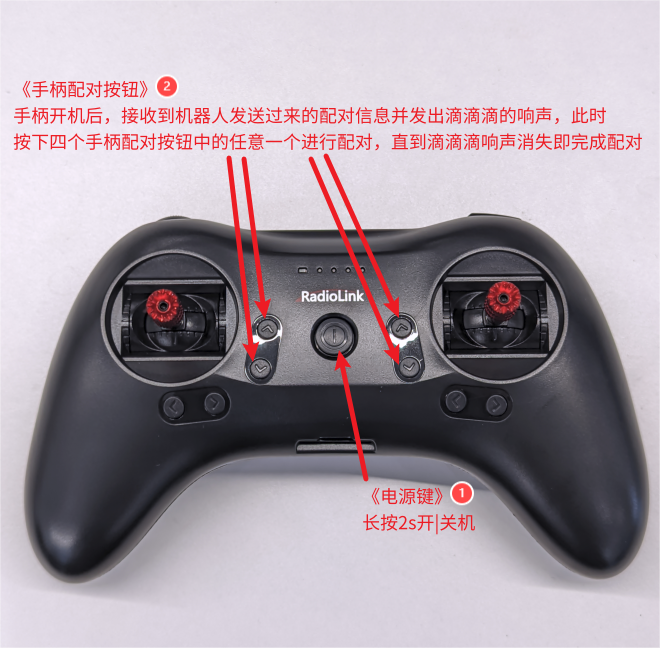
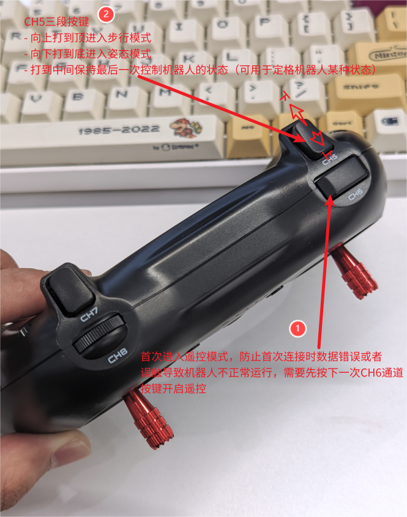
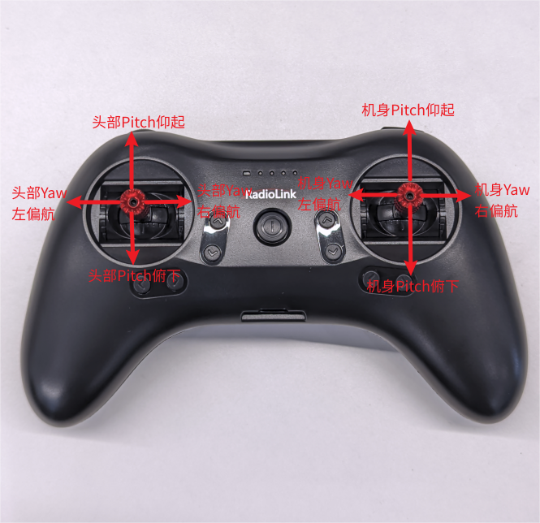
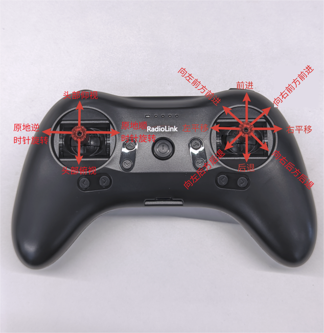

# Advanced-level (II): Operated by the gamepad

## I.Preface  

Welcome to Sparky's usage channel! This document will take you to quickly learn how to use a gamepad to remotely connect to Sparky and make it move. You will experience the gait, head, body and other movements of Sparky, feeling its flexibility and intelligence.  

## II.Preparation Work  

- **Hardware: Sparky/Official gamepad**
- **Environment: (Prerequisite for using the gamepad remote control) Sparky needs to enter remote control mode on the head interface(UI) .**

>

## III.Start Sparky  

<iframe width="780" height="400" src="https://www.youtube.com/embed/5XsQ4V2q488?si=RPv1GSvDMWLclHD0" title="YouTube video player" frameborder="0" allow="accelerometer; autoplay; clipboard-write; encrypted-media; gyroscope; picture-in-picture; web-share" referrerpolicy="strict-origin-when-cross-origin" allowfullscreen></iframe>

:::tip[USER TIPS]

**Remove the foam from the packaging box**. During moving, prevent the product from excessive impact, such as falling down or colliding, etc. **Make sure that the Sparky is placed on a stable ground in a proper initial posture before starting it up.**  

| Before starting up | After starting up |
|----------|----------|
|  |  |

**Use the original adapter and cable with the product in the packaging box for charging**: The Sparky can work for 1-2 hours without charging. It takes about 50 minutes to fully charge when turned it off. It is recommended to plug in the cable for charging during working for a long time.

:::

| Steps | Image Guide | Reference picture |
|---------------|----------|----|
| Press and hold the power button on the back for three seconds to turn on the device. |  |
| **Posture change after startup**①: Make a bark in a standing posture ; ②: Display the wink animation on the head | |
| **There are two possibilities for how to enter the remote control mode (UI)**: ① If Sparky is connected to the network, it will automatically enter the remote control mode, as shown in the image. ②: If there is no network connection in Sparky, please refer to the image guide and use the left and right ear buttons to select the remote control mode and confirm.| |  |

## IV.Connect the Gamepad for Remote Control

| Steps    | Image Guide |
|----------|-------------|
| **Start with the gamepad and perform pairing.****Label 1**: Press and hold the power button for 2s to start it. **Label 2**: Pair Sparky with the gamepad. | |
| **Press the CH6 key to start the gamepad (label 1)** to activate the remote control for the first time.|  |
|**Switch modes (Label 2 in above picture)** : Switch to walking/posture/freeze-frame mode with CH5.| |
|**Familiarize yourself with the functions in posture mode according to the diagram on the right**|  |
| **Familiarize yourself with the functions in gait mode according to the diagram on the right** ||

Now, you can use the gamepad to remotely control Sparky's gait, head, body, and other movements to experience it.