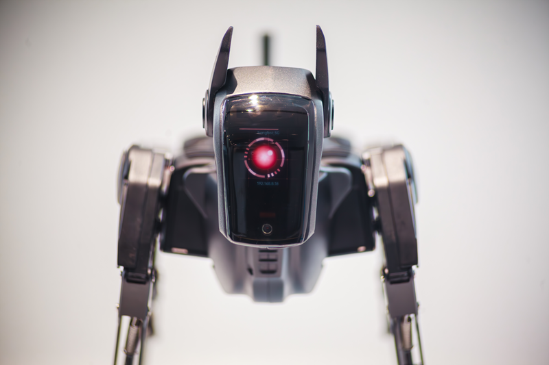

# 快速使用系列：手柄遥控

## 一、前言

欢迎来到哮天的使用频道！本篇文档将带您快速掌握如何使用手柄遥控连接哮天，并让它实现动起来。您将体验到哮天的步态、头部、机身等运动，感受其灵活与智能。

## 二、准备工作

- **硬件：哮天 / 官方配套遥控手柄**
- **环境：(使用手柄遥控的前提）哮天需在头部（UI）界面进入遥控模式。**

>图

## 三、启动哮天

<iframe width="780" height="400" src="https://www.youtube.com/embed/5XsQ4V2q488?si=RPv1GSvDMWLclHD0" title="YouTube video player" frameborder="0" allow="accelerometer; autoplay; clipboard-write; encrypted-media; gyroscope; picture-in-picture; web-share" referrerpolicy="strict-origin-when-cross-origin" allowfullscreen></iframe>

:::tip[Use Tip]

**开机前请保证哮天以正确的初始姿势放置在平稳地面上，使用时可取消包装箱的泡棉**，在途中请勿让产品受到过度冲击，例如从高处跌落或碰撞等；

| 开机前状态 | 开机后状态 |
|----------|----------|
|  |  |

**请使用包装箱原装充电头与充电线充电**：哮天不充电使用时间在1-2个小时，关机下充满需要50min左右，如果需要长时间编排动作与调试，建议尾部插上充电线使用。

:::

| 操作步骤 | 操作图 | 示意图
|---------------|----------|----|
| 长按背部开机键三秒启动哮天 |  |
| **开机后姿态变化**①：呈站立姿态并发出狗吠声 ②：头部播放开机眨眼动画。 |  |
| **如何进入（UI）遥控模式，这里会出现两个可能**：①：如果哮天已联网则会自动进入遥控模式，如示意图。②：如果哮天无联网请参考操作图，使用左右耳按键选中遥控模式并确认，| |  |

## 四、连接手柄遥控

| 操作步骤  | 操作图 |
|----------|--------|
| **手柄遥控开机及配对**（**标注一**）长按电源键2s开机；**标注二**：将哮天与手柄遥控进行配对。 | |
| **按下 CH6 开启手柄遥控**（**标注一**）**首次遥控**确认开启手柄遥控|  |
|**切换模式**（**上图标注二**）使用 CH5 更换步行/姿态/定格模式。|
|**根据右侧标识图熟悉姿态模式下的功能**|  |
| **根据右侧标识图熟悉步态模式下的功能** ||

接下来您就可以机器用手柄遥控控制哮天进行步态、头部、机身等运动体验了。