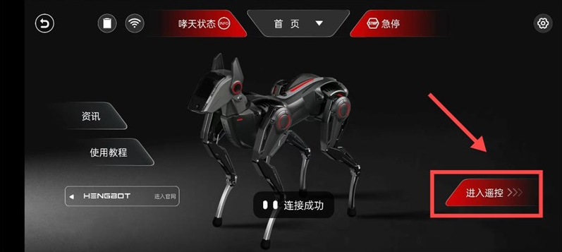
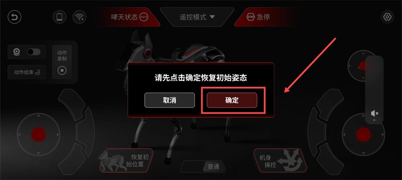
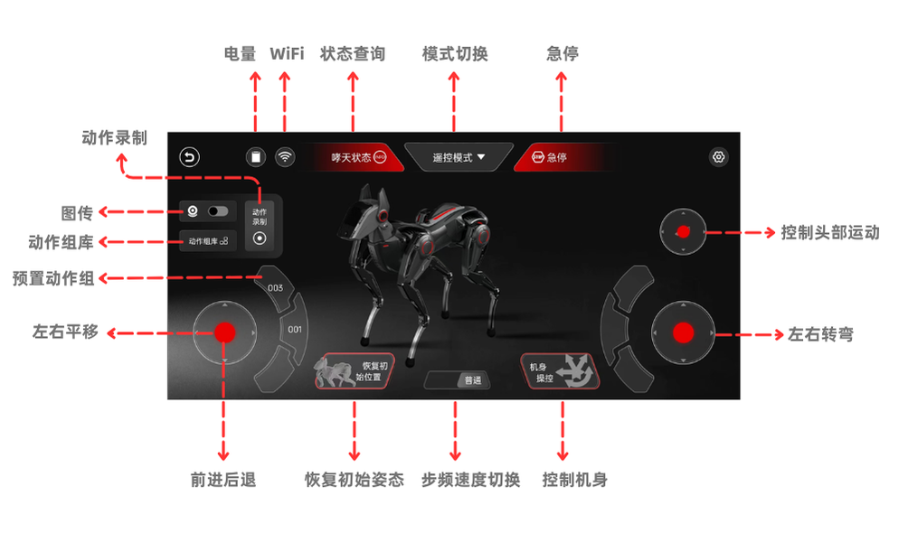
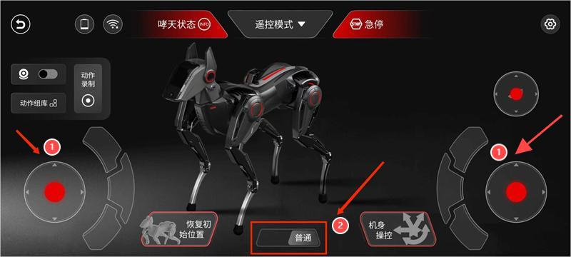
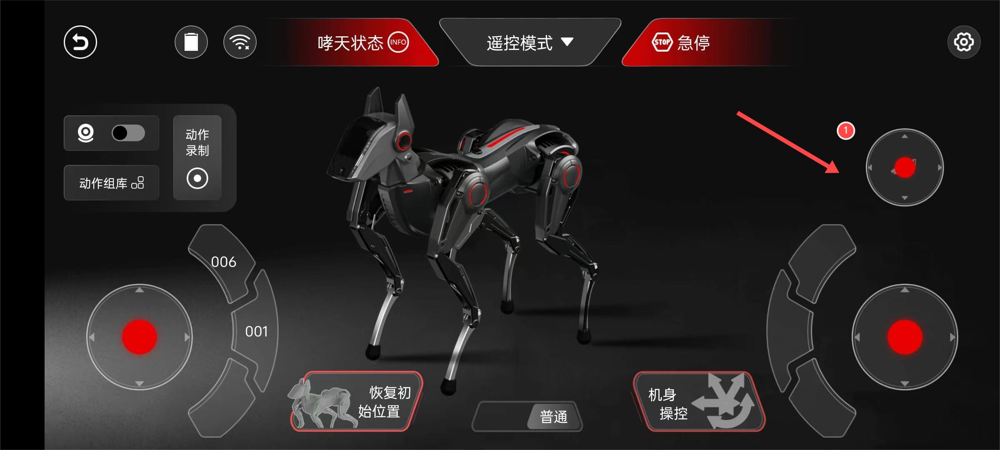
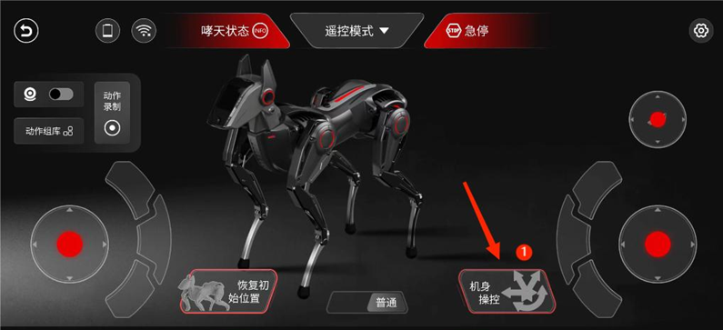
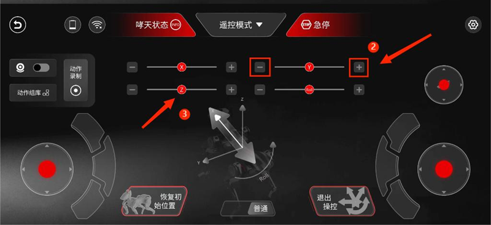
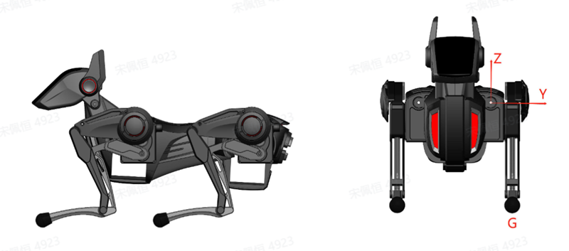

# 基础系列：APP 玩法

## 一、前言

前文、我们介绍了新伙伴“哮天”，并熟悉了包括联网和 App 连接在内的配置操作。现在，我们已经熟悉了这些设置。接下来，让我们一起探索 App 的有趣玩法，首先是学习如何控制哮天的步态、头部、机身运动等。"

## 二、准备工作

| 步骤 | 详细介绍 |
|------|---------|
|**软件：下载好 APP 并根据提示安装**|  |
| **环境：哮天已联网并已成功连接手机 app**| 此文档不再对基础配置等使用操作进行阐述，相关资料请参考此文档：[开箱系列：基础配置使用](./quick_start_guide.md) ||

## 三、体验 APP 基础玩法

| 步骤 | 示例图 |
|------|-------|
| 连接成功后 APP 会直接进入首页，**点击“进入遥控”** 开启体验您与哮天的奇妙互动。| |
| 进入遥控模式后，会弹出是否 **"恢复初始姿态"** 的提醒，点击 **“确定”** 后即可。|  |

### 3.1 功能标注图

先根据标注图了解各类组件及图标的作用，熟悉后接着往下体验哮天的步态运动。

### 3.2 体验步态运动

 | 操作步骤 | 示例图 |
 |------|-------|
 |**标注一**：滑动摇杆让哮天动起来实现步态运动，**标注二**：切换速度模式 “普通/急速” 来控制哮天的步态速度。|  |

在了解完基础的操作步骤后，您可以一边观看视频更直观的看到操作步骤，一边来体验哮天的步态运动。

| 功能 | 视频效果 |
|----|----|
| **左摇杆**：控制四足：向上（前进 向下（后退）/ 左右滑动可控制平移 | <iframe width="780" height="400" src="https://www.youtube.com/embed/sddgrfJwklk?si=AZlOMtSLRWS6SC_o" title="YouTube video player" frameborder="0" allow="accelerometer; autoplay; clipboard-write; encrypted-media; gyroscope; picture-in-picture; web-share" referrerpolicy="strict-origin-when-cross-origin" allowfullscreen></iframe> |
| **右摇杆**：实现左右方向转弯 | <iframe width="780" height="400" src="https://www.youtube.com/embed/K-hf0xVGXPQ?si=JcGrO0wLIagjwVRC" title="YouTube video player" frameborder="0" allow="accelerometer; autoplay; clipboard-write; encrypted-media; gyroscope; picture-in-picture; web-share" referrerpolicy="strict-origin-when-cross-origin" allowfullscreen></iframe> |
| **双摇杆结合步态**：控制步态速度：普通/急速  | <iframe width="780" height="400" src="https://www.youtube.com/embed/rxBW_JiWsoE?si=fcfcMxC_ozY2hzIR" title="YouTube video player" frameborder="0" allow="accelerometer; autoplay; clipboard-write; encrypted-media; gyroscope; picture-in-picture; web-share" referrerpolicy="strict-origin-when-cross-origin" allowfullscreen></iframe> |

### 3.3 体验头部运动

| 操作步骤 | 示例图 |
|------|-------|
| **标注一：头部滑杆** 此次头部单独做了摇杆控制的优化，用户能够更精细地控制头部运动。| |

在熟悉完基础操作步骤后，您可以通过观看视频来亲身体验哮天的头部运动。

<iframe width="780" height="400" src="https://www.youtube.com/embed/lsRLkfgB-U0?si=B36pN0rV2jiTT3Nr" title="YouTube video player" frameborder="0" allow="accelerometer; autoplay; clipboard-write; encrypted-media; gyroscope; picture-in-picture; web-share" referrerpolicy="strict-origin-when-cross-origin" allowfullscreen></iframe>

为了进一步加深理解，下文的表格将对这些功能进行详细的标注和介绍。

| 工具 | 用途 | 使用方法 |
|----|----|----|
| **头部滑杆** | 实现头部俯仰及偏航运动 | **上下滑动**：实现俯仰（抬头低头）；**左右滑动**：进行偏航运动（左右摇头）|
| **头部图传** | 头部图传模块暂未开放，敬请期待。| | 

### 3.4 体验机身运动

| 操作步骤 | 示例图 |
|------|-------|
| **标注一**：进入机身操控页面，调整参数轴来实现机身运动。|  |
| **标注二**：滑动红点进行调整参数轴；**标注三**：点击参数轴两侧的“-”来减少或“+”来增加。|  |

在熟悉完基础操作步骤后，您可以通过观看视频来亲身体验哮天的机身运动。

<iframe width="780" height="400" src="https://www.youtube.com/embed/8NgFbh8joss?si=gjuPSA8yoR42ZE1S" title="YouTube video player" frameborder="0" allow="accelerometer; autoplay; clipboard-write; encrypted-media; gyroscope; picture-in-picture; web-share" referrerpolicy="strict-origin-when-cross-origin" allowfullscreen></iframe>

为了进一步加深理解，下文的表格将对这些功能进行详细的标注和介绍。

| 名称 | 用途（滑动或调整“-”“+”按键使用）  | 
|----|----|
| **示意图** |  |
| **Roll** | 机身绕 X 轴做左右滚转运动 |
| **Z轴** | 腿部绕 Z 轴实现蹲下或站立姿态 |
| **Y轴** | 机身绕 Y 轴进行偏航运动 |
| **X轴** | 机身绕 X 轴实现俯仰运动 |

## 四、更多玩法

通过上文的玩法介绍，我们熟悉了 APP 的基础遥控玩法，学习了控制哮天的步态、头部和机身运动等技巧。而接下来准备更进一步，探索 APP 中的进阶遥控玩法——关键帧及拖拽示教。让我们共同期待下一章的精彩内容吧。敬请期待！

您可根据下文的导读区去往您需要的文档区。

| 文档 | 导读 |
| ------------- | ------------- |
| [开箱系列：基础配置使用](./quick_start_guide.md) | 在本文中，我们将带您了解哮天的基础配置和使用方法。这包括启动步骤、操作技巧、联网指南以及如何与 APP 进行连接等各项操作流程。 |
| [快速使用系列：手柄遥控](./sparky_remote.md) | 本文档详细介绍了如何快速将哮天与蓝牙手柄配对，以便通过遥控操作实现更流畅的步态、头部和机身运动。|
| [基础系列（一）：UI 界面使用](./quick_start_two.md) | 本文档介绍了哮天头部的 UI 基本界面与交互操作。|
| [基础系列（二）：基础遥控玩法](./app_user.md) | 本文档为您介绍了App的基础遥控玩法，涵盖从基础操作到步态运动，头部和机身运动等各个方面。让我们一起探索 App 中的各种有趣玩法吧！|
| [探索系列（一）：进阶遥控玩法](./create_a_blog_post.md) | 在这里我们将更进一步，探索 APP 中的进阶遥控玩法——关键帧模式及拖拽示教，来为您的哮天创造更多独一无二的动作吧！|
| [探索系列（二）：Python API](./python_api.md) | 本篇文档介绍了如何使用 python sdk 控制哮天的运动状态。您可以按照我们提供的接口和例程，尝试用 Python 来学习机器人控制，完成哮天的二次开发。|
|[探索系列（三）：WebSocket API](./deploy_your_site.md) | 本篇文档介绍了如何使用 WebSocket API 来控制哮天的运动状态，完成哮天的二次开发以及更详细的 API 资料。|