# 探索系列（四）：Blender 入门

## 一、前言

本篇文档阐述了如何使用 Blender 来编辑哮天的炫酷动作，并与哮天进行联合调试。文档还将展示如何通过 Python 脚本导出并播放动作，以实现哮天炫酷动作的自动化演示。为了帮助用户更高效地设计并掌握哮天的动作编辑，我们先解 Blender 可以实现什么效果吧！

## 二、效果展示

<iframe width="780" height="580" src="https://www.youtube.com/embed/EkRc4fHKcsc?si=5Nd43quHA12N91ZX" title="YouTube video player" frameborder="0" allow="accelerometer; autoplay; clipboard-write; encrypted-media; gyroscope; picture-in-picture; web-share" referrerpolicy="strict-origin-when-cross-origin" allowfullscreen></iframe>

## 三、快速体验动作组

>当我们了解完 blender 能实现的效果后，此时您是否想给您的哮天复刻这些有趣动作？  
>请跟随 HENGBOT 一起随着文档来快速体验动作组！

### 3.1 准备工作

**基础知识**  

- 请您先阅读开箱系列使用文档：[基础配置使用](https://hengbot-dynamics.github.io/heng-docs/docs/tutorial-basics/quick_start_guide) 了解哮天机器狗的基础配置和使用方法。
- 本文档需要具备Python语言编程基础，能够配置编程环境并运行程序。

**硬件需求**  

- 一台哮天机器人。
- 一台 Windows 系统的个人电脑。

**使用环境**  

**使用前请保证哮天以正确的初始姿势放置在平稳地面上，用户可取下包装箱的泡棉起到保护作用**，使用途中也请勿让产品受到过度冲击，例如从高处跌落或碰撞等；


**软件准备**  

> 软件准备分为两大块：一部分是在机器狗哮天的使用准备、一部分是 PC 端上的软件准备。

- **哮天开机并联网**

| 软件准备 | 文档参考 | 示例图 |
|---------|----------|-------|
| 哮天开机与充电 | 相关操作步骤请参考使用[文档](https://hengbot-dynamics.github.io/heng-docs/docs/tutorial-basics/quick_start_guide#41-%E5%BC%80%E6%9C%BA%E6%93%8D%E4%BD%9C) ||
| 哮天联网（如开机未出现联网页面：根据[参考资料](https://hengbot-dynamics.github.io/heng-docs/docs/tutorial-basics/quick_start_two#27-%E5%A4%B4%E9%83%A8%E6%9B%B4%E5%A4%9A%E8%AE%BE%E7%BD%AE)手动进入WiFi模式。 | 联网相关操作步骤请参考[文档](https://hengbot-dynamics.github.io/heng-docs/docs/tutorial-basics/quick_start_guide#%E4%BA%94%E8%81%94%E7%BD%91%E6%93%8D%E4%BD%9C).
tips：可使用以下[工具](https://www.mywifisign.com/zh-hans)进行生成二维码。| |

- **安装 Blender 并下载工程包**  

| 操作步骤 | 下载链接 |
|---------|----------|
| **安装 Blender 软件**：（演示版本为：4.2.2-Windows）根据右侧链接下载安装包并完成安装。| [Blender 下载网址](https://www.blender.org/download/) |
| **下载工程包**：此工程是已配置好舞蹈动作用于快速体验哮天的舞蹈，下载后记得对压缩包进行解压操作，这里可将工程包解压保存至与Blender 相同路径目录，方便后续使用。| 工程包zip待补 |

### 3.2 连接哮天并播放动作组

准备工作结束后，接下来将哮天与 Blender 软件连接快速体验动作组，让哮天动起来！

> 视频

| 操作步骤 | 示意图 |
| **第一步**：双击点开解压后的初始工程 | 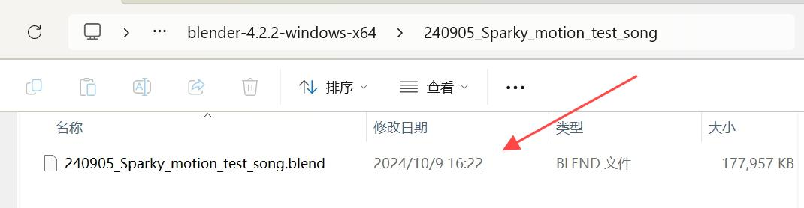 |
| **第二步**：根据**标注一**将 IP 地址修改为当前哮天头部 IP 地址，点击**标注二**播放键启动。| |
|**第三步**：根据图例**标注一二**关闭blender 并保存相关代码。|
|**第四步**：再次打开 Blender 工程根据**标注一**点击运行键，点击**标注二**播放动作组，此时您会看见哮天同步复现工程的动作组！ （标注一：运行此工程的程序代码，也包括了连接哮天等操作；标注二：播放/暂停动作。）|  |

## 四、如何让哮天实现“动起来”  

体验完 Blender 的丝滑动作组后，您是否也想为哮天创造一套专属的动作组呢？
那就请跟随文档学习如何让哮天动起来吧。

### 4.1 导入初始工程包  

开始进入实操阶段前，我们需要提前进行一些准备工作。

  **1. 下载并打开新的工程包。**
  **2. 根据前文的连接步骤更换IP地址重新连接哮天，具体步骤在此不再赘述。**  

### 4.2 哮天“动起来”编辑步骤  

> 启动工程包后我们可以看见初始工程包已内置好站立的初始帧。  

我们可知从**站立`->`趴下**这是由两个动作组成的，而初始工程默认哮天是站立姿势，所以只需编排“趴下”姿态即可。  

> 视频待补

:::danger[注意事项]
在使用 Blender 编辑动作时，动作会自动同步到哮天实机上。为了避免因动作幅度过大而引发实机的弹跳、跌落或碰撞等问题，建议在进行以下操作时格外小心，或者尽量采用缓慢的操作方式。  

- 编辑时请勿大幅度的拉动或调整，容导致哮天直接与 Blender 连接中断。
- 在进行任意新操作之前，请先将光标移至模型编辑区之外的安全区域。这样做可以避免因操作时不小心拉动光标，导致哮天实机意外弹起或跌落，从而损坏机身。
- 如出现掉线情况，请点击右上角的运行键再次运行脚本即可连接。
- 如采用100hz作为编排目标帧率时，由于电脑性能原因实时预览可能低于100hz，左上角显示只有60fps左右，这会导致最终导出的动作与编排时预览的速度不一致，需要在编排时提前考虑。  

:::
 
| 操作步骤 | 示意图 | 备注 |
|---------|--------|-----|
|**第一步**：图例是时间线编辑器，参考**标注一**将蓝色块拖到 100 新建关键帧。`0-100：这里默认时间一秒为100，也可缩减到75。` | 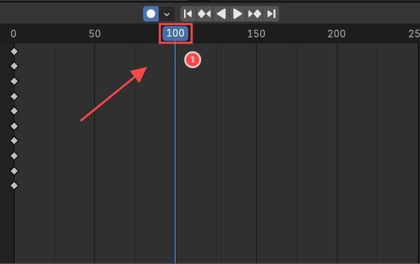 | 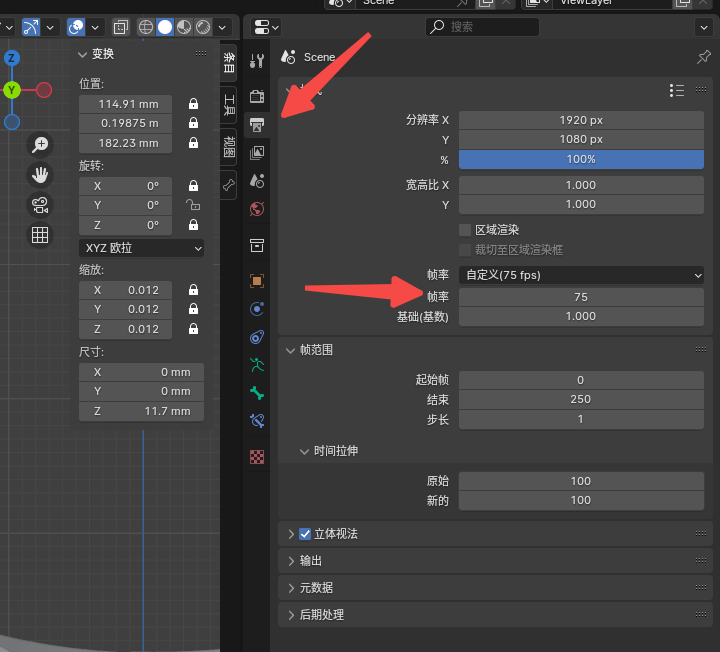 |
|**第二步**：选中**标注一**（高亮状态）此时将光标往下拖动让哮天实现整体下蹲的姿势，再将光标往右拉动将重心后移。`因下蹲跟后移重心的参数数值不好理解，这里数值范围可参考标记二：演示参数。`| 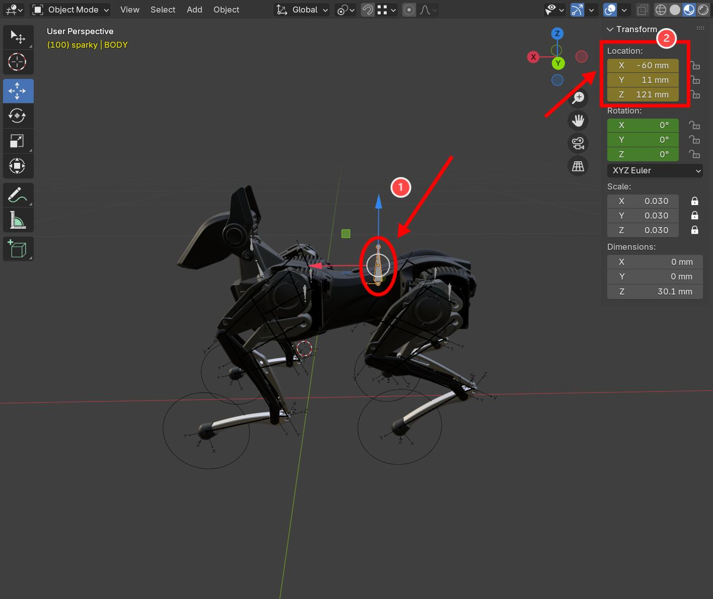 | |
|**第三步**：初始工程默认是**标注一**“移动模式”，此模式只支持上下左右平移。请切换到**标注二**“旋转模式”，再根据**“标注三”**将哮天调整为趴下姿势。`注释：标注一：移动模式\标注二：旋转模式\标注四：演示参数`|  | 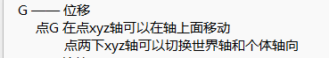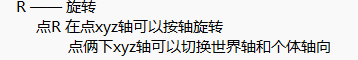 |
|**第四步**：上文调整后哮天初具坐下的形态，此时来进行最后的微调。切回**标注一**“移动模式”，利用**标注二**（三色参考线）调整到期望的位置和效果。调整完毕后点击**标注五**的“播放键”开始播放动作即可。
`注释：标注一：切换移动/旋转模式、标注二：模型视角切换、标注四：演示参数、标注五：播放暂停按键++（空格播放暂停）` | |

> 在编辑完哮天趴下的关键帧后，我们接下来要实现的是让哮天从趴姿过渡到站立，完成整个动作组流程。你可能会好奇？是否只需复制站立的关键帧就能实现这一动作？让我们接着往下看。

| 操作步骤 | 示意图 | 备注（原理点）|
| **第一步**：根据**标注一**选中0帧复制并粘贴到200数值的帧上，此时点击播放会发现哮天的姿势没有完全站起，也没有完全坐下。（原理普及请看备注）| 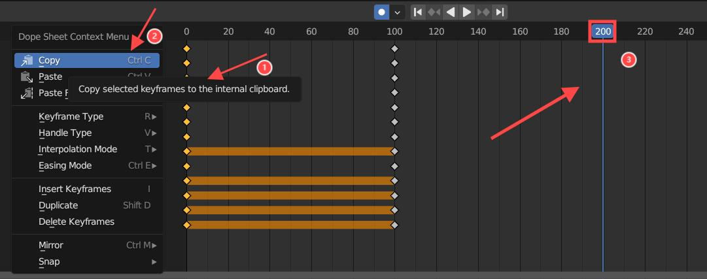 |为什么呢？这是因为“趴下”姿势的重心是朝后的，直接起来哮天会朝后方使力导致不能站起，所以我们需要在“趴下”到“站立”的姿势中间再加一个过渡姿势，使哮天重心先前移在起身。|
|**第二步**：参考**标注一**将播放头移动到150帧的位置。|  | |
| **第三步**（恢复机身平衡）：**标注一**切换至旋转模式，**标注二**选中正四棱柱，拖动**标注二**绿色圆圈将机身恢复平衡。`注释：标注三：演示参数。` |  | 但只恢复平衡的话，我们会发现哮天还是不能完全站起，此时需要将机身重心前移。| 
| **第四步**：**标注一**切换到移动模式，再选择**标注二**正四棱柱，拖动红色箭头将机身向前移动。`注释：标注三（演示参数）` `注意：移动的“多少”，用户可进行多次实验或参考演示参数，哮天向前移动较少会出现站不起来的现象，而过多则会向前翻到。`| |
| **第五步**：来验收学习成果了！根据**标注一**将蓝色块定位在0帧，点击**标注二**“播放键”看看效果。|  | 视频待补 |

>随着文档学习到这里后，关于哮天如何在 Blender 上一整组从“站立”到“趴下”再到“站立”的动作编排已经结束了，您基本已经熟悉基础操作流程，此时可以尝试自行给您的哮天编排专属炫酷动作了。

### 4.3 Blender 使用参考

如您需要 Blender 软件更详细的基础操作以及学习更多，请查看官方教程：[Blender 4.3 Manual](https://docs.blender.org/manual/zh-hans/dev/index.html)

| 功能 | 示例图 |
|------|-------|
| **基础页面** |  |
| **常用窗口** | 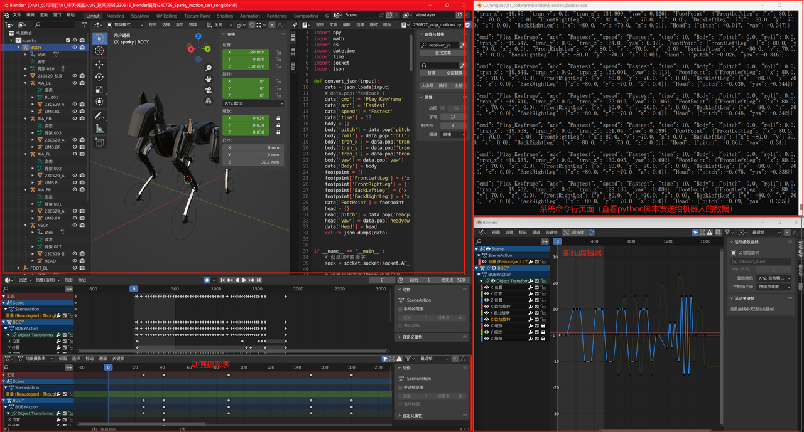 |
| **音频添加方法** | https://www.bilibili.com/video/BV1EY411j7bX/?vd_source=0d699efa3ba99bd10455fd93c3d9b1b1 |

## 五、使用 Python 播放动作组

前文我们学习了如何编排动作的基础技巧后，您可能希望将这些动作应用于本地环境，并让 AI 大模型进行调度这些动作。为此，我们借助了 Blender 的导出功能，让您可以将动作导出为文件，并通过 Python 代码实现本地化运行。接下来，将一起来学习如何使用这些工具来分享、上传和下载您精心编排的动作。

> 使用视频代补

### 5.1 Python 准备工作

#### 5.1.1 安装Python

| 操作步骤 | 示意图 |
| **第一步**：点击[`Python安装包`](https://www.python.org/downloads/)下载最新版本的软件。| 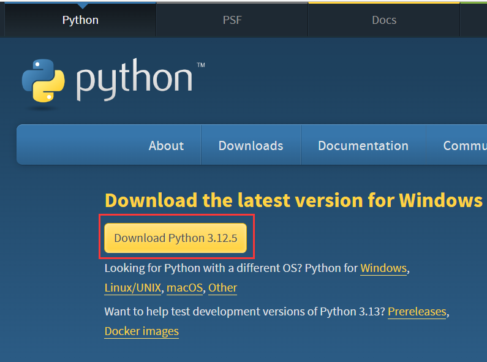 |
| **第二步**：根据**标注一**将安装界面下方选项全勾选，**标注二**点击“Install Now”进行安装。如果忘记勾选，请卸载Python软件重装。| 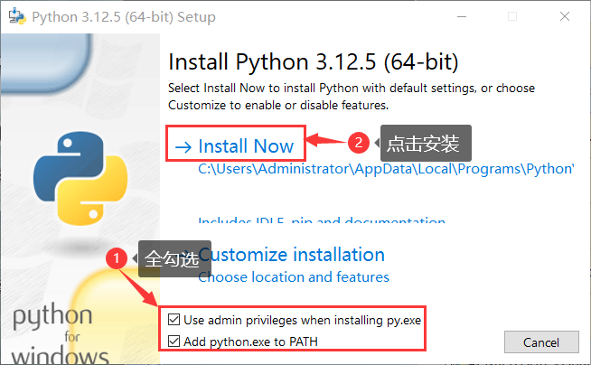 |

#### 5.1.2 配置Python环境

| 操作步骤 | 示意图 |
| **第一步**：按下 `Windows键 + R键` 打开“运行”对话框，输入 `cmd` 然后按确定键。| 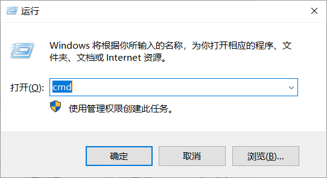 |
| **第二步**：确定后会弹出命令行窗口，输入右侧命令行：`pip install numpy hengbot-api -i https://pypi.tuna.tsinghua.edu.cn/simple` 敲下`Enter`键运行确定。| |

#### 5.1.3 创建Python文件

前文已安装好 Python 并配置好相关开发环境，下一步则是学习如何创建 Python 程序方便我们自行后续修改。

```python
#Python播放哮天动作
from hengbot import sparky
# set IP
IP = '192.168.8.154'
def test_play_frame(ip):
    import time
    # connect through ip
    with sparky.robot_control(ip) as robot:
        # switch to edit mode and return to edit mode operation object
        edit = robot.switch_mode(sparky.MODE_EDIT)
        # play action frame
        edit.play('./20240808_Shaking_your_head.txt')
        input("回车退出")
test_play_frame(IP)
```

| 操作步骤 | 示意图 | 
| **第一步**：新建文件夹存储相关文件，方便后续寻找使用，命名均可自定义或复用文档示例。| 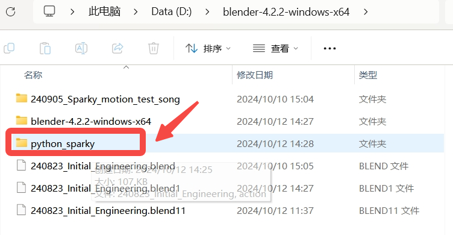|
| **第二步**：打开 Python IDLE。| 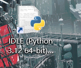 |
| **第三步**：点击**标注一**的 File 后创建新文件，点击**标注二**的 New File新建 Python文件。|  |
| **第四步**：将上文代码复制到新建的Python文件中，点击**标注一** `File->Save` 来进行保存，将其保存在新建 `Python_sparky` 文件夹里（**标注二**），并使用纯英文和数字作为文件名（**标注三**），避免Python程序无法识别。|  |

### 5.2 导出并检查Blender文件

我们先使用Blender导出动作文本文件，以供Python播放使用。

| 操作步骤 | 示意图 |
|---------|--------|
| **第一步**：根据**标注一二**切换至240823_udp_motions.py代码里，参考**标注三**找到324行修改程序文件名，再根据**标注四**启动运行，系统会自动保存文本。| 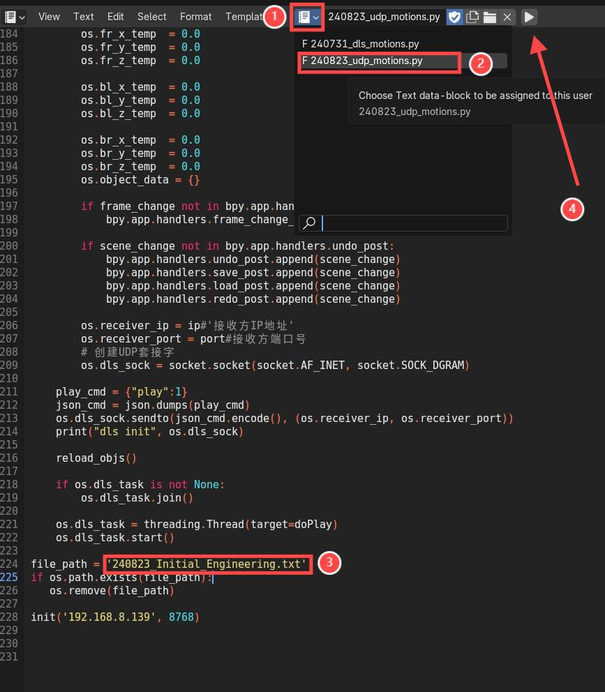|
| **第二步**：前文建议工程包与 Blender 程序放置同一目录下，此时请回目录下找到并打开以 `txt` 后缀的文本，我们需要检查导出的动作文本文件的行数是否和结束帧一致，避免重复动作。| 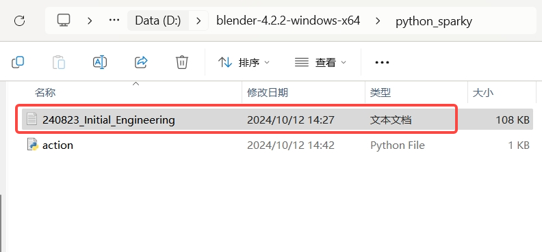 |
| **第三步**：根据**标注一二**将滑条拉到最下方，选中最后的大括号，查看总行数。| 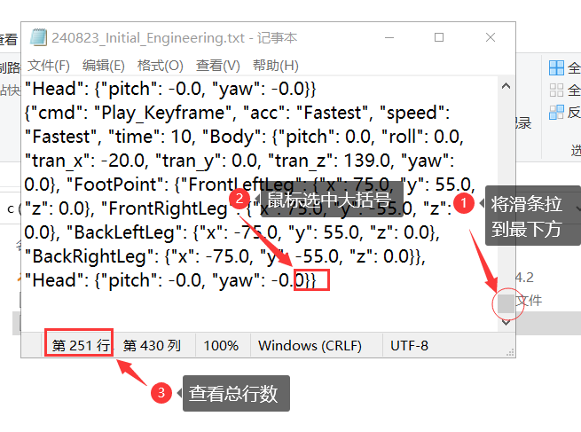 |
| **第四步**：每次播放完，播放头所在的位置即是结束帧，下面红框位置为结束帧。对比结束帧和总行数是否一致（因为起始帧是从第0帧开始的，所以总行数看起来会比结束帧多一帧或少一帧）|  |

完成对文本文件的导出与检查后，我们可以来尝试用 Python 播放程序。

### 5.3 使用 Python 播放动作

:::danger[注意事项]
若想播放另一个动作，需要当前动作执行完后，再重新执行python程序进行播放操作。
:::

| 操作步骤 | 示意图 |
|---------|--------|
| **第一步**：先找到刚保存的 action.py文件，在**标注一**位置将 IP 修改为哮天头部的 IP 地址。再到**标注二**位置将文本名修改为导出的 txt 文件名。**(注意：此 `action.py` 以及 `txt` 文件都是同一目录下的。)**| 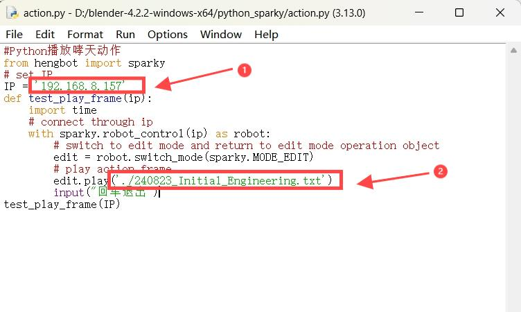|
| **第二步**：点击**标注一**`Run`再点击**标注二**`Run Module`来运行 Python 程序。| 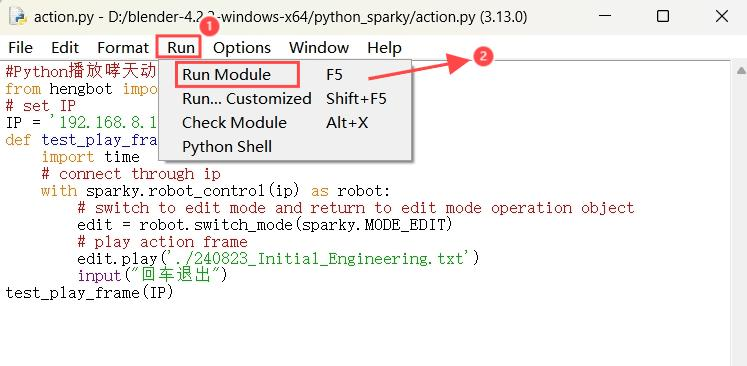|
| **第三步**：运行后 Python 窗口会显示已运行程序，哮天本地运行效果如右侧视频。| | 

>效果视频待补

## 六、常见问题处理

### 6.1 Q：Python 程序出现无法连接的报错，如何解决？

```python
Traceback (most recent call last):
  File "D:\桌面\Python播放动作\action.py", line 14, in <module>
    test_play_frame(IP)
  File "D:\桌面\Python播放动作\action.py", line 10, in test_play_frame
    edit = robot.switch_mode(sparky.MODE_EDIT)
  File "C:\Users\Administrator\AppData\Local\Programs\Python\Python312\Lib\site-packages\hengbot\sparky.py", line 116, in switch_mode
    self.ws.send('{"cmd": "Mode_Switch", "target": "' + target + '"}')
  File "C:\Users\Administrator\AppData\Local\Programs\Python\Python312\Lib\site-packages\websocket\_app.py", line 290, in send
    if not self.sock or self.sock.send(data, opcode) == 0:
  File "C:\Users\Administrator\AppData\Local\Programs\Python\Python312\Lib\site-packages\websocket\_core.py", line 297, in send
    return self.send_frame(frame)
  File "C:\Users\Administrator\AppData\Local\Programs\Python\Python312\Lib\site-packages\websocket\_core.py", line 337, in send_frame
    l = self._send(data)
  File "C:\Users\Administrator\AppData\Local\Programs\Python\Python312\Lib\site-packages\websocket\_core.py", line 559, in _send
    return send(self.sock, data)
  File "C:\Users\Administrator\AppData\Local\Programs\Python\Python312\Lib\site-packages\websocket\_socket.py", line 152, in send
    raise WebSocketConnectionClosedException("socket is already closed.")
websocket._exceptions.WebSocketConnectionClosedException: socket is already closed.
```

**A：确认哮天是否开机**  

- 检查哮天和电脑是否在同一局域网。
- 检查哮天屏幕IP和Python文件IP是否一致。

### 6.2 Q：Python 程序出现无法找到这个文件的报错，如何解决？

```python
Traceback (most recent call last):
  File "D:\桌面\Python播放动作\action.py", line 14, in <module>
    test_play_frame(IP)
  File "D:\桌面\Python播放动作\action.py", line 12, in test_play_frame
    edit.play('./240823_Initial_Engineerin.txt')
  File "C:\Users\Administrator\AppData\Local\Programs\Python\Python312\Lib\site-packages\hengbot\sparky.py", line 451, in play
    with open(path, 'r', encoding='utf-8') as f:
FileNotFoundError: [Errno 2] No such file or directory: './240823_Initial_Engineerin.txt'
```

**A：检查Blender导出的文件是否放置 Python 文件目录下。**

- 检查 Python 文件中文本名是否与 Blender 导出的文件名一致。


### 6.3 Q：Python 程序运行后哮天会蹦一下，如何解决？

A：动作执行完后，在IDLE Shell窗口按Enter键七次左右，再运行程序。

### 6.4 Q：Python程序出现无法找到“numpy”和“hengbot-api”的报错，如何解决？

- 按 `window+R键` 打开“运行”对话框，输入cmd，然后按确定键。 在命令行窗口执行以下命令行。

```python
pip install numpy hengbot-api -i https://pypi.tuna.tsinghua.edu.cn/simple
```
