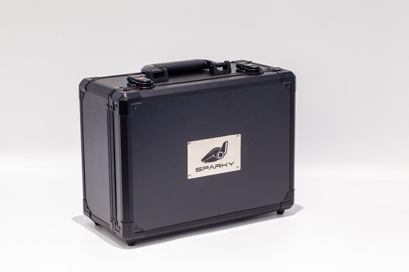
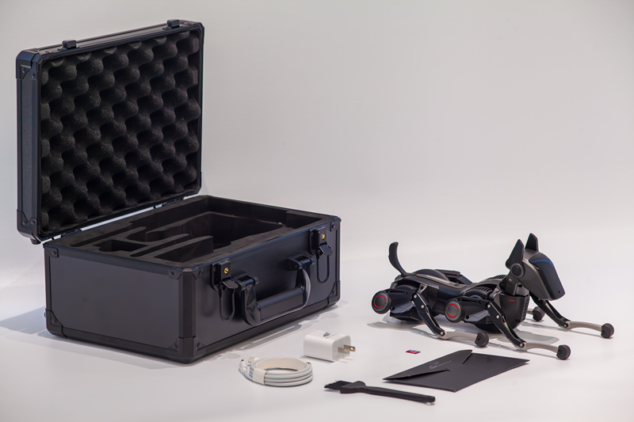
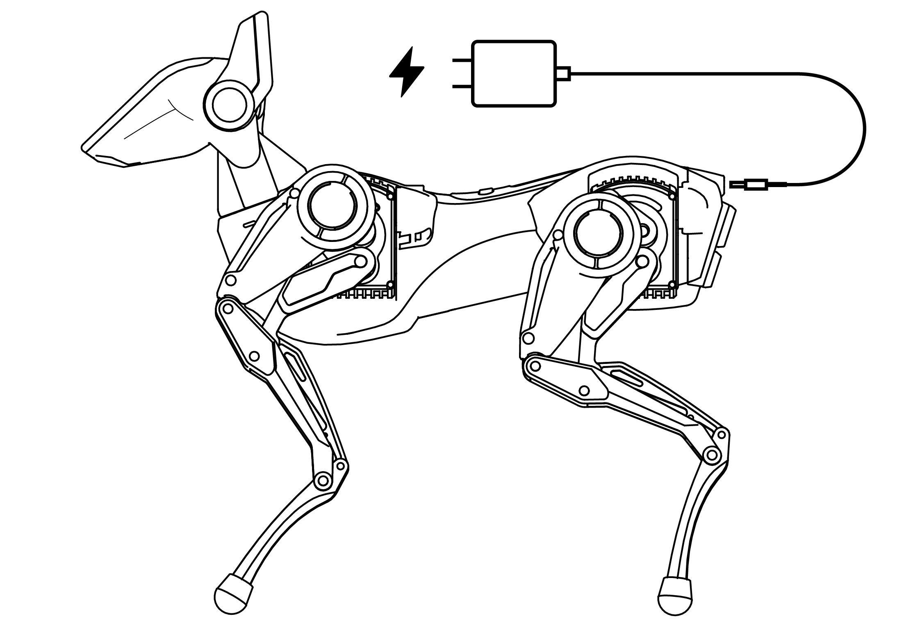
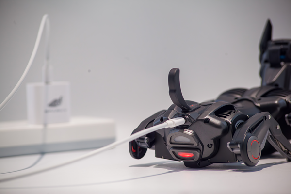
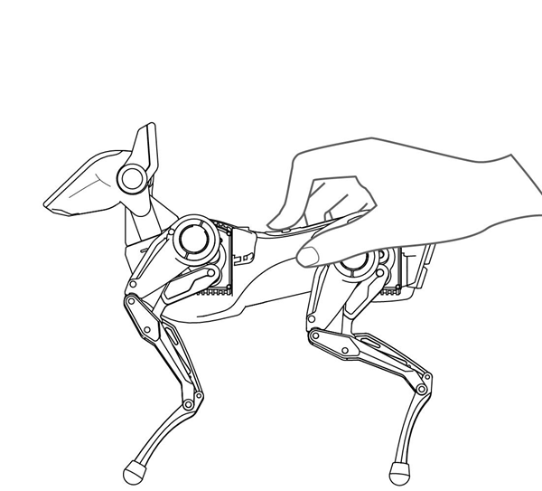
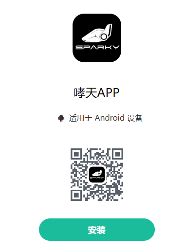
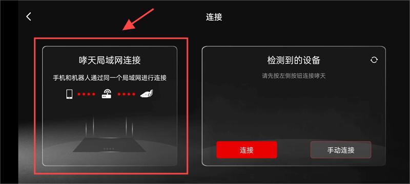
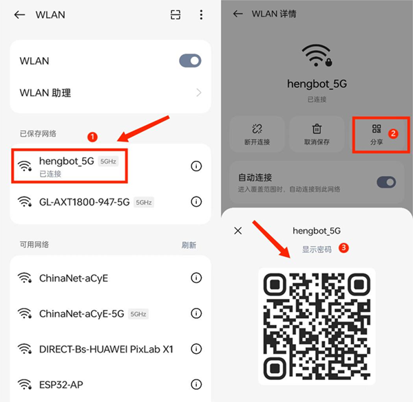
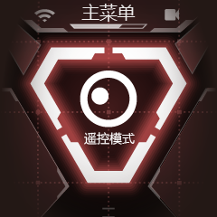
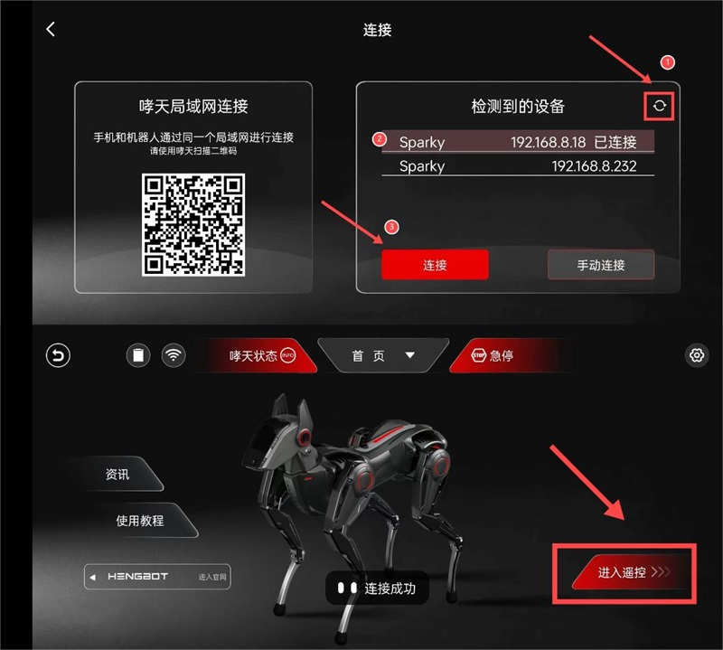

# 开箱系列：基础配置使用

:::warning 历史快照 —— App 与联网步骤可能已变化

本指南是基于 **App 版本 `240726`** 与当时的固件编写的。下文的 App 界面、局域网自动连接行为与二维码配网流程都是那一版的快照，可能与你当前安装的 App 已不一致。

硬件与开箱步骤在不同型号之间也可能不同，请对照你实际拥有的型号确认。

:::

## 一、前言

嘿，未来的机器狗训练大师！欢迎您踏上与新伙伴——哮天的旅程。这份精心准备的开箱指南将引导您深入了解哮天的奇妙世界。它将教您如何启动、使用并与哮天进行互动。同时，这份指南也将激发您的创造力，鼓励您探索未知，创造更多有趣的玩法。

## 二、开箱

首先，感谢您选择并信任我们的产品——哮天（Sparky）！现在，让我们一起来开箱。
我们为哮天配备了金属箱体作为外包装，箱体表面采用亮光纹设计，正面镶嵌了银色铭牌，这不仅增加了美观性，箱体还便于用户携带或保存哮天。接下来，一起解开包装箱的锁扣一探究竟吧！

开箱后，首先映入眼帘的是我们的主角——哮天。它以狗狗休息时的舒适姿态趴在箱内。在开始使用前请抓住哮天的腰部，小心地将它从箱中取出，取出后放置在任意平整的地面或台面上。

哮天整机重量仅有850克，相当于两瓶矿泉水的重量。我们采用了先进的轻量化设计，在机身和腿部进行了重量的大幅减轻，既保持了了轻巧的手感，又保留了金属结构的坚固性。

## 三、配件盘点

配件：清洁刷 / 双 Type-C 数据线 / 充电器。

  

| 配件名称     |    说明     |
| ----------- | ----------- |
| **SD镜像卡** | 内置哮天镜像系统（已提前插入头部卡槽）|
| **清洁刷** | 可对头部或机身进行灰尘清洁 |
| **Type-C 数据线** | 连接 SPARKY哮天 与其他设备（PC端）的线材，用于数据传输和充电 |
| **充电器** | 搭配 Type-C 数据线 进行充电使用 |

至此，开箱过程就告一段落了。  
在开启与哮天的互动前，请仔细对整机及配件进行核对及外观检查。如果在检查过程中发现任何问题，请您可以通过购买渠道或邮箱 support@hengbot.com 联系我们提供必要的帮助和解决方案。
:::tip[Use Tip] 

- 外观检查：请仔细观察哮天的外观以及整机机身，确保没有任何明显的损坏迹象，如划痕、凹陷等。
- 充电检查：请使用官方配套充电器进上电接入哮天进行充电测试，尾巴灯亮起表示在充电状态。
:::

## 四、启动哮天

检查无误后，下一步是启动哮天。

:::tip[Use Tip]

**开机前请保证哮天以正确的初始姿势放置在平稳地面上，使用前可取下包装箱的泡棉起到保护作用**，使用途中也请勿让产品受到过度冲击，例如从高处跌落或碰撞等；

| 开机前状态 | 开机后状态 |
|----------|----------|
|  |  |

**请使用包装箱原装充电头与充电线充电**：哮天不充电使用时间在1-2个小时，关机下充满需要50min左右，如果需要长时间编排动作与调试，建议尾部插上充电线使用。

:::

### 4.1 开机操作

将哮天放置平地后**长按背部电源键三秒**开机，启动时哮天将从趴卧形态收回四肢，自动调整至站立姿态并发出狗吠声。此时**头部开始播放开机及眨眼动画**，请接受来自哮天的友好 Wink 吧！

### 4.2 使用技巧

| 功能         | 使用技巧 | 备注 |
| -----------  | ----------- | ------- |
| **使用环境** | 请在平坦宽阔的地面或台面上使用哮天，请勿在有水或其他液体的户外地面上操作。|   |
| **查看电量** | 哮天头部顶端会**实时显示电量条**，电量充足的情况下，哮天可**实现 45min 以上的不插电使用**，如电量低时，它会发出**提醒（狗狗叫声）并自动关机恢复趴下状态.** |  |
| **充电** | 我们建议您**使用官方配套充电设备**（PD30w)，以确保充电的安全和效果，如使用其他充电设备出现特殊情况后果自负。充电时设备通电后，尾灯点亮表明已在充电状态。|  |
| **开机** | 长按背部电源键三秒进行开机操作 |  |
| **关机** | 一种是长按背部电源键进行关机，另一种是头部 UI 程序进行系统关机。|
| **头部交互** | 左右耳按键功能一致，均可进行选项选择或调节，头顶触摸可确认选项。|  |
| **发热** |哮天长时间使用后电机温度会升高，这是正常现象，请确保您在通风良好的环境中使用。此外，哮天内置过热保护程序，当电机温度过高时该电机将主动失能，待其温度降到合理范围内再重新启动工作。| |
| **清洁** | 长时间使用哮天导致积压灰尘时，可使用附赠小刷子对执行器凹槽进行清洁，头部面盖及其他部位可使用柔软的湿布轻轻擦拭，但在清洁时确保哮天在关闭电源且不在充电状态下，避免将水或其他液体直接溅到机器人表面。|  |

## 五、联网操作

哮天播放开机动画后，如设备处于无联网状态下，则头部会显示摄像头等待扫码联网页面，此时可通过以下两种方式进行联网。

### 5.1 准备工作

- **下载 App （版本：240726）**  
  
  1. 请准备一台安卓系统的手机备用。
  2. 请先用准备的手机下载安装包，并依照指示完成安装，方便后续使用。

### 5.2 APP 局域网连接

启动 App 时如果哮天处于未联网状态，App 会直接弹出联网页面，方便我们进行连接。
> 如果当前 IP 已连接过，APP 会直接自动连接无需扫码手动进行确认连接。

| 操作步骤 | 示意图 |
|----------|-------|
| **点击 "哮天局域网连接"** 后 Sparky's App 自动搜索并显示网络， |  |
| **标注一**：选择需连接的网络并输入密码，**标注二**：完成后点击“确定”，**标注三**：生成二维码备用。|  |
| 请将生成**二维码对准哮天头部**进行扫描，扫描后哮天会自动搜索并连接到网络。 |  |
| 联网成功后头部会显示 **“连接成功”** 的信息，同时会进入遥控模式并显示相关信息的 `网络名称`、` IP地址` 及`电量`。 |  |

### 5.3 Wifi 热点连接

:::tip[Use Tip] 
此 Tip 为非开箱必要步骤，当无手机 APP 且在哮天无法联网的前提下，仍然能为哮天联网的保底操作，联网成功后可跳过。
:::

| 操作步骤 | 示例图 |
|----------|-------|
| **标注一**：选择需连接的网络并点击进入详情页，**标注二**：点击生成或分享此网络（二维码形式），**标注三**：将生成二维码保存备用。|  |
| 请将生成**二维码对准哮天头部**进行扫描，扫描后哮天会自动搜索并连接到网络。 |  |
| 联网成功后头部会显示 **“连接成功”** 的信息，同时会进入遥控模式并显示相关信息的 `网络名称`、` IP地址` 及`电量`。 |  |

## 六、连接 APP

### 6.1 前提条件

- **确保哮天已联网并且头部（UI）进入遥控模式。**
- **确保哮天网络与 `手机app端` 的网络处于同一局域网下。**

> **这里阐述下部分相关逻辑：**  
**逻辑一**：正常使用流程下开机扫码后，哮天头部显示 `眼睛标志` 及 `IP 地址` 就代表已联网并进入遥控模式。  
**逻辑二**：但如果是在头部（UI）手动开启 `WIFI` 进行联网则也需手动进入遥控模式。  
 

|项目 | 操作步骤 | 示例图 |
|---------|--------|-----|
| **头部交互** | 左右耳按键功能一致，均可进行选项选择或调节，头顶触摸可确认选项。|  |
| **进入头部（UI）遥控模式** | 直接在主菜单选择 “遥控模式” 选项。确认选择后，通过触摸头顶来开启这一功能。  ||

### 6.2 连接 APP

完成以上的前提条件后，我们回到 App 联网页面将哮天与手机 App 连接。

| 操作步骤 | 示例图 |
|---------|--------|
| **标注一**：点击 "刷新键" 后页面显示检测到的设备 IP，**标注二**：选择哮天的 "IP 地址"，**标注三**：点击 "连接" 按钮使用 IP 地址进行连接，成功后会弹出“连接成功”。 |  |

如果连接时出现没有显示 IP 地址，我们还可以通过此页面的 **“手动连接” 进行连接**哮天。

| 操作步骤 | 示例图 |
|-----|------|
| **标注一**：点击 “手动连接”，**标注二**：输入哮天头部 IP 地址，**标注三**：点击 “确定” 手动连接哮天。 ||

## 七、结语

上文我们熟悉了哮天的基础配置用法，接下来就开始探索哮天各种有趣的基础玩法，您可根据下文的导读去往其他文档！

| 文档 | 导读 |
| ------------- | ------------- |
| [开箱系列：基础配置使用](./quick_start_guide.md) | 在本文中，我们将带您了解哮天的基础配置和使用方法。这包括启动步骤、操作技巧、联网指南以及如何与 APP 进行连接等各项操作流程。 |
| [快速使用系列：手柄遥控](./sparky_remote.md) | 本文档详细介绍了如何快速将哮天与蓝牙手柄配对，以便通过遥控操作实现更流畅的步态、头部和机身运动。|
| [基础系列（一）：UI 界面使用](./quick_start_two.md) | 本文档介绍了哮天头部的 UI 基本界面与交互操作。|
| [基础系列（二）：基础遥控玩法](./app_user.md) | 本文档为您介绍了App的基础遥控玩法，涵盖从基础操作到步态运动，头部和机身运动等各个方面。让我们一起探索 App 中的各种有趣玩法吧！|
| [探索系列（一）：进阶遥控玩法](./create_a_blog_post.md) | 在这里我们将更进一步，探索 APP 中的进阶遥控玩法——关键帧模式及拖拽示教，来为您的哮天创造更多独一无二的动作吧！|
| [探索系列（二）：Python API](./python_api.md) | 本篇文档介绍了如何使用 python sdk 控制哮天的运动状态。您可以按照我们提供的接口和例程，尝试用 Python 来学习机器人控制，完成哮天的二次开发。**Sirius v1.0 世代内容 —— 请先阅读该页顶部的安全提示。**|
|[Sirius v1.0 WebSocket API 退役说明](./deploy_your_site.md) | 本页是旧 v1.0 WebSocket API 的退役说明，记录其退役状态与需遵守的安全边界；不提供当前 API 操作指引。|
