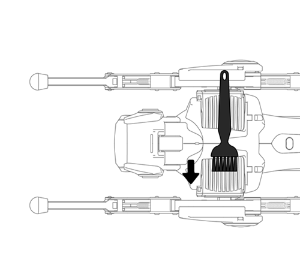
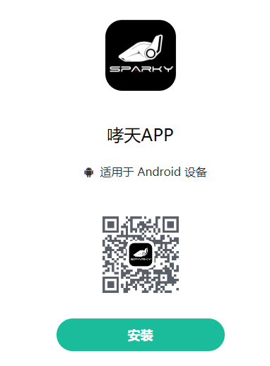
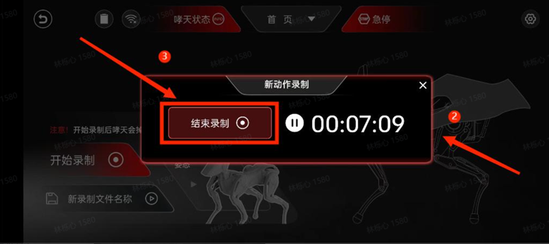
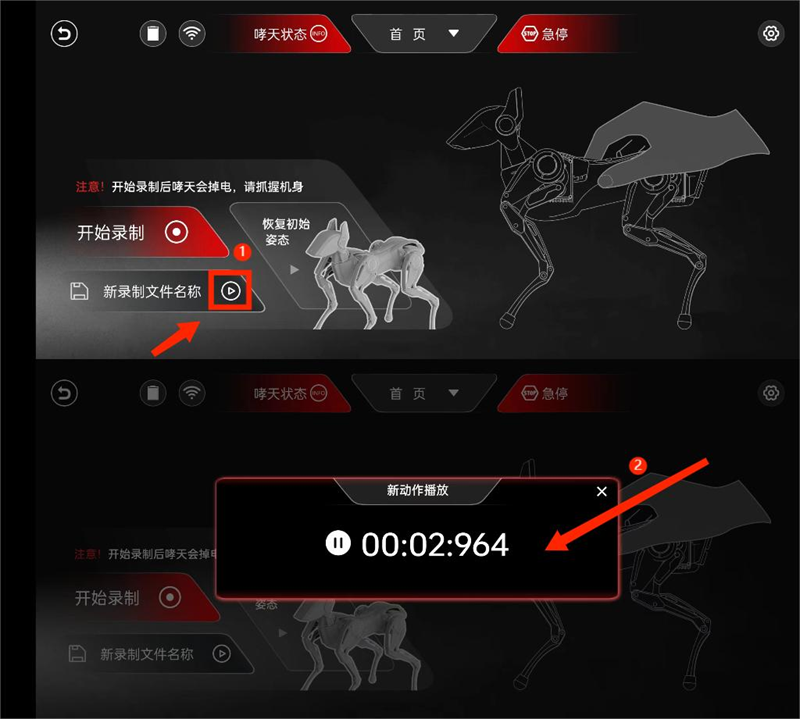

# Unboxing: Entry-level Configuration and Usage

## I.Preface

Hey, the future robot dog trainer! Welcome to the  journey with your new partner-Sparky. This unboxing guide will lead you to understand the wonderful world of Sparky. It will teach you how to start, use and interact with your Sparky. At the same time, this guide will also stimulate your creativity and encourage you to explore the unknown and create more interesting ways to play.   

## II.Unboxing

First of all, thank you for trusting us with your choice of Sparky! Now, let's open the box together. We have equipped Sparky with a metal box as the outer packaging. The surface of the box is designed with bright stripes, and the front is inlaid with a silver nameplate, which not only increases the aesthetics, but also facilitates users to carry or store Sparky. Next, let's unlock the box and find it out!

After unpacking, the first thing that catches the eye is our protagonist - Sparky. It lies in the box in the comfortable posture of a dog resting. Before starting to use, please grab Sparky's waist and carefully take it from the box. And then, place it on any flat ground or tabletop.

Sparky weighs only 850g, which is equivalent to the weight of two bottles of water. We have adopted advanced lightweight design, significantly reduced the weight of the body and legs, while maintained a lightweight feel and the robustness of the metal structure.

## III.Accessory List  

List: Cleaning brush, USB data cable (Type-C), Battery charger.

  

| Accessory Name  |  Description  |
| ----------- | ----------- |
| **SD mirror card** | Built in Sparky mirror system (pre-inserted into the head card slot) |
| **Cleaning brush** | Clean the dust on the head or body |
| **USB cable (Type-C)** | Connect Sparky with other devices (e.g. PC) for data transmission or charging |
| **Charger** | Used with Type-C USB cable for charging |

The end of unpacking guide. 
Before starting the interaction with your Sparky, please carefully check and visually inspect the entire product and accessories. If any problems are found during the inspection, please contact us through the purchasing channel or email support@hengbot.com for necessary assistance and solutions.  

:::tip[USER TIPS] 

- Appearance inspection: Please carefully check the appearance of your Sparky and the entire body to ensure that there are no obvious signs of damage, such as scratches, dents, etc.  
- Charging check: Please use the official charger for charging test. The taillight lights up to indicate that it is in the charging state.

:::

## IV.Start up Sparky  

After checking, the next step is to start Sparky.

:::tip[Use Tip]

**Remove the foam from the packaging box**. During moving, prevent the product from excessive impact, such as falling down or colliding, etc. **Make sure that the Sparky is placed on a stable ground in a proper initial posture before starting it up.**  

| Before starting up | After starting up |
|----------|----------|
|  |  |

**Use the original adapter and cable with the product in the packaging box for charging**: The Sparky can work for 1-2 hours without charging. It takes about 50 minutes to fully charge when turned it off. It is recommended to plug in the cable for charging during working for a long time.

:::

### 4.1 Startup

Place Sparky on a flat ground, **press and hold the power button on its back for three seconds** to turn on the device. Sparky will retract its limbs from a prone position, automatically adjust to a standing posture, and make a barking sound. At this point, **boot and wink animations begin to play on the head**. Please accept the friendly Wink from your Sparky!

### 4.2 Startup

| Function     | Skills | Remarks |
| -----------  | ----------- | ------- |
| **Application environment** | A clean desktop or flat ground is a relatively ideal control environment. Please do not operate the Sparky on the outdoor ground with water or other liquids, so as to avoid reducing the accuracy of Sparky control and ensure the task going well. |  |
| **Check the power** | There is a battery status bar on the top of Sparky's head. When the battery is sufficient, Sparky can work for more than 45 minutes. If the battery power is too low, it will bark to warn and automatically power off with limbs retracting. |  |
| **Recharge** | Please use the official charger (PD30w) to ensure the charging effect and safety. After connecting the charging cable, the taillight lights up to indicate that it is in the charging state. |  |
| **Power on** | Press and hold the power button on the back for three seconds to turn on the device. |
| **Power off** | Method 1 (recommended): Press and hold the power button on the back of Sparky to power off.
Method 2: Shutdown the system from the UI menu on the Sparky's head. |
| **Interaction on the head** | The functions of the left and right ear buttons are consistent, and both can be used to select or adjust options. Touching the top of the head can confirm the options. |  |
| **Heating** | It is normal that the motor temperature will rise after long-term use. Please ensure that you use it in a well-ventilated environment. In addition, Sparky has a built-in overheat protection program, when the motor temperature is too high, the motor will be disabled actively, and then restart the work when its temperature drops to a reasonable range. | |
| **Cleaning** | When dust accumulates due to long-term use of Sparky, the groove of the actuator can be cleaned with the attached small brush, and the head cover and other parts can be gently wiped with a soft wet cloth. When cleaning, please make sure that Sparky is turned off and not charging, and avoid splashing water or other liquids directly on the robot surface. |  |

## V.Network Connection

After playing the startup animation on Sparky, if the device is in a network-disconnected state, QR code scanning page will display on the head and wait to scan the code to connect to the internet. Please connect the internet as following two ways below:

### 5.1 ​Preparation Work

- **Download the App (version: 240726)**  
  
i.Prepare an Android phone.
ii.Download APK into the phone and complete the App installation as instructions.

### 5.2 LAN Connection APP  

When open the App, if the network is in disconnection state, a page will pop up for LAN connection.
If the IP address has been connected before, the App will automatically connect without manually scanning the code.

| Steps | Reference pictures |
|----------|-------|
| After clicking on **“Sparky LAN Connection”**, Sparky's App automatically searches and displays the network |  |
| **Label 1**: Select the network to be connected and enter the password，**Label 2**: Click "OK" after completion，**Label 3**: Generate a QR code.|  |
| Please **aim the QR code at Sparky's head** for scanning. After scanning, Sparky will automatically search and connect to the network. |  |
| After the network connection is successful, the message **"Connection Successful"** will be displayed in the head and at the same time, it will enter remote control mode and display the network name, IP address, and battery level. |  |

### 5.3 Wi-Fi Hotspot Connection

:::tip[USER TIPS] 
This Tip is an optional step. If the network connection is successful, you can skip this step. When you can't use the mobile APP to connect with Sparky, you can still connect with Sparky as following steps.
:::

| Steps    | Reference pictures |
|----------|-------|
| **Label 1**: Select the network to be connected and click to enter the settings page. **Label 2**: Click to generate or share this network (QR code). **Label 3**: Save the generated QR code for later use. |  |
| Please aim the QR code at Sparky's head for scanning. After scanning, Sparky will automatically search and connect to the network. |  |
| After the network connection is successful, the message "Connection Successful" will be displayed in the head and at the same time, it will enter remote control mode and display the network name, IP address, and battery level. |  |

## VI.Connect APP  

### 6.1 Precondition

- **Ensure that Sparky is connected to the network and the UI on the head displays that it has entered remote control mode.**
- **Ensure that Sparky and the mobile App are in the same network.**

**Here is a partial explanation of the relevant logic:**
**Logic 1**: Under normal usage, when the device is turned on and the QR code is scanned, the display of the eye logo and IP address on the head of Sparky indicates that it is connected to the internet and has entered remote control mode.
**Logic 2**: However, if you manually turn on WIFI for network connecting in the head (UI), you also need to manually enter remote control mode.

 

| Function | Steps | Reference pictures |
|---------|--------|-----|
| **Interaction on the head** | The functions of the left and right ear buttons are consistent, and both can be used to select or adjust options. Touching the top of the head can confirm the options. |  |
| **Enter Head (UI) Remote Control Mode** | Select the 'Remote Control Mode' option directly from the main menu. Activate this function by touching the top of the head to confirm the selection. ||

### 6.2 Connect APP

After completing the above preconditions, return to the App networking page to connect Sparky with the mobile App.

| Steps    | Reference pictures |
|---------|--------|
| **Label 1**: After clicking the "Refresh" icon, the detected device IP will be displayed on the page. **Label 2**: Select the "IP address" of Sparky.**Label 3**: Click the "Connect" button to connect network with the selected IP address. And then, "Connection successful" will pop up. |  |  

If the IP address is not displayed when connecting, we can also connect through the "Manual Connection" feature on this page.

| Steps | Reference pictures |
|-------|------|
| **Label 1**: Click on "Manual Connection".**Label 2**: Enter the IP address of Sparky's head.**Label 3**: Click "OK" to manually connect to Sparky. ||

## VII.Conclusion

In the previous text, we learnt the basic configuration and usage of Sparky. Now, we will explore various interesting entry-level gameplay of Sparky. You can follow the introduction below to other documents!

| Document title | Introduction |
| ------------- | ------------- |
| [Unboxing: Entry-level configuration and usage](./quick_start_guide.md) | In this section, we will show you the basic configuration and usage of Sparky including steps of startup, operation skills, network connection and how to connect with the APP. |
| [Entry-level: APP operation](./app_user.md) | This section introduces the basic remote-control gameplay of App, covering from basic operation to gait movement, head and body movement and so on. Let’s explore all kinds of interesting gameplay in the App! |
| [Mid-level (I): Advanced APP operation](./create_a_blog_post.md) | In this section, we will further explore the advanced remote-control gameplay in the App - Keyframe Mode and Drag & Drop tutorial, to create more unique actions for your Sparky! |
| [Mid-level (II): Python API](./python_api.md) | This section introduces how to use Python SDK to control the movement status of your Sparky. You can try using Python to learn robot control and complete the secondary development of your Sparky by following the interfaces and instances we provide.|
|[Mid-level (III): WebSocket API](./deploy_your_site.md) | This section introduces how to use WebSocket API to control the movement status of your Sparky, complete the secondary development of your Sparky, and provide more detailed API information. |
| [Advanced-level (I): UI Usage](./quick_start_two.md) | This section introduces the basic UI interface and interactive operations of Sparky’s Head. |
| [Advanced-level (II): Operated by the gamepad](./sparky_remote.md) | This section provides a detailed description on how to quickly pair Sparky with the gamepad through Bluetooth for smoother movements of Sparky’s gait, head, and body through remote control. |

<!-- ## 七、更多玩法

./quick_start_two.md
./sparky_remote.md

### 5.4 拓展用法

:::tip[Use Tip]
文档（6.3）小节是拓展用法，专为已使用过哮天联网及 Sparky's App 连接功能的用户开放，此小节非必要开箱步骤，新用户可直接跳过这一章节！
:::

#### 5.4.1 联网

哮天除上文用的方法：使用头部对 Sparky's App 生成的二维码进行扫描联网。
还可使用手机端分享或生成网络二维码供哮天联网操作。

#### 5.4.2 遥控

:::danger[Take care]
哮天连接 Sparky's App 的前提：双方都应均在同一局域网下！！！
:::

除上文的检测到 IP 地址进行连接，如果出现没有 IP 地址显示。我们还可以通过此页面的 **“手动连接”** 进行连接设备，此用法更适合已联网过的哮天，只需输入 IP 地址即可一步完成连接。

连接完成后 APP 会回到首页，此时 **点击“进入遥控”** 开启体验您与哮天的奇妙互动。

### 5.5 遥控模式

进入后会弹出是否恢复初始姿态的提醒，点击 **“确定”** 后即可。

先根据标注图了解各类组件及图标的作用，熟悉后接着往下体验哮天的步态运动。

#### 5.5.1 体验步态运动

先尝试**滑动摇杆让哮天动起来实现步态运动**，再尝试 **切换速度模式“普通/急速”** 来控制哮天的步态速度。

| 工具 | 用途 | 使用方法 | 效果展示
|----|----|----|----|
| **左侧摇杆** | **控制四足：实现前进后退的步态运**动 | 向上滑动左侧摇杆（前进）  向下滑动左侧摇杆（后退）/ 摇杆的左右可搭配上下共同滑动来控制步行方向| |
| **右侧摇杆** | **控制四足：搭配左侧摇杆可实现左右方向型转弯**。| | |
| **速度模式** | **控制步态速度：普通/急速** | 点击即可切换速度模式 | |

#### 5.5.2 体验头部运动

此次头部单独做了摇杆控制的优化，用户能够更精细地控制头部运动。

| 工具 | 用途 | 使用方法 | 效果展示
|----|----|----|----|
| **头部滑杆** |控制头部：实现头部的俯仰及偏航运动 | **向上或下滑动**：头部实现俯仰动作（抬头低头）/ **向左或右滑动**：头部及颈部进行偏航运动（左右摇头）||
| **头部图传** | Sparky's App 内置的头部图传模块暂未开放，敬请期待。| | |

#### 5.5.3 体验机身运动

参照以下示例图进入机身操控页面，我们可以通过调整参数轴来实现各类机身运动。调整参数轴的方法有两种：一是**滑动红点进行调整**；二是**通过点击参数轴两侧的“-”来减少或“+”来增加。**

| 名称 | 用途（滑动或调整“-”“+”按键使用）  | 效果展示 |
|----|----|----|
| **Roll** | 机身绕 X 轴做左右滚转运动 | |
| **Z轴** | 腿部绕 X 轴实现蹲下或站立姿态 | |
| **Y轴** | 机身绕Y轴进行偏航运动 || 
| **X轴** | 机身绕X轴实现俯仰运动 ||

可同时控制多个滑动条实现完整或复杂动作（更多效果请观看示例视频）

#### 5.5.4 体验动作录制

前文，我们学习了如何使用遥控模式来操控哮天的头部、机身和姿态，从而实现多样化的运动。现在，让我们转向新功能——动作录制。我们可以通过认识及熟悉录制动作流程及技巧，来为哮天设计更加精彩和个性化的动作。

**第一步：进入并开启“动作录制”**

参照图例左上角 **点击“动作录制”按钮**，进入动作录制页面后将哮天 **“恢复至初始位置”**。现在，我们可以 **“点击开始录制”** 来熟悉录制的具体操作和流程。

**第二步：熟悉录制过程及操作，并为哮天移动头部或抬腿。**

点击后会弹出“掉电倒计时”的提示，您可以尝试移动头部或抬抬腿部来熟悉动作录制的流程，再接着尝试让哮天抬头扭屁股完成整组动作。

**第三步：点击“结束录制”并播放哮天新录制动作**

:::danger[Take care]
1. 请点击“结束录制”按钮来结束，切勿点击右上角的×键来结束，否则会出现一直录制不中断的情况
2. 请注意在完成录制后及播放动作后，哮天将保持录制时的结束姿势。若要将其恢复至初始位置，请确保在电机上电前牢固握持机身，以防止因电机突然启动导致的机身弹起和损坏。
:::

**点击“结束录制”后**录制会停止，然后请握住哮天机身并**点击“恢复初始姿态”**使哮天回到默认姿势，最后参考图例**点击“播放”键**，哮天会为您复现刚才录制的动作。

>视频待补充

**第四步：进行命名及保存到库操作**

在 Sparky's App 中，您可对录制的文件进行命名并保存到库。只需**点击“保存”按钮**，页面会弹出命名框和保存确认框，为您刚录制的动作进行命名后确认即可保存到动作库。

#### 5.5.5 体验动作库

>我们保存的录制文件会被存放到什么位置呢？  
答案就是：动作组库！点击动作组库来查看保存的文件吧！

**第一步：查看保存的录制文件**

- 点击“动作组库”图标，进入动作库的内页。
- 在这您可以查看到系统预置的动作组以及您新建的录制文件。

>动作组库里不止有新建的录制动作组，还有 HENGBOT 已提前内置的哮天精彩动作组，我们还可以创建“动作组快捷触发”按键，可在展示步态运动时顺便让哮天展示动作组，那如何创建动作组快捷按键呢？

**第二步：创建动作组快捷触发**

- 进入动作组库，点击您想要编辑的动作组的图标。
- 从列表中选择一个动作组，点击“确认”按钮。
- 系统会返回到遥控模式页面，此时摇杆组块会显示您选择的动作组名称。
- 直接点击该组块，哮天将展示您放置的动作组。
  
这样，您就可以在遥控模式下快速触发并展示您选择的动作组了。

一起来演示来快速演示下放置好的动作组吧！
>视频待补充

## 六、更多玩法

>探索完 Sparky’s App 的遥控模式后，您是否会觉得到这里已经结束了？  
>不，这只是一个无限可能的新开始！

**我们还有以下这些有趣的玩法：**

### 6.1 开箱指南续集

您已踏上与哮天（Sparky）的探索之旅。在这份指南的引导下，您可以体验头部的 UI 程序，看看我们预置了哪一些彩蛋以及有趣的应用。

> [初识 Sparky（续）：更多玩法](./quick_start_two.md)

### 6.2 玩转动作编辑

在这篇《玩转动作编辑》的 `Sparky's App` 续篇中，我们深入探索如何个性化定制哮天的动作。利用示教模式，您可以亲自引导哮天学习一系列新动作，而编辑模式则让您能够精准调整每个动作的关键帧，创造出独一无二的舞蹈或表演。

> [探索 Sparky：玩转动作编辑](./create_a_blog_post.md)

### 6.3 WebSocket API 使用

文档不止有详细的使用指南，开发者们期待已久的 API 使用指南我们也一并奉上，在这我们公开了遥控的 API 接口相关信息，以及部分图形化相关案例，希望您可以使用它探索并为哮天创造更多的花样玩法。

> [WebSocket API 使用说明](./deploy_your_site.md)

### 6.4 Python 二次开发

在这我们着重介绍了核心 API 手册以及如何使用 `Python SDK` 控制哮天的运动状态。您可以按照我们提供的接口和例程，学习机器人控制，完成哮天的二次开发。

> [Python 二次开发指南](./python_api.md)
 -->
